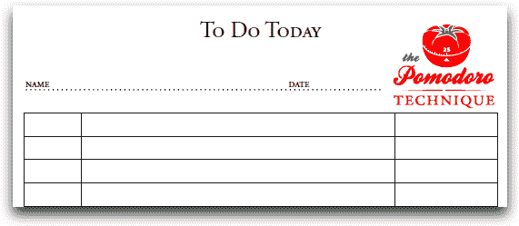

# 用于时间管理的番茄工作法

> 原文：<https://www.sitepoint.com/the-pomodoro-technique-time-management/>

我写了很多关于时间管理和生产力的文章，可能是因为我总是和时间短兵相接，每天都尽可能地适应时间。对我来说，这几乎就像是一个个人挑战，一个我乐此不疲的挑战。我有很多让我保持正轨的系统，虽然它们运行得相当好，但我一直在寻找更有成效和效率的方法。

我最近偶然发现了番茄工作法，并立刻被吸引住了。虽然这并不新鲜(弗朗西斯科·西里洛在 1992 年发明了这项技术)，但番茄工作法教我们如何消除时间带来的焦虑，并学会如何变得更有效率。

## 番茄工作法的重点

根据网站上可下载的免费电子书，番茄工作法的目标是提供一种简单的方法来提高生产率，方法是:

*   缓解焦虑
*   通过减少干扰来提高注意力和集中力
*   提高对自己决策的认识
*   提升动力并保持不变
*   增强实现目标的决心
*   从定性和定量两方面完善评估流程
*   改善你的工作或学习过程
*   坚定你的决心，在复杂的情况下继续努力

听起来像是一个相当大的目标，不是吗？如果你能够完成它，它肯定会让你更有效率。让我们看看这项技术实际上是如何工作的。

## 使用番茄工作法

番茄工作法最吸引人的一个特点是它非常简单。以下是根据网站和书中提供的信息汇编的简化的 6 步流程:

1.  收集必要的材料:一个计时器、空白纸或划线纸(或网站上的待办事项模板，如下所示)、一支铅笔和一块橡皮。
2.  选择一个要完成的任务。
3.  将你的计时器设置为 25 分钟(每个 25 分钟的时间间隔被认为是一个“番茄红素”)。
4.  继续完成任务，直到计时器响起，然后在你的任务右边的一栏中打勾。
5.  休息 3-5 分钟。
6.  继续下一个任务。

你应该能够坚持工作，一个番茄接一个番茄，直到每个任务都完成。然后你就把它划掉。

## 有用的提示

我绝对建议通读电子书和网站上的信息(有许多模板、便签和工具可用)，但这里有一些通用的提示可以帮助你充分利用番茄工作法:

*   每吃 4 个番茄，休息 15-30 分钟。
*   如果你完成一项任务时番茄还在滴答作响，利用这个机会“过度学习”，用它们来回顾你的工作并做出改进。
*   如果一项任务需要超过 5-7 个番茄来完成，那就把它分解成更小的任务。
*   在你的表格上标出打断，这样你就可以随着时间的推移跟踪(并消除)它们。
*   不要把番茄工作法用于你在空闲时间做的活动。

不是纸人？您可以使用电子表格或数据库以电子方式实现这一技术。这对我来说是最好的应用程序，我可以把它应用到我当前的任务跟踪系统中作为一个时间指南。我计划在未来几周内尝试一下。

你认为番茄工作法怎么样？你会尝试提高你的工作效率吗？

## 分享这篇文章