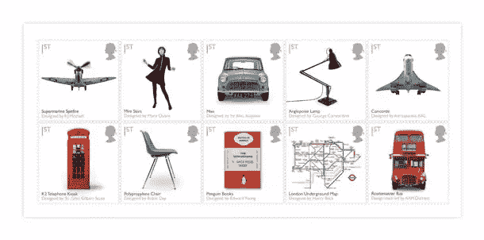
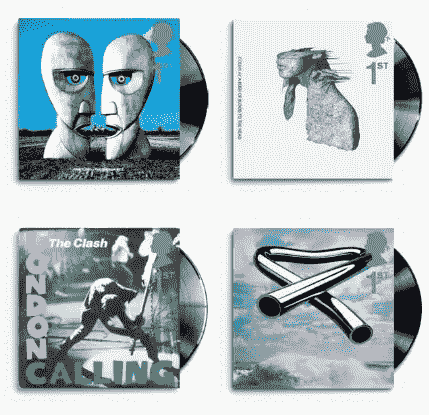
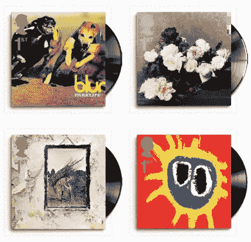
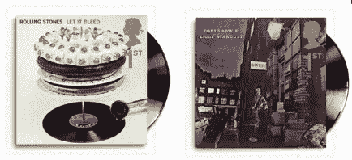

# 摇滚:英国邮票以专辑封面设计为特色

> 原文：<https://www.sitepoint.com/rock-on-uk-stamps-to-feature-album-cover-designs/>

去年，英国皇家邮政发行了一套非常酷的设计相关邮票，名为《英国设计经典》,其中包括地铁地图、迷你汽车、迷你短裙和企鹅书籍。

明年初，一套新的邮票将会发行，以十张经典英国专辑的封面为特色。这些相册跨越几十年，邮票庆祝平面设计师，摄影师和艺术家创造了令人难忘的封面的工作。多年来，专辑封面一直是一些精彩设计作品的场景，它本身已经成为一种艺术形式。

去年的“经典英国设计”邮票。

新邮票略有不同，因为它们是一个非正方形的形状，乙烯基光盘出现在邮票的模切外面。

皇家邮政研究了现有的“最伟大的专辑封面”名单，并向音乐出版物和平面设计师寻求建议。选出了十个设计的最终名单。

皇家邮政特别邮票负责人朱丽叶·埃德加说:

> 继 2009 年英国设计经典大获成功后，我们继续探索专辑封面的经典艺术。
> 
> 几十年来，专辑《袖子》一直是世界上一些最具想象力的平面艺术家的画布，这一期庆祝了这种独特的艺术形式和一些最伟大的例子。

这是邮票和相册:

平克·弗洛伊德的《钟声激越》

酷玩乐队的《热血奔涌》——由 solve sundsb 设计

伦敦在冲突中呼唤——摄影彭妮·史密斯

麦克·戈登·欧菲尔德的管状钟

由 Blur 设计的 park life–由 Chris Thomson/Stylorouge 设计，由 Bob Thomas 摄影

新秩序下的权力、腐败和谎言——彼得·萨维尔设计的《1983 年工厂》,亨利·芳汀·拉图尔 1890 年设计的《一篮玫瑰》

齐柏林飞船的齐柏林飞艇四号

原始吶喊的《呐喊》——艺术家:保罗·坎内尔

《让滚石乐队流血》——罗伯特·布朗约翰原创封面和内衬设计，唐·麦卡勒斯特摄影，迪莉娅·史密斯蛋糕

大卫·鲍依的《齐格星尘和来自火星的蜘蛛的兴衰》。

你可以在[诺维克集邮](http://www.norphil.co.uk/2010/01-album_covers_stamps.htm)了解更多关于邮票的信息。

这些会是你选择的“经典英国”专辑设计吗？你希望看到哪种经典的专辑封面设计在邮票上流芳百世？

## 分享这篇文章