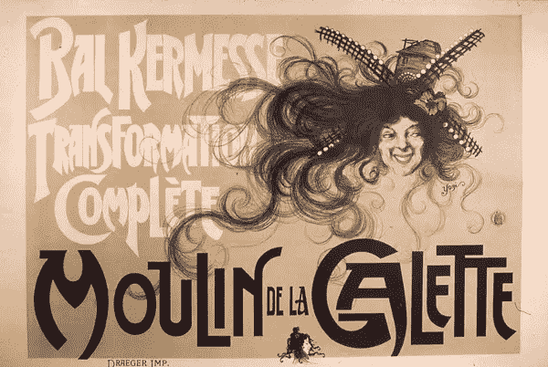
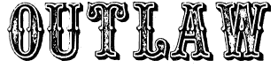
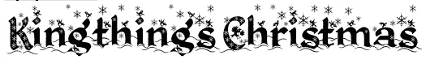

# 装饰字体

> 原文：<https://www.sitepoint.com/the-decorative-typeface/>

这是字体类别系列中的最后一个。我们已经了解了[旧式](https://www.sitepoint.com/the-old-style-typeface/)、[现代](https://www.sitepoint.com/the-modern-typeface/)、[平板衬线](https://www.sitepoint.com/big-bold-and-sometimes-beautiful-serif-slab-fonts/)、[无衬线](https://www.sitepoint.com/the-sans-serif-typeface/)、[手写体](https://www.sitepoint.com/the-script-typeface/)字体及其特点。我们今天最后将看一下装饰字体。这些字体也称为装饰字体或显示字体。

装饰字体和显示字体在 19 世纪开始流行，并被广泛用于海报和广告中。这种类型和字体的风格可能是艺术和引人注目的，这是以前没有考虑过的。威廉·莫里斯发起了艺术和手工艺运动，并作为当时实验和创新的一部分，开发了特洛伊字体。

[莫里斯特洛伊](http://www.fonts.com/findfonts/detail.htm?pid=438235)

在工艺美术运动之后，新艺术运动传遍了整个欧洲。装饰性文字是这场运动的重要组成部分，被用在许多海报和广告中。

[19 世纪装饰艺术海报](http://www.zukorartconservation.com/quad3.htm)

从 20 世纪到现在的 21 世纪，装饰性字体一直被用于广告和海报中。可供下载的显示字体即使没有上千种，也有数百种。关于装饰字体，要记住的一点是，只有当它们的使用受到限制时，它们才是强大的。如果你在任何地方都使用它们，它们的效果就会减弱。随着像 Cufon、sIFR 和 Typekit 这样的技术的出现，你没有理由不在你的网站上使用它们作为标题。

顾名思义，装饰性字体应该用于装饰或修饰目的。它们不适合在正文中使用。如果你强迫人们用这些字体中的一种读太多，你会有一些非常斜视和恶心的读者。他们往往有一个非常独特的外观，例如狂野西部风格，恐怖或圣诞节。

[不法之徒](http://www.dafont.com/outlaw.font)

[恐怖酒店](http://www.dafont.com/horror-hotel.font)

[Kingthings 圣诞节](http://www.dafont.com/kingthings-christmas.font)

我希望这个关于字体的系列对你有用。通过有意识地选择合适的字体，你可以改变和改进设计，这是令人惊讶的。你对它们了解得越多，你就越有信心使用它们。给自己做一些字体测试。当你在看杂志的时候，看看你是否至少能说出字体的种类。随着你变得越来越狂热，你会发现你可以说出许多单独的字体。看看纯文本标志，看看设计师如何使用对比字体来获得良好的效果，并尝试自己混合和匹配字体，看看哪些字体在一起效果很好。

下周，会有更多关于字体的内容。周五无意中成了我在 SitePoint 上的字体日，我想继续发表更多关于排版和字体以及如何有效使用它们的帖子。

**相关阅读:**

*   **[无衬线字体](https://www.sitepoint.com/the-sans-serif-typeface/)**
*   [**脚本字体**](https://www.sitepoint.com/the-script-typeface/)
*   [**旧字体**](https://www.sitepoint.com/the-old-style-typeface/)
*   **[现代字体](https://www.sitepoint.com/the-modern-typeface/)**
*   **[大而粗的漂亮石板衬线](https://www.sitepoint.com/big-bold-and-sometimes-beautiful-serif-slab-fonts/)**

## 分享这篇文章