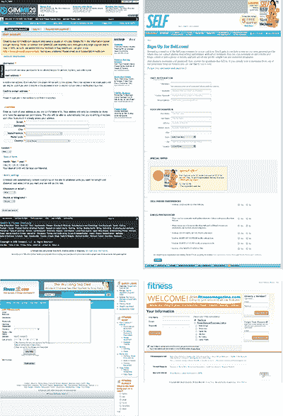
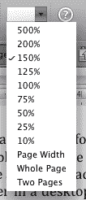
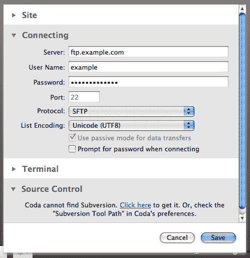

# 简单的表单设计公式

> 原文：<https://www.sitepoint.com/foolproof-form-design-formula/>

本文节选自 SitePoint 图书*第一章。如果你想阅读更多内容，你可以[下载样本 PDF](https://www.sitepoint.com/books/forms1/samplechapters.php) ，包含本书的前两章[，完全免费](https://www.sitepoint.com/books/forms1/samplechapters.php)。*

 *## 研究和寻找灵感

在开始构建表单之前，先做好准备工作是很重要的。表单是强大的，但是如果没有适当的规划和设计，它们会使任务变得难以完成。从表单设计的交互和视觉方面寻找灵感也是很好的。

在*的花式形态设计中，我们通过构建一个虚构的社交网站 **Fit and Awesome** 来实现书中的概念，为热衷于健康和健身的人们服务。Fit 和 Awesome 社区的成员可以在网站上存储他们的统计数据和训练日志，并与其他成员分享他们的健身目标和活动。自然，像这样的网站需要许多不同的表单和小部件——这里有很多值得我们钻研的东西！*

 *### 执行竞争性审计

看看类似的网站和应用程序都在做些什么。这是了解其他网站成功之处或找出失败之处的理想方式。如果你正在设计一个社交网络，看看其他的社交网络。不同的公司如何处理编辑个人资料？还是隐私设置？如果你正在做一个电子商务网站，看看一些成功的竞争对手。他们的结账过程是快速简单，还是繁琐？你是否发现自己一遍又一遍地输入相同的信息？

当你观察竞争对手时，记下你在尝试使用他们的产品时遇到的问题，以及哪些产品效果好。这些信息将有助于你的头脑风暴过程。寻找可能的创新领域，同时仍然考虑既定的惯例；考察理由 *为什么* 一个技巧有效与否。

在图 1 的[“gimme 20、SELF、Fitness.com 和健身杂志的注册界面”](#fig_registrationforms "Figure 1. The registration screens for Gimme20, SELF, Fitness.com, and Fitness Magazine")中，我收集了四个不同网站的注册表单——[gimme 20、](http://gimme20.com/) [健身杂志、](http://fitnessmagazine.com/)[Fitness.com、](http://fitness.com/)和 [SELF 杂志。每个表单都有不同的功能、问题和界面元素，所有这些都值得考虑。](http://self.com/)

**图一。Gimme20、SELF、Fitness.com 和健身杂志的注册屏幕**

### 使用软件作为灵感

桌面软件是一个值得寻找灵感的地方。如今，越来越多的 web 应用程序看起来和感觉上都像软件。这可能是好的也可能是坏的——一个选择不当的桌面小部件可能会让用户困惑，而且有些交互在桌面上比在浏览器上效果更好。当你考虑在你的站点中包含一个类似桌面的小部件时，试着确定你选择它是因为它是合适的工具，而不是因为它在桌面应用中很流行。考虑是否有必要。如果你可以没有它，很可能你应该不要它。

**图二。微软 Word 的视图大小菜单**

[图 2，“Microsoft Word 的视图大小菜单”](#fig_wordmenu "Figure 2. Microsoft Word’s view size menu")显示了 Mac 版 Microsoft Word 中的视图大小菜单；在许多方面，它类似于一个常规的选择菜单，这几乎不值得注意，但选择的范围和排列的顺序可能是一个有用的模仿或改进技术。

如下图所示，在[图 3 中，“Coda 的新站点面板，带有可折叠部分”](#fig_codaform "Figure 3. Coda’s new site panel, with collapsible sections")，Coda 的新站点面板使用了一系列可折叠部分来帮助用户更好地理解各种需求。表单本身只占用很少的空间，并且利用了右边的滚动条。这两种方法都有助于理解更大的表单。

**图 3。Coda 的新站点面板，带有可折叠部分**

**

## **分享这篇文章**