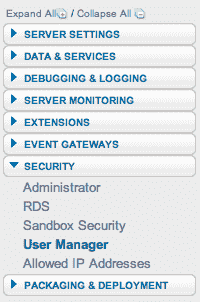
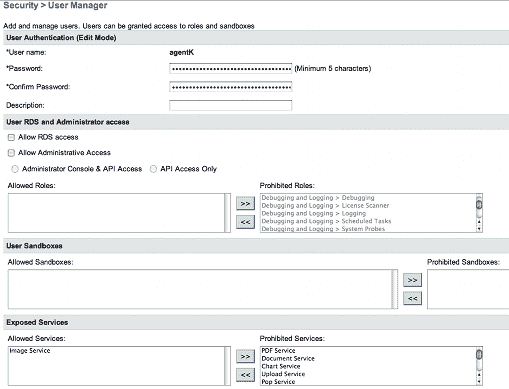

# ColdFusion 9 为您服务:使用 AIR 进行图像处理

> 原文：<https://www.sitepoint.com/image-manipulation-coldfusion-9-air/>

本月早些时候，Adobe 在洛杉矶的 MAX 大会上发布了 ColdFusion 的最新版本。早在 7 月份，我就对 ColdFusion 9 做了一个[概述，借助 Kay Smoljak 的例子介绍了一些新功能。这篇文章是关于我们在那篇文章中忽略的一个有趣的新功能:ColdFusion as a service (CFaaS)。](https://www.sitepoint.com/article/whats-new-coldfusion-9)

CFaaS 是以远程或本地服务的形式访问 ColdFusion 的一些功能的新方法。例如，`<CFIMAGE>`和`<CFDOCUMENT>`，它们以前只能作为 CFML 标签使用，因此只能在服务器上运行的`.cfm`文档中使用。使用 CFaaS，您的客户端代码可以通过 web 服务调用来访问这些 ColdFusion 功能。

随着当前客户端基于 Flash、Flex、AIR 或 AJAX 的更丰富的应用程序的趋势，Adobe 为 ColdFusion 9 提供服务层是有意义的。这允许 RIA 开发人员在工作中利用 ColdFusion 的一些快速应用程序开发功能。

为了说明如何利用这个新的服务层，我将向您展示如何构建一个简单的 AIR 应用程序，该应用程序将充当在服务器端执行的图像处理任务的前端。我们希望能够将图像拖放到应用程序中，将其上传到 ColdFusion 服务器，执行一些 CFaaS 功能来修改图像，然后检索图像以在我们的应用程序中显示。最后，用户可以将修改后的图像作为 JPEG 文件拖放回他们的文件系统中。

在我们开始之前，这里是你需要的:

*   Adobe 的 ColdFusion 9 。下载并安装免费的开发者版。

*   来自 Adobe 实验室的 Flash Builder 4 beta 2 ，我们将使用它来构建我们的 AIR 应用程序。我们将使用 Flex 3.4 SDK，因此理论上您可以使用 Flex Builder 3 来完成我们将要做的大部分工作，但是 Flash Builder 4 将简化一些关键任务。

*   示例代码，在这里可以找到[。归档文件包括一个可以导入 Flash Builder 的`.fxp`项目，以及原始源文件，以防您想单独查看它们。](http://sitepoint-examples.s3.amazonaws.com/cf9webservices/ImageDragger.zip)

一旦你读完了这篇文章，请过来参加我们的[文章测试](https://www.sitepoint.com/quiz/coldfusion/image-manipulation-coldfusion-9-air)来测试你的新技能！

## 基础知识

在我们开始研究这个例子之前，让我们先看看一些基本的 CFaaS 特性，以及如何利用它们。在 ColdFusion 9 中，以下标签及其功能可作为基于 SOAP/WSDL 的 web 服务使用:

*   `<cfchart>`

*   `<cfdocument>`

*   `<cfimage>`

*   `<cfmail>`

*   `<cfpop>`

*   `<cfpdf>`

这些服务的 WDSL URL 遵循以下格式:`http://<servername>:<port>/CFIDE/services/<servicename>.cfc?wsdl`。因此，如果您使用内置的 HTTP 服务器在本地计算机上安装了 ColdFusion 9，则访问图像服务的 WSDL URL 将是:`http://localhost:8500/CFIDE/services/image.cfc?wsdl`。所有示例和样本代码都将使用这种格式，所以如果您使用不同的服务器名称或端口，您需要相应地调整 URL。

服务的 WSDL URL 本质上公开了整个服务 API，这可能会带来很大的安全风险。因此，CFaaS 引擎在默认情况下是禁用的，因此您(或您的 ColdFusion 服务器管理员)需要为 CFaaS 层设置一个用户帐户，并为该用户提供对各个服务的适当访问权限。您还需要提供允许访问公开服务的 IP 地址列表或范围。出于本练习的目的，我们将只从本地机器访问服务，因此您只需将`127.0.0.1`添加到该列表中。

要为我们的服务添加用户，我们将首先登录到位于`http://localhost:8500/CFIDE/administrator/index.cfm`的 ColdFusion 服务器管理区域。我们需要的两个屏幕都可以在安全部分找到:用户管理器和允许的 IP 地址。

**图一。ColdFusion 管理员菜单**

首先，在用户管理器屏幕中，创建一个用户，指定用户名和密码。在屏幕底部，将影像服务从禁止服务列表移至公开服务列表。

**图二。用户经理**

不要管这个表单的其他部分，在这个应用程序中你可以不去管它们。请务必记住您为新用户设置的用户名和密码，因为您将需要它们来允许您的 AIR 应用程序访问影像服务。

## 分享这篇文章