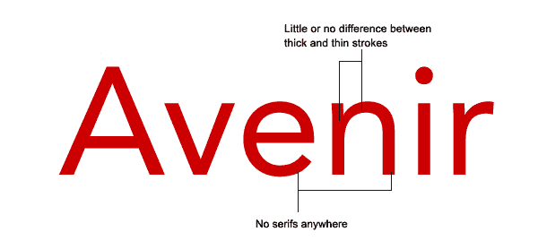
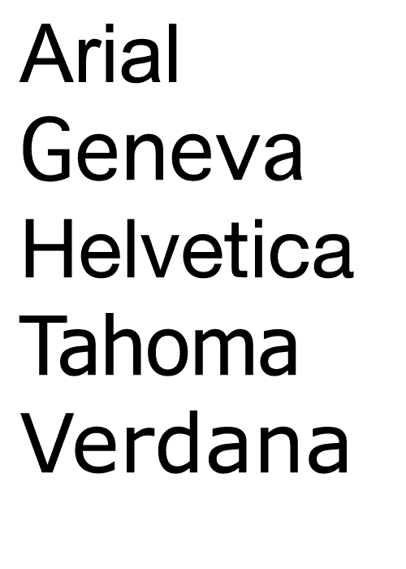
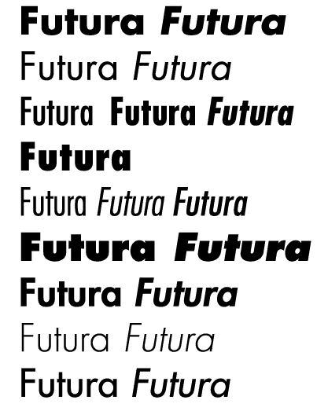

# 无衬线字体

> 原文：<https://www.sitepoint.com/the-sans-serif-typeface/>

在过去的几周里，我张贴了一些关于老式、现代和平板衬线字体的帖子。所有这三种字体类别涵盖了被描述为衬线字体的字体。也就是说，他们的字母形式在笔画末端有一个衬线。

如果你学过法语，你会知道“sans”的意思是“没有”，所以很自然地，无衬线字体就是那些在笔画末端没有衬线的字体。属于这一类别的字体通常被称为无衬线字体，但你也可能会看到他们被称为怪诞，多利克和哥特式(不要与黑色字体混淆)。

无衬线印刷字体的第一次实验是在 18 世纪中期，然而直到 19 世纪早期，它们在印刷中的使用才变得更加普遍。

区分无衬线字体的特征是它们几乎总是“单重”这意味着笔画中没有粗细过渡，它们的粗细完全相同。当然，这里没有衬线。

无衬线字体被认为易于从屏幕上阅读，因此非常适合网站的正文。它们在印刷中不太容易辨认，所以被用在杂志、书籍和小册子的标题、引语和小块文字中。您的计算机上可能已经有了几种无衬线字体。以下都是 web safe。

看起来很相似，不是吗？Helvetica 和日内瓦装有 MAC 电脑，而 Arial、Tahoma 和 Verdana 装有 Windows 电脑。

一些专业或商业字体系列有多种粗细和样式。为你的图书馆购买一些好的无衬线字体是值得的。例如，我是 Futura 字体的忠实粉丝。(我不打算在这里链接，因为我已经在各种网站上看到了不同的价格，并作为软件包的一部分，所以建议是货比三家，为你的字体。)以及“常规”或中等字体 Futura 有以下几种。

所以一个有 19 种风格的字体是一个非常通用的工具。

显然，无衬线字体这个术语涵盖了无数种，但是你最喜欢的无衬线字体是什么呢？(免费或商用)

**相关阅读:**

*   [**旧字体**](https://www.sitepoint.com/the-old-style-typeface/)
*   [**现代字体**](https://www.sitepoint.com/the-modern-typeface/)
*   [**大而粗的漂亮石板衬线**](https://www.sitepoint.com/big-bold-and-sometimes-beautiful-serif-slab-fonts/)

## 分享这篇文章