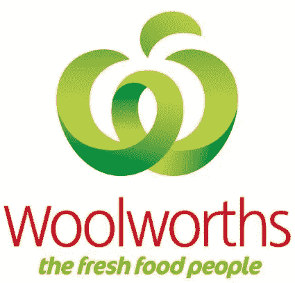
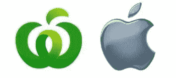

# 苹果声称所有苹果形状的东西

> 原文：<https://www.sitepoint.com/apple-claims-all-things-apple-shaped/>

澳大利亚的 Woolworths 去年推出了新的标识和品牌。标志是一个风格化的 w。它是绿色的，顶部有一片叶子。它看起来有点像削了皮的苹果。

我有没有提到新标志看起来有点像苹果的**？苹果科技公司认为新的 Woolies 商标看起来有点像他们的*T5苹果。他们发起了一项挑战，试图阻止他们使用他们的新标志，这已经出现在产品，商店，卡车和网站上。***

 **去年，Woolworths 向澳大利亚知识产权局申请将新商标注册为一揽子商标。这意味着该标志可以出现在许多不同类型的产品上，这正是让苹果感到不安的地方。如果在未来，Woolworths 决定开始销售电脑，客户可能会看到两种不同的电脑，上面有苹果形状的标志。苹果现在必须说服澳大利亚知识产权局拒绝伍尔沃斯的商标申请。

这个标志是由澳大利亚最大的品牌和设计机构之一 [Hulsbosch](https://www.hulsbosch.com.au/) 设计的。设计师 Hulsbosch 先生说，他认为苹果公司将商标保护发挥到了极致。

> 基于这种逻辑，他们将不得不对每一个卖水果的人采取行动。

类似的情况以前也发生过，当时苹果和纽约市因为 GreeNYC 的商标而进入董阿定。

苹果似乎在今年 3 月就对 Woolworths 的申请提出了异议，但这一消息是在过去两周 Woolworths 接受《时代周刊》采访时才传出的。

虽然它们之间有一些相似之处，但我认为要把这两个标志混为一谈，需要对其头部进行猛烈的打击。

你怎么看？苹果是恃强凌弱者，还是只关心他们在品牌中建立起来的资产？** 

## ***分享这篇文章***