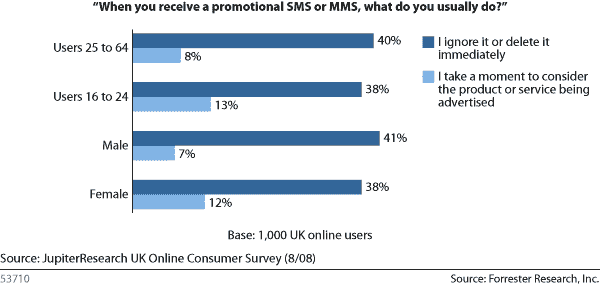

# 短信营销是新的广告时尚吗？

> 原文：<https://www.sitepoint.com/text-messaging-marketing/>

根据 Opus Research 最近进行的一项研究，这可能不是一种时尚，但肯定是一个未开发的市场。该研究显示，短信量已经增长到每天 35 亿条(超过移动互联网接入量)。

此外，因为短信营销需要消费者选择加入，所以通过短信进行营销不仅会击中那些最感兴趣的人，而且研究表明，所有短信营销消息中有 97%是在一小时内打开的，其中 83%是在一小时内打开的。惊艳；毫无疑问，这些统计数据击败了互联网广告和其他在线广告方式。

但是等等……这不全是好消息。事实上，市场营销人员和短信发送者对使用短信营销仍有很大的抵触情绪。Mark Walsh 的文章“[不要忘记短信](http://www.mediapost.com/publications/?fa=Articles.showArticle&art_aid=110802)”强调了 Opus Research 研究的发现，并指出:

> 尽管有两位数回复率的报告，但无论是营销人员还是移动用户似乎都不在乎短信营销。对于营销人员来说，这种不情愿至少部分源于政府监管的前景。今年春天，美国参议员奥林匹亚·斯诺(缅因州共和党)和比尔·纳尔逊(佛罗里达州民主党)提出了一项立法，通过 2009 年的《反垃圾邮件法》提供额外的消费者保护来遏制不请自来的短信。

文章接着说:

> 营销人员也不想冒险用不想要的信息疏远移动用户。为了避免这个问题，Forrester Research 最近在一份单独的报告中建议广告商不要发送没有针对性的短信。

坚持有针对性的信息显然是很好的建议，不仅仅是短信营销。但它能克服移动用户不喜欢在手机上获取促销信息这一简单事实吗？英国 Forrester Research 进行的一项研究的结果相当清楚地表明:

你怎么想呢?你会考虑为你的企业进行短信营销吗？成为短信营销活动的收件人会让你烦恼吗？

## 分享这篇文章