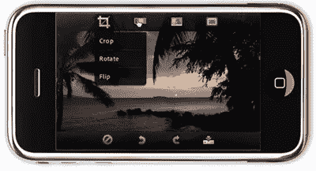

# Photoshop Mobile 发布

> 原文：<https://www.sitepoint.com/photoshop-mobile-released/>

这只是时间问题，不是吗？Adobe 已经为 iPhone 和 iPod 发布了 Photoshop 的移动版本。当我点击链接时，iTunes 打开了令人失望的消息，该应用程序在爱尔兰不可用。目前它似乎只在美国和加拿大可用。所以我在没有亲自玩过 app 的情况下，就把 Photoshop 的官方简介传了过去。

来自 Adobe

> iPhone 版 Photoshop.com 手机提供了一种有趣的无缝体验，可以全屏预览照片，并通过基于手势的编辑来编辑图像。消费者可以通过裁剪、旋转和翻转等基本编辑来改变他们的照片。用户可以通过调整饱和度和色调、增强曝光度和活力以及将图像转换为黑白来纠正和处理颜色。
> 
> Photoshop.com 手机还提供引人注目的特殊效果。素描工具有助于照片看起来像素描，柔焦可以给照片一个微妙的模糊艺术效果。只需一次点击，用户还可以通过温暖的复古、晕影和流行等效果，对照片的外观和感觉进行戏剧性的改变。编辑或更改可以撤销或重做，因此用户可以进行实验，而不必担心丢失原始照片。

Photoshop 免费提供 2GB 的 Photoshop 移动应用空间。

你可以[阅读更多相关内容，并从这里下载](http://mobile.photoshop.com/iphone/)。

你认为 Photoshop 的精简版会有多大用处？你会下载应用程序吗？

**相关阅读:**

*   [用 Autodesk Sketchbook Mobile 进行手指画](https://www.sitepoint.com/finger-painting-with-autodesk-sketchbook-mobile/)

## 分享这篇文章