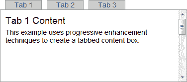

# 渐进增强技术 CSS

> 原文：<https://www.sitepoint.com/progressive-enhancement-2-css/>

在我的前一篇文章中，我们使用普通的语义 HTML (POSH)创建了一个选项卡控件。它可以在所有浏览器上运行，但不会赢得任何设计奖项。这是一个由三部分组成的系列的第二部分，演示了如何使用渐进增强技术构建一个简单的选项卡式框。

## 甜美的一层

CSS 是网页层，为你的页面添加布局、样式和背景图形。尽管 CSS 属性是有据可查的，而且(大部分)是符合逻辑的，但是设备对于呈现会有自己的想法。最令人悲伤的浏览器是 IE6，其次是 IE7——与竞争对手相比，这两款浏览器都很老，但仍有很大一部分人在继续使用它们。[有可能克服大多数问题](https://www.sitepoint.com/10-fixes-for-ie6-problems/)，但请记住:

像素完美是一个神话！

如果你需要一个精确设计的布局，你应该忘记网络——把你的杰作放在纸上或以 PDF 格式分发！IT 系统千差万别:人们使用不同的操作系统、屏幕尺寸、DPI 设置、字体、色深和浏览器。CSS 只能*建议*一个布局——由浏览器来解释你的代码，它可能不总是如你所愿。用户很少会注意到一个小部件偏离了位置几个像素，但是如果功能被破坏了，他们会抱怨。

## 不显眼的 CSS

我们的标签控件 HTML 已经被编码为可以在任何浏览器中工作。我们将使用 CSS 来设计和改进布局，使其看起来像一个选项卡式的框，但我们必须小心不要破坏我们的可访问性工作。

对于实现任何依赖脚本的 CSS 都要保持警惕。例如，可以使用 CSS `display: none;`属性隐藏选项卡框中的非活动内容。然而，如果 JavaScript 被禁用，这些内容将永远不会出现。总的来说:

1.  保持你的 CSS 简单。
2.  确保你的 CSS 在没有 JavaScript 的情况下也能工作。
3.  If your JavaScript implements styling changes, use that script to add a class to appropriate DOM nodes after the page has loaded. Therefore, JavaScript-dependent CSS is only activated if the script runs successfully.

    例如，您的脚本可以将一个“jsenabled”类添加到触发 CSS 样式更改的`body`标记中:

    ```
     p { ... styles applied always ... }
    body.jsenabled p { ... styles applied when JS executes ... } 
    ```

请注意，可以禁用 CSS 并启用 JavaScript。可能性比较小，但是一定不要对我们的用户做假设！

## 设置选项卡式框的样式

可以使用以下 CSS 设置选项卡的样式:

```
 /* tab control CSS: the tabs */
.tabs
{
	position: relative;
	bottom: -1px;
	height: 20px;
	list-style-type: none;
	padding: 0;
	margin: 0;
}

.tabs li
{
	display: inline;
	float: left;
	padding: 0;
	margin: 0 0 0 10px;
}

.tabs a
{
	display: block;
	width: 5em;
	height: 18px;
	line-height: 18px;
	text-align: center;
	text-decoration: none;
	color: #555;
	background-color: #ccc;
	border: 1px solid #999;
	outline: 0 none;
}

.tabs a.active, .tabs a:hover, .tabs a:focus, .tabs a:active
{
	color: #222;
	background-color: #fff;
	border-bottom-color: #fff;
} 
```

代码以 10px 的边距将列表元素向左浮动。`a`链接选择器指定标签颜色和边框。`ul`标签向下放置 1px，因此选项卡呈现在应用于内容周围的边框的顶部。

`.tabs a.active`选择器是支持 JavaScript 的 CSS 的一个例子。在这种情况下，当 JavaScript 将“active”类分配给选项卡时，将应用样式。

选项卡内容区域使用以下 CSS 样式:

```
 .tabcontent
{
	width: 26em;
	height: 10em;
	margin: 0 0 2em 0;
	border: 1px solid #999;
	overflow: auto;
}

.tabcontent div
{
	height: 10em;
	margin: 0 10px;
}

.tabcontent div h2
{
	padding-top: 10px;
	margin-top: 0;
} 
```

外部的`div`(“tab content”的类)被设置为 10em 高，并且将`overflow`设置为 auto，以便滚动条在需要时出现。我们的内容块(内部的`div`元素)也被设置为 10 米的高度。

结果是一个带有滚动内部区域的选项卡式框。用户可以使用滚动条或通过单击标签跳转到正确的位置来访问内容。

[](https://blogs.sitepointstatic.com/examples/tech/pe/pe-html-css.html "view example page")

CSS 使得内容更容易查看，并且在没有 JavaScript 的情况下仍然有效。然而，它并不完美:活动标签没有突出显示，滚动条对于一个光滑的 web 应用程序来说有点笨拙。

在下一篇文章中，我们[创建了一个可重用的 JavaScript 模块，添加了最终的增强功能](https://www.sitepoint.com/progressive-enhancement-3-javascript/)。

**资源链接:**

*   [查看 HTML 和 CSS 标签控件](https://blogs.sitepointstatic.com/examples/tech/pe/pe-html-css.html)
*   [查看 CSS 文件，pe.css](https://blogs.sitepointstatic.com/examples/tech/pe/pe.css)
*   [查看纯 HTML 标签控件](https://blogs.sitepointstatic.com/examples/tech/pe/pe-html.html)

**本系列其他零件:**

*   [渐进增强技术 1:HTML](https://www.sitepoint.com/progressive-enhancement-1-html/)
*   [渐进增强技术 2:CSS](https://www.sitepoint.com/progressive-enhancement-2-css/)
*   [渐进增强技术 3:JavaScript](https://www.sitepoint.com/progressive-enhancement-3-javascript/)

**相关阅读:**

*   [渐进增强和适度退化:概述](https://www.sitepoint.com/progressive-enhancement-graceful-degradation-basics/)
*   [渐进增强与优雅退化:做出选择](https://www.sitepoint.com/progressive-enhancement-graceful-degradation-choice/)
*   [不应发布受支持浏览器列表的 5 个理由](https://www.sitepoint.com/5-reasons-to-avoid-supported-browser-lists/)
*   [微软 Office Online:针对受支持浏览器列表的案例](https://www.sitepoint.com/case-against-official-browser-support/)
*   谁在使用 ARIA？

## 分享这篇文章