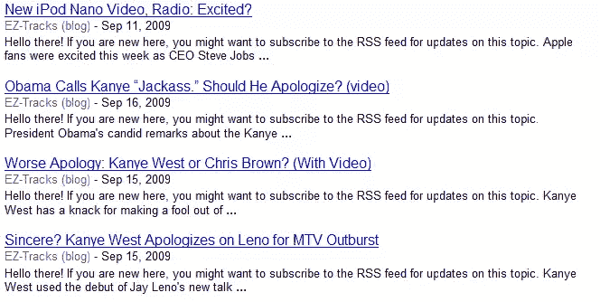

# 糟糕的嵌套代码会损害你的 SE 排名

> 原文：<https://www.sitepoint.com/coding-se-rankings/>

糟糕的代码会损害一个网站的排名，主要有两种情况:当出版商对已经存在的网站进行修改时，以及当网站从一开始就被粗心地开发时。

一些网站(通常是博客)可能会在搜索方面表现不佳，通常是在网站做了一些小调整之后，比如:添加新的插件、插件或富媒体文件。这些添加可能会破坏代码，使搜索引擎无法抓取网站。

从一开始就开发了 JavaScript、cookies、会话 id、frames、DHTML 或 Flash 等特殊功能的网站可能永远不会表现良好，这不是因为搜索引擎无法读取这样的页面，而是因为有些页面的编码不正确。优化不良编码网站的搜索既费时又费钱。如果你计划一个新的网站，确保你要求开发人员特别注意代码，并确保所有的页面在不同的浏览器中正确显示。

避免任何此类问题的最简单方法是开发尊重谷歌 Flash 和富媒体指南和谷歌技术指南的网站。

## 给 WordPress 用户的一些特别提示:

正如我已经提到的，添加小部件和插件可能会改变页面代码，甚至破坏它，结果几乎总是降低搜索引擎的性能。

一个已知会导致问题的插件是【Seth Godin 会怎么做 (WWSGD)。这个插件添加了一段文字，鼓励博客的新访客注册成为 RSS 订阅者。如果你将插件设置为在博客条目的第一段之前添加欢迎信息，那么它的文本可能是谷歌索引的唯一内容，作为它出现的页面的“描述”。插件会在一定数量的回访后停用欢迎文本，但谷歌的爬虫每次都会被插件视为新访客，所以你最终会看到一系列被谷歌索引的文章，如下所示:

谷歌的机器人足够聪明，可以读取文本的其余部分，网站会被编入索引，但搜索引擎的排名充其量也就一般。如果你的站点必须有 WWSGD，试着把它加在文章的正文之后。

有时候[插件碾压](http://www.chrisg.com/when-good-plugins-go-bad-comment-relish-considered-dangerous/)MySQL 数据库( *WP 超级缓存*和*评论津津乐道*有已知问题)；如果你的博客太长时间(通常是几天)不可用，它可能会被完全取消索引。幸运的是，大多数 WP 用户能够在适当的时候找到解决这些问题的方法。对于不太了解的用户，一句忠告:少即是多。不要添加太多的小部件、徽章、脚本或插件。

然而，最危险的情况是由可定制的 WP 主题中已经存在的脚本生成的；例如，在每个页面上添加标签云的脚本。每个标签都是一个链接，页面上的链接越多，它的“链接价值”就越低。一些标签云只向用户显示有限数量的标签，但是如果你打开“页面源代码”来查看代码，你有时会看到成百上千的标签。这种混乱会导致页面过大，加载速度极慢，并可能导致爬行问题。

对于[新闻出版商](http://www.google.com/support/news_pub/bin/answer.py?hl=en&answer=93994)(由谷歌新闻索引)，这些爬行问题表现为“文章太长”或“文章碎片”和“页面太大”(页面只能有 256KB 长)，并导致完全去索引。其他出版商不受影响，但他们的 SE 排名仍然很低(一个可能的解决方案是安装一个插件，将 rel="nofollow "添加到标签中)。一个已知的会产生这种问题的主题是 [WP 杂志](http://www.wp-magazine.com)(点击演示网站上的任何文章标题，查看源代码)。

我希望这几个例子能让你明白好的编码对一个站点的 se 成功有多重要。如果你知道任何其他不良嵌套代码损害网站出版商和搜索引擎排名的情况，请告诉我们。

## 分享这篇文章