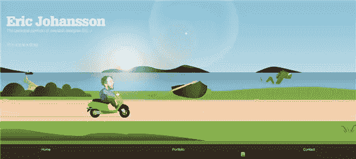
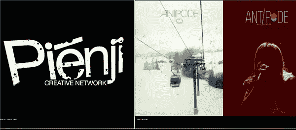
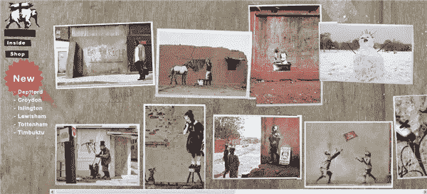
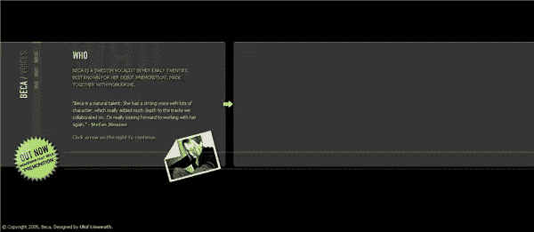
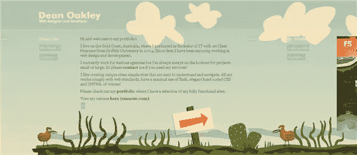
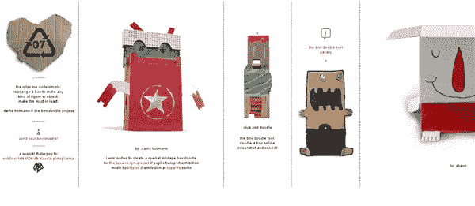
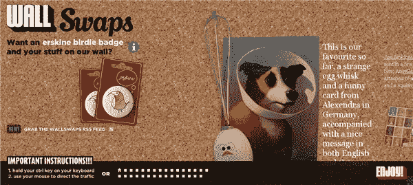
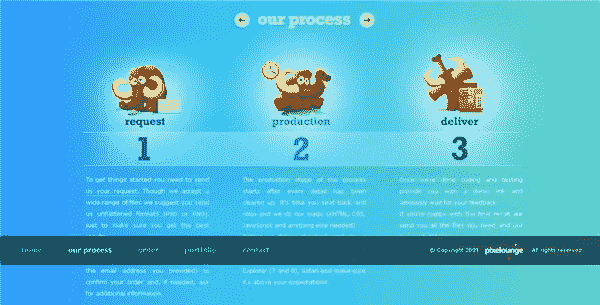
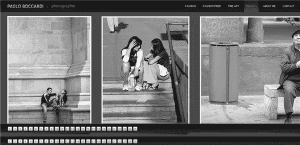
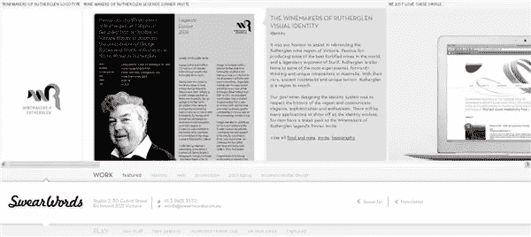

# 十五个使用水平滚动的网站

> 原文：<https://www.sitepoint.com/fifteen-web-sites-using-horizontal-scrolling/>

网站上有水平滚动条通常被认为是一大禁忌。可用性专家雅各布·尼尔森对滚动条有如下指导:

*   如果一个区域有滚动内容，提供滚动条。不要依赖自动滚动或拖动，人们可能不会注意到。
*   **如果所有内容都可见，隐藏滚动条**。如果人们看到滚动条，他们会认为有额外的内容，如果不能滚动，他们会感到沮丧。
*   **遵守 GUI 标准**使用看起来像滚动条的滚动条。
*   避免在网页上水平滚动，在其他地方最小化。
*   **在文件夹上方显示所有重要信息。**用户经常根据不用滚动就能看到的内容来决定是留下还是离开。

"避免水平滚动."是的，当然重要的是没有 ***偶然的*** 横向滚动。这似乎是显而易见的，但是对于一些设计师来说，决定使用水平滚动就像选择颜色一样是设计的一部分。看一个水平滚动的网站有点像打开一本多折的小册子，因为当你拖动页面时，它会给你带来小小的惊喜。

正如你将从我下面挑选的例子中看到的，这些网站中有许多是为创造性职业服务的。网页和平面设计师，摄影师和涂鸦艺术家，也许这就是这种风格最适合的地方？这里有 15 个成功使用水平滚动的网站。

[埃里克·约翰松](http://www.ericj.se/)有一句合适的口号“这个网站很无聊。”

[斯特凡·布科的投资组合](http://www.sockho.com)

[班克斯](http://www.banksy.co.uk/outdoors/horizontal_1.htm)

里卡多·阿尔塞

[贝卡之声](http://lonnroth.info/beca/)

迪安·奥克利

[弗兰克·雅各](http://www.frankgiacobbe.com/)

[盒子涂鸦](http://www.neu-e.de/)

[墙面置换](http://www.wallswaps.com/)

[像素休息室](http://pixelounge.info/)

[保罗·博卡迪](http://www.fashionphotographer.it/travel.html)

[脏话](http://swearwords.com.au/#work_0)

[前端设计会议](http://frontenddesignconference.com/)–会议现在已经结束，但是网站上有关于会议的信息和下载，并且仍然使用水平滚动。

关于 CSS 技巧，Chris Coyier 有一个很好的教程，解释了如何用 CSS 创建一个[水平滚动的网站。](http://css-tricks.com/how-to-create-a-horizontally-scrolling-site/)

**你怎么看待水平滚动？它是最好保存在创意网站上，还是我们会在主流网站上看到更多？**

## 分享这篇文章