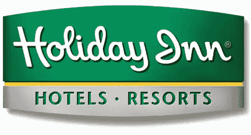
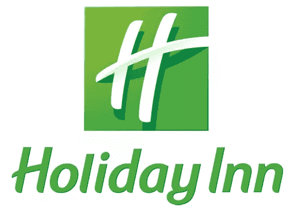
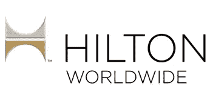
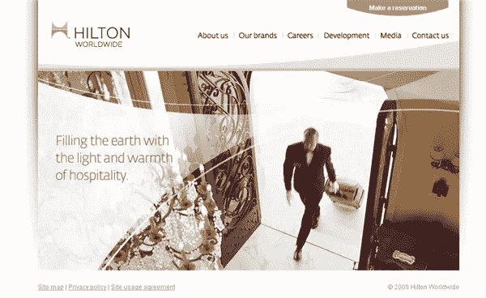

# 假日酒店和希尔顿全球酒店的新标识

> 原文：<https://www.sitepoint.com/new-logos-for-holiday-inn-hilton-worldwide/>

过去几周，两家全球最大的连锁酒店披露了新的身份和品牌重塑。首先，假日酒店的标志。由 Interbrand 设计，它取代了旧的，有点不寻常的反斜体标志。正如我们所知，品牌不仅仅是标志，在这种情况下，新标志只是整个组织大规模改革的一部分。假日酒店在世界各地有超过 3000 家酒店，每一家都在翻新，改善了床上用品、景观，信不信由你，还有假日酒店的香味。现在，每家酒店都必须在大堂安装一台“气味机器”,产生生姜、白茶、柑橘和麝香的温和香气。更便宜的假日快捷酒店网站将会散发出青草和绿茶的香味。下面你可以看到之前和之后的标志设计。*假日酒店前*  *假日酒店后*  *新假日酒店 Express Logo* 就个人而言，我真的很喜欢这个新 Logo。它明亮、清新、友好。希尔顿酒店集团最近也改变了他们的公司名称、标志和网站，将名称从希尔顿酒店集团改为希尔顿全球，以表明他们的全球影响力。在新的标志设计上，希尔顿说:

> 铂金和黄金风格的 H 象征着希尔顿的品质、地位和丰富的遗产。两半部分是反光的，提醒人们该公司传奇的过去和充满活力的未来，开放的曲线是受欢迎的，通过暗示地球的圆边、桥的拱门和床的柱子来象征旅行的世界。

*The new logo*

新网站嗯，我不能说希尔顿全球的新标志或网站给了我灵感。对于像希尔顿这样的公司来说，我原本期待更优雅一点的东西。显然，这里有两种完全不同的受众，但这两者之间有如此巨大的反差。希尔顿标志的颜色和形状的选择相当单调，而假日酒店的字体和颜色有欢迎的感觉。**你觉得新的标志设计怎么样？**

## 分享这篇文章