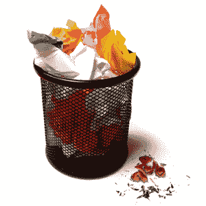

# 错误让我快乐的 5 个原因

> 原文：<https://www.sitepoint.com/why-mistakes-are-good/>

几个月前，我发表了一篇关于[当你把工作搞砸时处理错误的最好方法](https://www.sitepoint.com/what-to-do-when-you-mess-up/)的文章。在一天结束时，在一个错误被纠正和消除后，从混乱中学习的潜力是巨大的。但前提是你愿意从中学习。

我在商业和生活中学到的一些最好的教训是由一个错误促成的。以下是我重视所犯错误并花时间从中吸取教训的五个最大原因。
 **1。错误提醒我，我并不完美。**

作为一个幻想破灭的完美主义者，犯一个错误可以很好地提醒自己，努力做到最好是可以的，但是无论我想变得多么完美，我就是不完美。这种认识非但没有让我气馁，反而有助于减轻我肩上的压力，让我认识到并欣赏自己的局限性。

**2。错误让我锻炼自由意志。**

有时候，我会犯错误，因为我不听别人的(好)建议，或者只是忽略了我内心深处那个总是知道得更好的小声音。虽然有些情况本来是可以避免的，但我发现有时候自己做决定，即使会导致一团糟，也是值得的，因为我可以自由地在任何时候做任何我想做的决定。

**3。错误提醒我我是多么幸运。**

如果你像我一样，你会忘记你在生活中是多么幸运，即使你每天都面临着挑战。我的错误迫使我现实地看待我所拥有的一切，并简单地为此感恩。最终，我意识到生活中的挑战和挣扎都是相对的。

**4。错误是激励。**

我想我从来没有像搞砸之后那样有动力去做好一件事。犯错误就像个人的挑战，让我更加努力，学得更快，做得更好。这种挑战不仅能激励我，还能提升我对成功的关注和承诺。

**5。错误迫使我不断冒险。**

犯错意味着你的生活中有一个领域需要改进。除非你愿意冒险再犯同样的错误，否则进步不会到来。这个错误、学习和再次尝试的循环让我专注于把自己放在那里，以便做得更好。

你从所犯的错误中学到的最大的教训是什么？

*形象信用:[关键词基兰](http://www.sxc.hu/photo/1218054)*

## 分享这篇文章