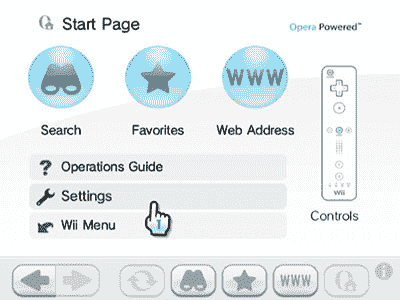

# 免费玩 Wii！

> 原文：<https://www.sitepoint.com/nintendo-wii-opera-browser/>

任天堂 Wii 已经成为世界上最受欢迎的现代游戏机。虽然它在技术上不如索尼的 Playstation 3 或微软的 Xbox 360 先进，但创新的 Wii 遥控和家庭友好型游戏已经在典型的游戏市场之外得到了广泛采用。全球已售出超过 5000 万台。

Wii 内置 wi-fi，也可以购买以太网适配器。互联网连接通常用于更新、多人游戏、下载和任天堂的专门内容“频道”。

一般上网是可以的，但是需要下载互联网频道。到目前为止，500 点 Wii 积分需要 5 美元(尽管只能从 Wii 商店购买 1000 点的积木)。然而，从本月开始，任天堂免费发布了互联网频道——任何有 Wii 和网络连接的人都可以下载浏览器并访问网络。最近购买该软件的人将在今年晚些时候收到游戏积分。

该浏览器由 [Opera](http://www.opera.com/devices/wii/) 创建，是专门为主机设计的。它具有与现代手机浏览器类似的功能集，并提供 HTML、CSS、JavaScript 和 Flash 3.1 Lite 支持。Wii 的屏幕分辨率明显小于 PC 显示器，但 Opera 提供了几种手动和自动缩放功能。即使复杂的网站仍然可读。

通过用 Wii 遥控器指向屏幕来控制浏览器。键入长网址很麻烦，但它提供了很好的自动建议。狂热的 Wii 冲浪爱好者可以使用外置键盘。

总的来说，Wii 浏览器很简单，相当快，而且运行良好。许多人将使用它来快速检查电子邮件、了解新闻或玩简单的基于 Flash 的游戏。

然而，我们现在的情况是，Wii、DSi、Playstation 3 和 PSP 都提供了可行的网络浏览软件*(我确信微软可以将 IE6 移植到 Xbox 上！人们用它们来访问 SitePoint，那么控制台用户会成为你的网站人口统计中的一个重要部分吗？也许是时候让你的老板买一系列游戏机了…显然是为了*测试*的目的！*

## 分享这篇文章