# 19 套万圣节怪异图标

> 原文：<https://www.sitepoint.com/spooky-icon-sets-for-halloween/>

通过更新你的图标来给你的网站涂上一层“新鲜的油漆”不会有什么坏处。假期给了你一个完美的借口来交换一些图片，让你的项目在几周内焕然一新。考虑到这一点，我们为你收集了 19 个万圣节主题图标。其中大部分是免费的，只要确保你阅读许可协议！

## 免费图标集

**[5 个万圣节图标](http://www.iconbulk.com/icons_new.asp?strt=40)** :一个很小的细节图标集合，但是考虑到包括一些版权角色，人们认为它最好只供个人使用。

**[8 个恐怖图标](http://www.smashingmagazine.com/2009/01/12/tools-icons-horror-icons-and-twitter-icons/)**:8 个以血腥为特色的恐怖主题图标。

**[14 张万圣节矢量](http://www.smashingmagazine.com/2008/10/27/smashing-pumpkins-a-free-halloween-vector-icon-set/)** :收集 14 张矢量艺术的免费作品。PNG 和高达 512×512。它们来自。AI (CS3)和. EPS。

[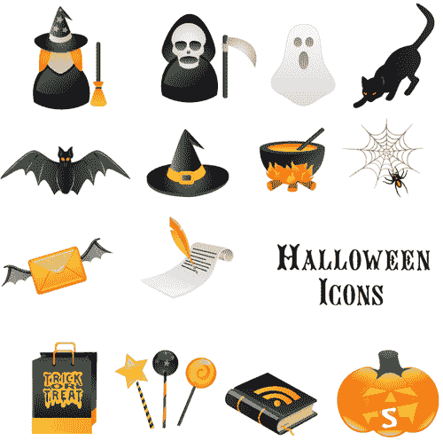](https://blogs.sitepointstatic.com.s3.amazonaws.cimg/lists/halloweenicons/smashinghalloween.jpg)

**[Benjigarner 万圣节图标包](http://benjigarner.deviantart.com/art/Halloween-Icon-Pack-68116852)** :四个。尺寸为 256×256 的 PNG 万圣节图标。

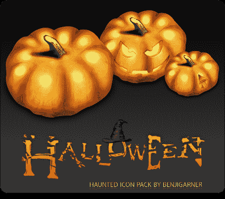

**[CSS Creme 万圣节图标](http://csscreme.com/freeiconspack/halloween)** :免费提供 11 个万圣节主题图标供您下载。

[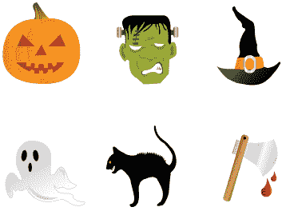](https://blogs.sitepointstatic.com.s3.amazonaws.cimg/lists/halloweenicons/csscremehalloween.jpg)

**[Danilux 鬼魅万圣节图标](http://danilux.deviantart.com/art/Halloween-Spooky-Icons-68572482)** :这些 16×16 的图标非常适合替换你电脑上的图标。

[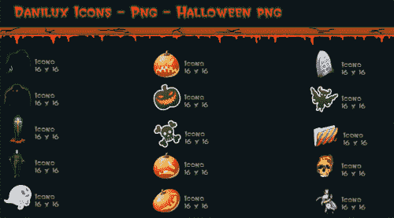](https://blogs.sitepointstatic.com.s3.amazonaws.cimg/lists/halloweenicons/daniluxdesktopicons.jpg)

**[Deleket 万圣节头像](http://deleket.deviantart.com/art/Halloween-Avatars-66955374)**:20 张各种怪物和食尸鬼的万圣节头像趣味合集。

**[设计极乐万圣节](http://www.designbliss.com/2007/10/24/free-halloween-graphic-design-resources-day-eighteen-vector-rss-icons-a-db-download/)**:RSS 图标的四张万圣节矢量图片。

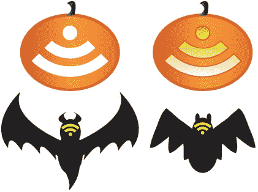

**[hybrid works Haunted Hotel](http://www.hybridworks.jp/)**:一个小型但高质量的鬼火图标收藏，一个闹鬼的酒店和一个看起来像墓碑的硬盘。

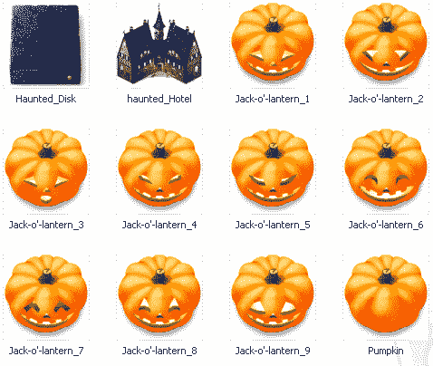

**[图标档案一套 19 个万圣节图标](http://www.iconarchive.com/category/halloween/halloween-icons-by-zeusbox.html)** : 19 个各种各样的万圣节图标。ICO 和。PNG 格式，有 128×128 和 48×48 两种尺寸。

[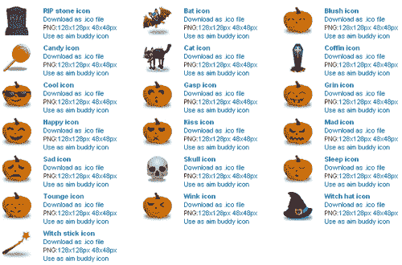](https://blogs.sitepointstatic.com.s3.amazonaws.cimg/lists/halloweenicons/ia19halloweenset.gif)

[**IconDrawer 万圣节一对**](http://www.icondrawer.com/free.php) :这一套只有两个图标，但是看起来非常圆滑和专业。

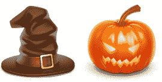

非卡通电脑图标:42 个灵感来自万圣节的电脑图标，尺寸都是 128×128 英寸。PNG 格式。

[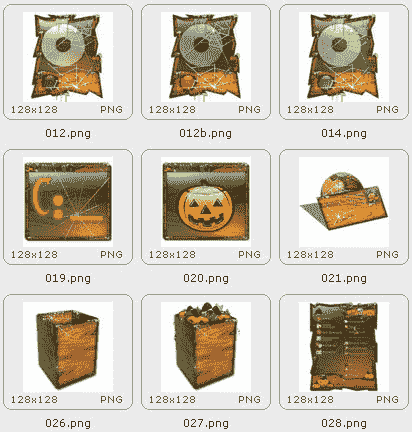](https://blogs.sitepointstatic.com.s3.amazonaws.cimg/lists/halloweenicons/nonamdcomputericons.jpg)

第三个万圣节社交图标 :一组非常棒的社交媒体图标，为万圣节前夜做了改动。

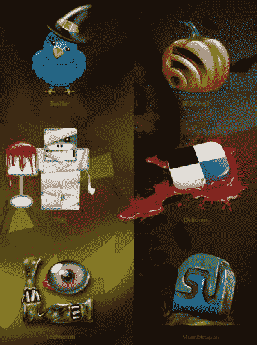

:四个与“不给糖就捣蛋”相关的图标的有趣集合。

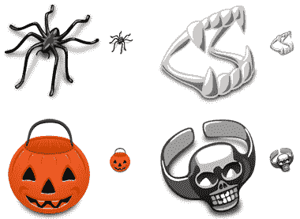

**[矢量 RSS 图标](http://qvectors.com/vector-icons/vector-rss-icons/)** :一套三个带有万圣节主题的矢量 RSS 图形。

:11 个各种女巫主题的图标。ICO 和。PNG 格式，有 128×128 和 48×48 两种尺寸。

[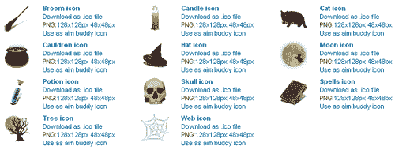](https://blogs.sitepointstatic.com.s3.amazonaws.cimg/lists/halloweenicons/witcheryicons.gif)

**[水之世界:黑暗之后](http://iconfactory.com/freeware/preview/woah)**:icon factory 的幽灵图标集合。

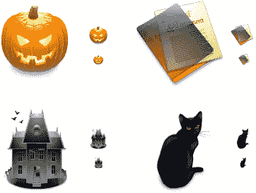

## 高级图标集

**[FastIcon 万圣节表情](http://www.fasticon.com/stockicons/index.php/halloween-emoticons/)** :一套五个南瓜图标。图标，苹果图标和。PNG 格式，尺寸为 16×16、24×24、32×32、48×48、64×64、128×128。

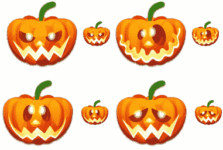

**[Vista 风格的万圣节南瓜表情](http://www.icons-land.com/vista-style-halloween-pumpkin-emoticons.php)** : 25 个各式图标。ICO 和。PNG 格式，尺寸为 16×16、24×24、32×32、48×48、64×64、128×128、256×256。

[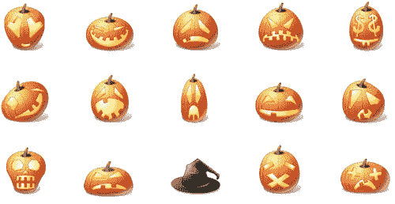](https://blogs.sitepointstatic.com.s3.amazonaws.cimg/lists/halloweenicons/iconslandhalloween.jpg)

## 分享这篇文章