# 周日早晨咖啡艺术

> 原文：<https://www.sitepoint.com/sunday-morning-coffee-art/>

为了获得一点离线设计灵感，我认为远离电脑，看看咖啡艺术会很好。我最近看到一个广告牌广告，上面有一张两杯拿铁咖啡的图片，上面有一些设计。他们(我假设)是 PS 过的。然而，当我上网去看时，我惊喜地发现有很多人用咖啡作为媒介进行艺术创作，也有人在他们的拿铁咖啡上进行设计。甚至还有展示这种艺术形式的比赛。

拿铁艺术是将蒸过的牛奶倒入一杯浓缩咖啡中，并在表面形成对比图案或设计而产生的。最常见的设计是一种被称为罗塞塔的花朵形状。其他受欢迎的设计是心，动物和交叉影线图案。对于更复杂的拿铁设计，一些咖啡师使用咖啡搅拌器蚀刻图案。

一些喝咖啡的人认为，过于强调设计，留下了一杯难吃的咖啡。形式服从功能？

这里有一些美丽的拿铁艺术的例子。(注意:链接是给摄影师的，不是咖啡师的。)

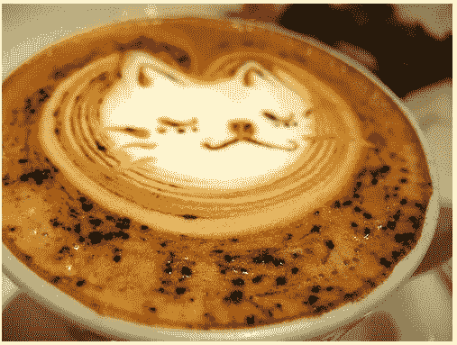

猫靠[发髻不哭](http://www.flickr.com/photos/bun_buku/2287809439/)

由 Perrys 设计的郁金香

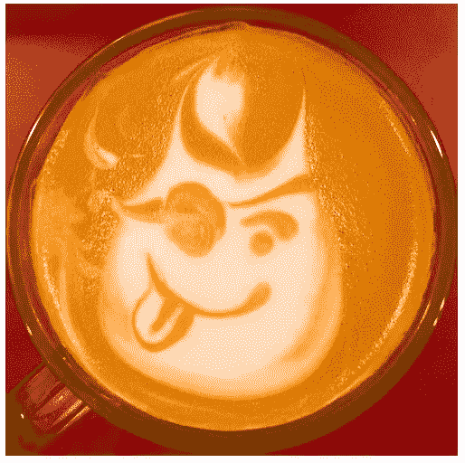

克里斯·布莱克利

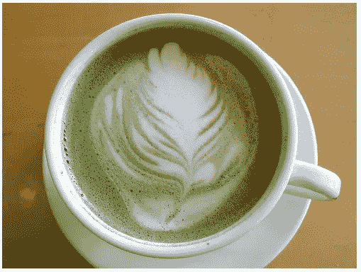

一杯绿色抹茶拿铁由[登山者](http://www.flickr.com/photos/davidleong/286552054/)

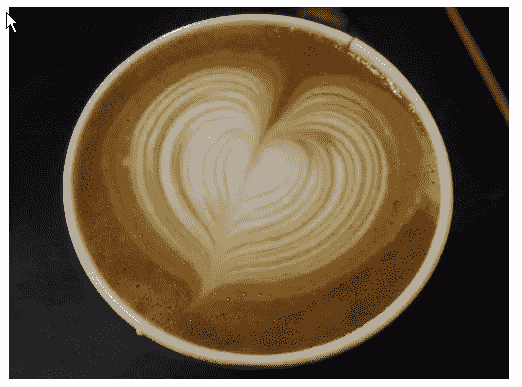

心由 [Tonx](http://www.flickr.com/photos/tonx/122899704/in/set-48921/)

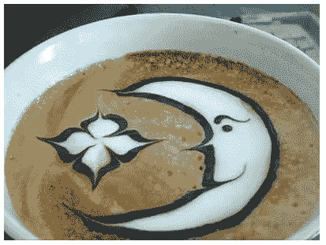

月亮和星星乘[春](http://www.flickr.com/photos/esquaredfashion/2326606926/)

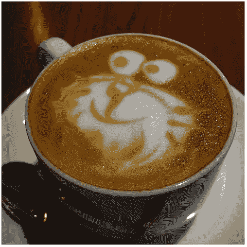

哆啦 a 梦由[良子](http://www.flickr.com/photos/yoshiko314/1422746433/)

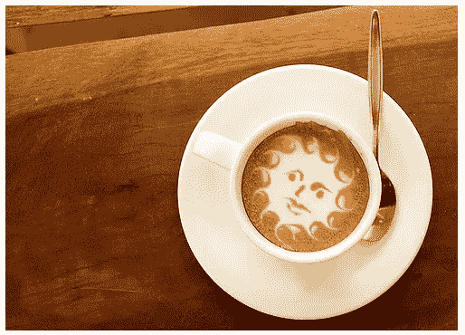

希尔弗

如果你想自己制作，WikiHow 有一个很棒的教程，教你如何制作自己的拿铁艺术作品，包括提示和警告(不要烫到自己！).

**用咖啡作画**

[只是咖啡艺术](http://www.justcoffeeart.com/)

Andrew Saur 和 Angel Sarkela-Saur 使用咖啡作为他们的媒介创作绘画，并用它作为水彩画。这项工作是用丙烯酸密封剂完成的。

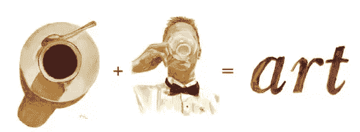

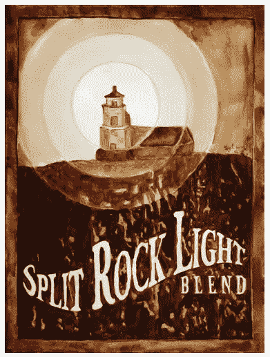

另一位在这种媒介中工作的艺术家是凯伦·伊兰，她用 expresso 创作出美丽的画作。

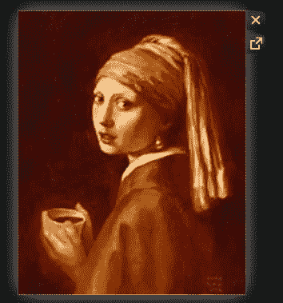

最后，上个月在澳大利亚，用 3604 杯咖啡和 564 品脱牛奶上色，创作出了一幅巨大的蒙娜丽莎画像。

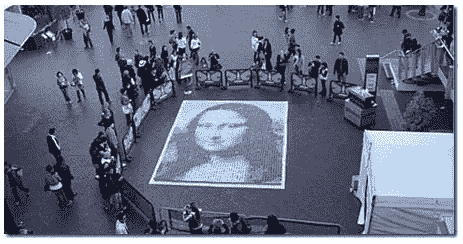

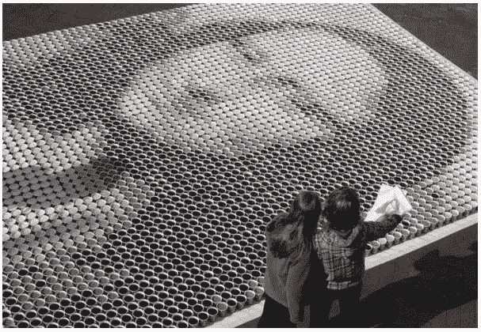

**你对咖啡艺术有什么看法？鼓舞人心还是浪费一个好的兴奋剂？**

## 分享这篇文章