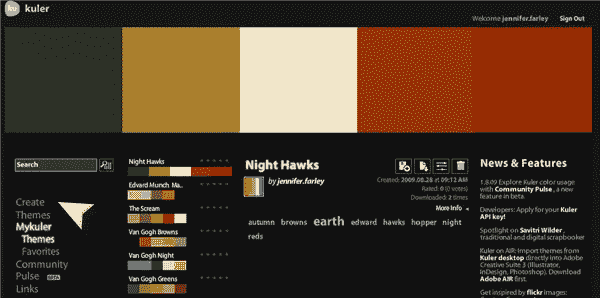
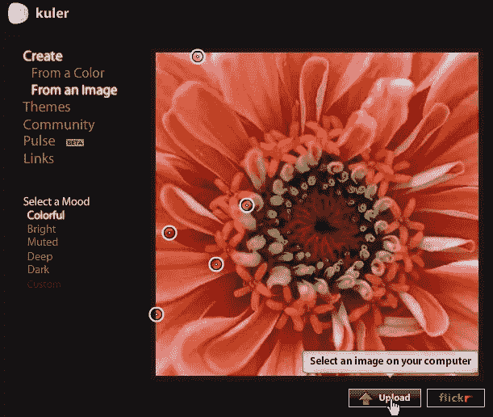
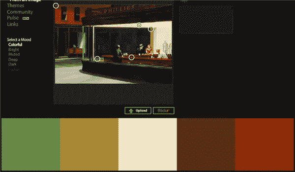
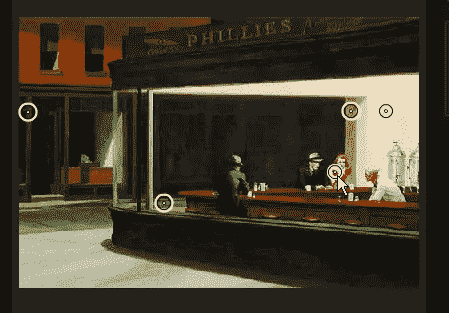
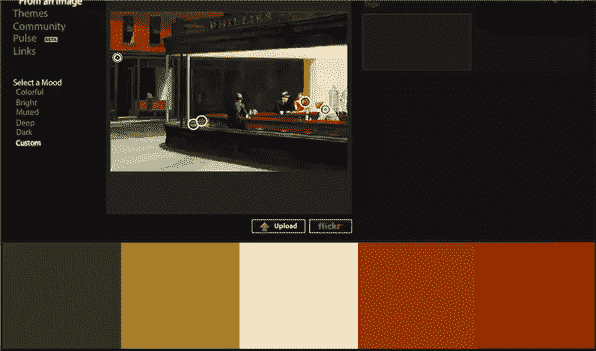

# 如何使用 Kuler 从图像创建调色板

> 原文：<https://www.sitepoint.com/how-to-create-a-color-palette-from-an-image-using-kuler/>

如果你觉得很难想出配色方案，Kuler 是一个很棒的工具，既可以用来获得别人的配色方案，也可以用来创建自己的配色方案。Kuler 归 Adobe 所有，可以免费使用。我非常喜欢使用并且经常使用的一个特性是从图像创建颜色主题的能力。

假设你正在做一个网站或设计项目，你有一个特定的图像，你想用在页眉或作为整体外观的主要部分。通过使用照片中的颜色，你将能够创造出一个很好的、有凝聚力的配色方案。下面是怎么做的。

1.  如果你还不是 Kuler 会员，注册一个免费账户。如果您是会员，请登录。
2.  On the home page of Kuler, you’ll see color themes created by yourself if you’ve saved some, or color themes created by the huge Kuler community.

    

3.  Click on the Create button and then choose From An Image.

    

4.  将会出现一个默认的花朵图像，显示图像上的许多点，调色板就是从这些点创建的。点击上传按钮选择您自己的图像。
5.  Once your image is uploaded, Kuler will choose five points to form a palette. In the screen grab below you can see that I uploaded the famous painting Nighthawks by [Edward Hopper](http://en.wikipedia.org/wiki/Edward_Hopper).

    

    Kuler 给我选了五种颜色，但是我不是很喜欢这个方案。

6.  To change the selected colors, you can simply click and drag the points around on the image.

    

    当您拖动每个点时，调色板会发生变化。我真正喜欢的一点是，图像中经常有你甚至没有意识到的颜色，你可以把一些非常可爱的配色方案放在一起。

    

7.  当你对你的调色板满意时，给它一个标题和一些描述性的关键字，然后保存它。如果你愿意，你可以和其他人分享你的调色板。
8.  To download your swatch as an Adobe Swatch Exchange file, click on the download icon and save to your computer. ASE files can be opened by any of the Adobe products from CS2 onwards, (It might actually be CS), where you can import the file in and see the palette as a swatch.

    

    你用 Kuler 创建调色板吗？你还用什么方法来创建网页设计的调色板？

## 分享这篇文章