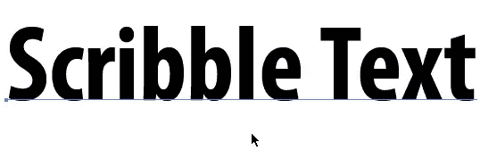
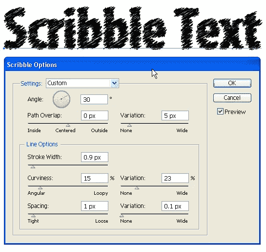
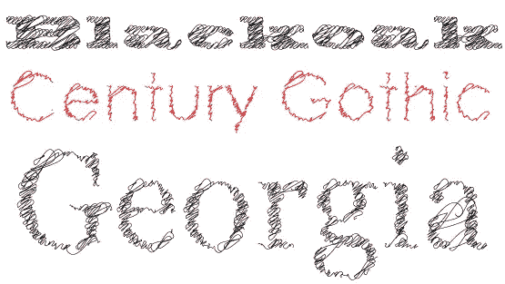

# 在 Illustrator 中创建您自己的潦草、粗糙的字体

> 原文：<https://www.sitepoint.com/create-your-own-scribbled-scratchy-typeface-in-illustrator/>

手绘外观在网络上仍然很流行。涂鸦，涂鸦，潦草的文字和手绘的元素可以结合在一起，为你的网站创造一个不那么精致，自制的外观。有大量的[手绘字体和其他设计元素](https://www.sitepoint.com/sketch-style-ten-fonts-and-ten-design-elements/)可供下载，但今天我想告诉你如何在 Illustrator 中使用任何字体，并给它一个潦草的外观。使用 Scribble 命令非常简单，你可以创建一些非常漂亮的效果。

因此，让我们从在 Illustrator 中打开一个文档并添加一些文本开始。

1.  我用过 Myriad Pro Bold Condensed(如果你安装了 Illustrator，你的系统上应该有)，但这种效果对各种字体都很有效。这里的字体大小是 120px，填充颜色是黑色，没有笔画。
    
2.  在文本仍然被选中的情况下，选择**效果>风格化>涂鸦**。“涂鸦选项”对话框打开，您的文本将立即更改。确保您选中了预览框，这样您就可以看到更改。
    
3.  现在，我们可以玩滑块来实现不同类型的涂鸦。我让线条宽度变得更细，线条间隔变得更紧密，还改变了每个选项的变化。
    
4.  当您对文本满意时，点按“好”。仅此而已。使用这种方法真正酷的部分是文本仍然是可编辑的，并且您添加的任何额外字符都将自动呈现涂鸦效果。
    
5.  通过使用不同的字体，你可以得到一些有趣的结果。这里还有几个使用各种涂鸦设置创建的例子。

您以前使用过 Scribble 命令吗？你还把它用在了什么地方？

**相关阅读:**

*   [素描风格:十种字体，十种设计元素](https://www.sitepoint.com/sketch-style-ten-fonts-and-ten-design-elements/)
*   [粗略的设计风格依然强劲:10 个例子](https://www.sitepoint.com/sketchy-design-style-still-going-strong-10-examples/)

## 分享这篇文章