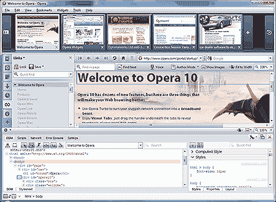

# Opera 10 最终发布

> 原文：<https://www.sitepoint.com/opera-10-final-released/>

经过几个月的 beta 测试， [Opera 10 终于发布了，并且可以下载](http://www.opera.com/download/)。

我们在 6 月份预览了[的新特性](https://www.sitepoint.com/opera-10-new-features/)和[的性能](https://www.sitepoint.com/opera-10-turbo-performance/)，但是你可以期待的主要新增功能是:

*   改进的界面
*   带有页面预览的可重新调整大小的标签栏
*   内嵌拼写检查
*   webmail 集成
*   HTML 电子邮件撰写
*   自动更新
*   故障修复
*   opera Turbo——一种新的代理压缩系统，可以加快慢速互联网连接的速度。

更好的是——他们改进了应用程序徽标*(是时候了！)*

开发人员还可以利用一些新的工具，包括:

*   更好的蜻蜓；Opera 的类似 Firebug 的开发和调试控制台
*   web fonts
*   CSS 中的 HSL(色调、饱和度和亮度)颜色
*   RGB 和 HSL 声明中的 CSS 不透明度
*   使用类似 CSS 的语法选择 JavaScript DOM 元素
*   改进的 SVG 支持
*   基本的 HTML5 支持

我的第一印象很好。Opera 10 很光滑，看起来比竞争对手更好。它的速度和 Chrome 或 Safari 一样快，而且 Firefox 中有许多定制选项和强大的工具。现在还为时尚早，但是我越来越倾向于使用 Opera 作为我的默认浏览器…我建议你亲自尝试一下。

链接:

*   [下载 Opera 10](http://www.opera.com/download/)
*   [Opera 10 新闻稿](http://www.opera.com/press/releases/2009/09/01/)
*   [歌剧网站](http://www.opera.com/)

相关阅读:

*   歌剧能流行起来吗？
*   [Opera 10(第一部分)有什么新内容](https://www.sitepoint.com/opera-10-new-features/)
*   [Opera 10 的新功能(第二部分:表演)](https://www.sitepoint.com/opera-10-turbo-performance/)
*   [为什么 Opera 10 的用户代理气味难闻](https://www.sitepoint.com/opera-10-user-agent/)

## 分享这篇文章