# Google AdSense 的 11 种上下文广告替代方案

> 原文：<https://www.sitepoint.com/alternatives-to-google-adsense/>

毫无疑问，当谈到上下文广告解决方案时，Google AdSense 是房间里 800 磅的大猩猩。然而，问题是，当你不符合使用它的要求，因为某种原因被抛弃，或者只是想尝试不同的东西时，你该怎么办？幸运的是，还有一些其他的选择，我们收集了其中的 11 个，给你一些选择来填充你网站的广告库存。

**[AdBrite](http://www.adbrite.com)** : AdBrite 从标准的上下文广告单元中提供多种广告风格，同时还提供富媒体、内嵌、整页等等。该系统具有最低的支付门槛。它默认为 100 美元付款，但您可以设置低至 5 美元。付款是在 net-60 系统上发出的，即 3 月份的收入在 5 月份支付。

[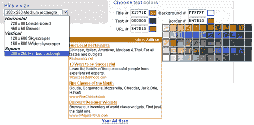](https://blogs.sitepointstatic.com.s3.amazonaws.cimg/lists/contextads/adbrite.gif)

:ad toll 是一个混合广告网络，允许你以自己决定的价格出售网站上的广告空间，并保留 75%的收入。如果你不出售空间，未售出的库存将被“网络运行”广告填满，这是一种按点击付费的解决方案。PayPal 的最低支付额为 20 美元，支票为 40 美元。

[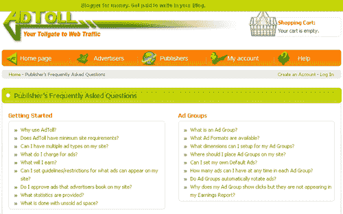](https://blogs.sitepointstatic.com.s3.amazonaws.cimg/lists/contextads/adtoll.png)

:BidVertiser 的工作方式与列表中的其他公司稍有不同，因为广告商直接为你的广告清单竞价。这些广告看起来像普通的上下文广告，所以它们适用于基于 Flash 的网站和内容非常少的网站。最低支出是 10 美元，可以通过支票或贝宝。对他们来说，另一个明显的好处是，他们提供实际的电话号码，让出版商在需要时可以打电话寻求帮助。

[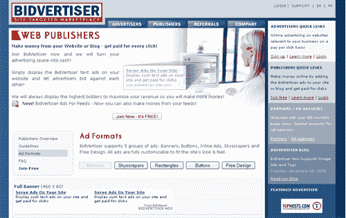](https://blogs.sitepointstatic.com.s3.amazonaws.cimg/lists/contextads/bidvertiser.png)

**[【Chitika】](http://chitika.com)**:大多数广告解决方案的有趣替代方案，因为它只显示给你的搜索流量。Chitika 显示与将用户带到您的网站的术语相关的广告，并向他们展示基于该术语的广告，以及在不离开您的页面的情况下搜索更多术语的选项。广告不会出现在你的常客面前，所以你不必担心用太多的广告轰炸你的常客。最低支付额为 20 美元。

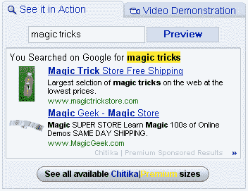

**[点击或](http://clicksor.com)** :点击或提供你所习惯的所有通常的上下文广告尺寸(排行榜、摩天大楼等等)，以及提供内嵌广告、富媒体、图形横幅等等。支付方式因广告风格而异，标准支票或 PayPal 的最低支付额为 50 美元。这个项目每月至少有 150，000 的页面浏览量。 [eTor](http://etor.org/ "download movies")

[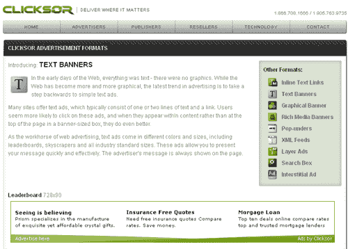](https://blogs.sitepointstatic.com.s3.amazonaws.cimg/lists/contextads/clicksor.png)

**[eClickZ](http://www.eclickz.com/)** : eClickZ 专注于搜索引擎网站和一些内容网站，他们保证他们的广告商有更高质量的流量。如果你的网站合格，你将能够与客户经理交谈，使用免费电话号码给他们打电话，并利用贝宝支付的最低 50 美元的支出。

[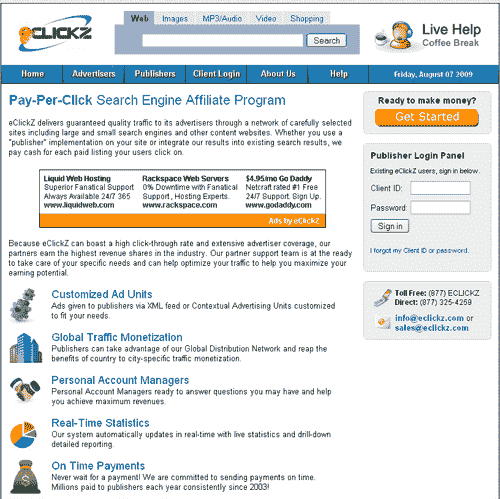](https://blogs.sitepointstatic.com.s3.amazonaws.cimg/lists/contextads/eclickz.png)

Infolinks : Infolinks 专注于文字广告，但也欢迎各种规模和流量的网站，因此几乎没有加入门槛。付款门槛是 100 美元，可以通过贝宝或支票。

[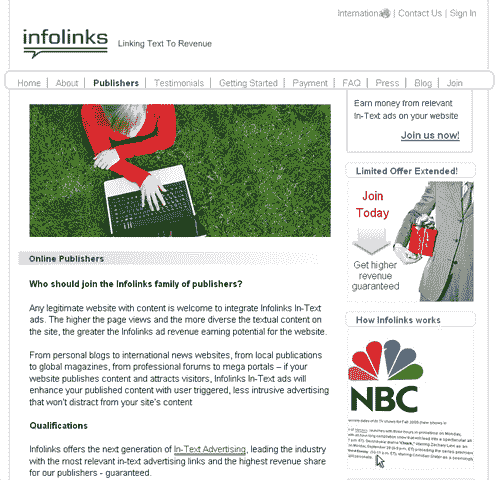](https://blogs.sitepointstatic.com.s3.amazonaws.cimg/lists/contextads/infolinks.png)

**[【Kontera](http://www.kontera.com/)**:Kontera 主要专注于在线上下文广告，并为 Blogger、Drupal、Joomla 和 WordPress 提供插件和一键式支持。这项服务的标准支付门槛是 100 美元，但是根据你网站产生的流量提供可协商的 CPM 费率。参与该系统需要 500 000 次页面浏览。

[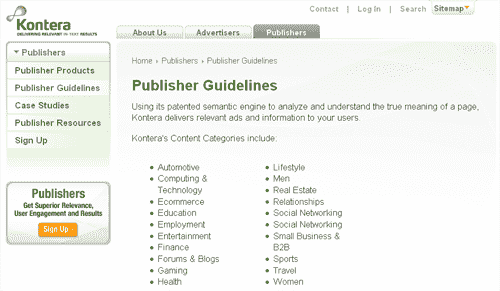](https://blogs.sitepointstatic.com.s3.amazonaws.cimg/lists/contextads/kontera.png)

微软发布中心 :微软的广告解决方案仍被认为是测试版产品，但它功能齐全，你可以通过整理关键词或网址来控制网站上出现的广告。最低支付额为 50 美元。

[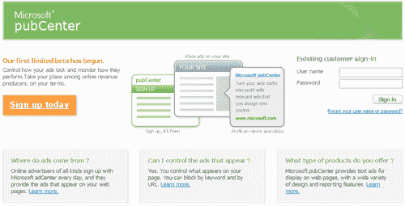](https://blogs.sitepointstatic.com.s3.amazonaws.cimg/lists/contextads/microsoftpubcenter.png)

:widget bucks CPC，CPM 是赚钱的推荐选项，它们都显示在一个你可以放在你网站任何地方的小部件里。贝宝或支票的最低支付额为 50 美元。

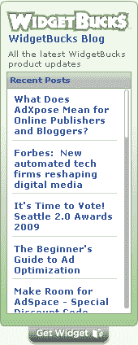

雅虎出版商网络(Yahoo Publisher Network):雅虎出版商网络将为您提供所有标准的上下文广告尺寸，并允许您过滤掉竞争对手的广告。支付系统为您提供了一些额外的支付选项，当您的收入达到 50 美元时，您可以通过 PayPal 申请支付，并在当天收到。当天支付 100 美元的最低直接存款或收入直接转移到您的雅虎！搜索营销帐户。在你提出申请后，打印好的支票需要 7-10 天才能到达。

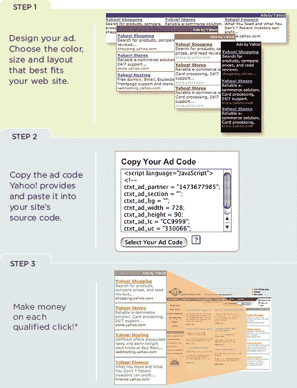

## 分享这篇文章