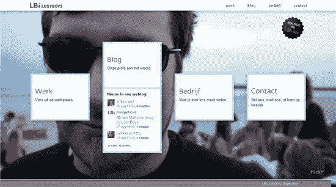
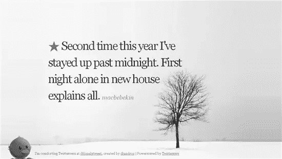
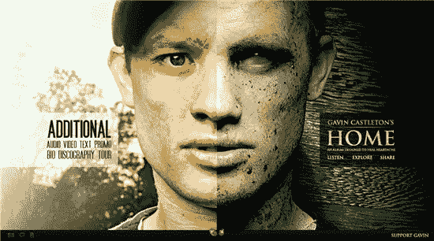
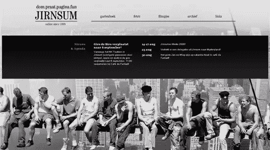
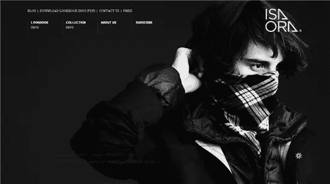
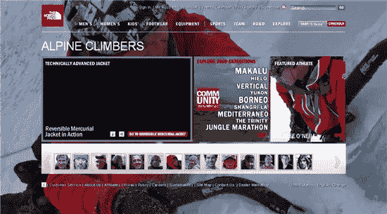
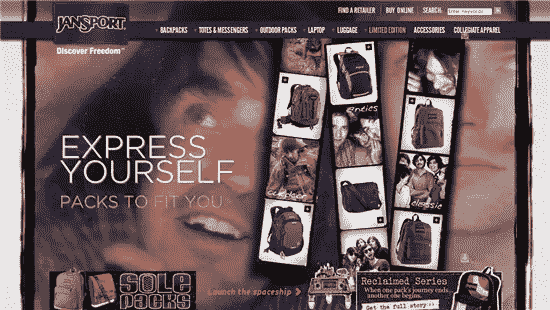
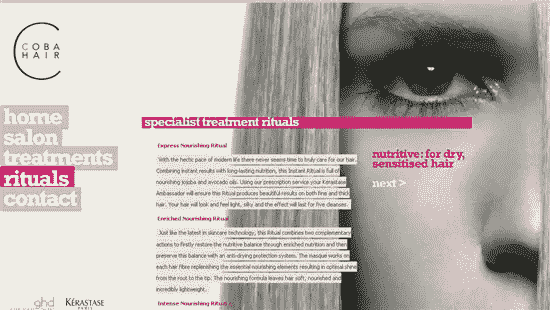
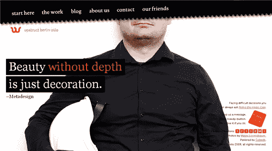
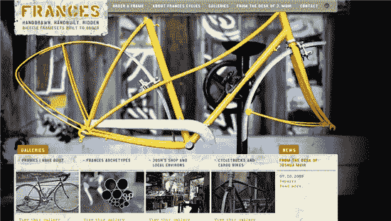

# 关注网页设计中的图片背景

> 原文：<https://www.sitepoint.com/photographic-backgrounds-web-design/>

几年前，使用照片作为背景是勇敢者和那些不太担心让访问者在网站加载时等待的人的专利。现在有了宽带，并且很好地理解了如何在保持质量的同时压缩图像文件的大小，许多网页设计师使用大的照片图像作为他们网站的背景。

和所有的设计一样，这不仅仅是简单地把一些东西放在那里，然后希望得到最好的结果。设计师们正以引人注目和巧妙的方式使用照片。

因为大多数网站的目的是交流信息和想法，所以信息清晰可见是至关重要的。因此，如果你使用深色的摄影背景，你会想要避开使用深色的文字。这听起来当然是显而易见的，但是有时人们对使用漂亮的图片感到兴奋，而忘记了图片上面的信息。

这里要考虑的另一个重要问题是，照片背景必须符合许多屏幕分辨率和显示器尺寸。你需要测试图像在尽可能多的不同浏览器宽度下的外观，这并不总是容易做到的。Chris Coyier 有一个很棒的教程，教你如何用 CSS 处理一个大小可调的背景图片。

下面我挑选的例子展示了我认为是结合了合理设计原则的强烈的创造性倾向。每一个都经过精心考虑。有很多 flash 网站使用这种技术，所以我特意为这篇文章寻找 HTML 和 CSS 构建的网站。所以，事不宜迟，为了给你带来浏览的乐趣和灵感，这里有十个使用照片作为背景的网站。

Lbi 丢失的男孩。这个挺聪明的。每次刷新页面时，都会从 Flickr 中提取一个新的背景图像。

[孤独的呢喃者](http://lonely.prevvy.com/)。如果你刚和某人分手，最好不要看这个。我觉得会让你更郁闷。不过，网站看起来不错。

加文·卡斯尔顿 在他的主页上有一个帅气/僵尸的外观。

Jirnsum 有一个很酷的形象，让人想起著名的纽约建筑工人[路易斯·维克斯·海因](http://www.historyplace.com/unitedstates/childlabor/)的照片。

[伊莎奥拉](http://isaora.com/)，黑白相间看起来刻薄喜怒无常。

北面网站的背景在每一页上都有变化。将鼠标指针悬停在每页左下方的小“I”上，可以看到图像的完整视图。

Jansport 给人一种粗糙肮脏的感觉，背景图像很大。

[Coba Hair](http://www.cobahair.co.uk/rituals.html) 产品使用黑白摄影作为背景。

[Upstruct](http://www.upstruct.com/) ，简单又好玩。

[弗朗西斯手工制作的自行车](http://francescycles.com/)

这是你喜欢的网页设计风格吗？你还见过哪些善用大型摄影背景的网站？

## 分享这篇文章