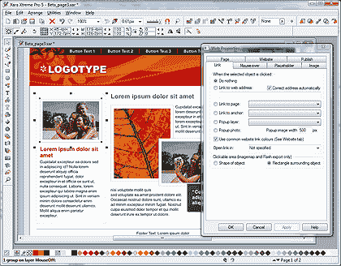

# Xara Xtreme 5 回顾:开发者的视角

> 原文：<https://www.sitepoint.com/xara-xtreme-5-developer-review/>

Xara Xtreme 5 是一个类似 Illustrator 的图形包。我通常会把完整的评论留给 Jennifer，但是 Xara 在这个版本中为 web 开发人员做了一些大胆的声明。请注意，我并不隶属于 Xara，他们没有在 SitePoint 上做广告，Xara 也没有为此评论付费。

## 什么是 Xara Xtreme？

Xara 功能丰富，很难知道它的目标是谁。它主要是一个矢量图形包，但也提供:

*   位图编辑(滤镜、红眼消除和内容感知缩放)
*   3D 图形(拉伸、旋转等。)
*   桌面出版系统
*   Flash 和 GIF 动画
*   网页制作

该产品有两个版本:标准版(89/69/79 美元)和专业版(249/199/299 美元)，后者增加了 PANTONE 颜色支持、全景、PDF 导出和其他一些高级功能。[提供 30 天的试用下载](http://www.xara.com/)。

Xara Xtreme 最显著的特点就是速度。没有很长的加载时间，应用程序始终保持响应。

## 网页制作

Xara Xtreme 不是 Dreamweaver 的替代品，网页与标准 DTP 页面的处理方式几乎相同。首先选择页面大小(提供 640、760 和 955 像素宽度默认值)，然后添加图形和文本对象。流体和弹性设计是不可能的——如果你需要更多或更少的空间，可以通过拖动来调整页面高度。

[ *点击放大*](https://blogs.sitepointstatic.cimg/tech/140-xara-full.png "click to enlarge")

web 特有的主要功能有:

1.  可以定义页面的属性，如文件名、标题和描述。
2.  对象和文本可以应用翻转效果或链接。
3.  图形格式可以在 JPG 和 PNG 之间切换(或者您可以让 Xara 选择合适的类型)。
4.  HTML 代码可以添加到内容框中，例如 YouTube 视频或谷歌地图等小工具。
5.  支持自动 FTP 上传。

HTML 导出需要一次点击来创建一组 [XHTML 1.0 过渡网页——查看示例](https://blogs.sitepointstatic.com/examples/tech/xara/index.html)。

与许多 HTML 导出应用程序不同，Xara 做得很好。文本仍然是 HTML，图形使用得当，代码可以在所有现代浏览器中工作，并且没有可疑的验证错误。不幸的是，转换是通过将每个图形和文本行(不是段落)转换成绝对定位的元素来实现的。翻转也需要 JavaScript，而不是基本的 CSS。

HTML 可以工作，但它不会赢得任何可访问性奖项或增强您的 SEO 活动。然而，对于创建网页原型的业余爱好者或专业设计师来说，这无疑是一个选择。

## 闪光产品

Xara 提供了简单的 Flash 横幅制作——不要指望 ActionScript IDE 或游戏创作工具。Flash 是在固定大小的“动画”模板上创建的。然后，您可以添加带有命名文本和其他对象的单独框架。

Xara 使用动画变换(如移动、缩放、旋转、倾斜和重新着色)补间同名的对象。简单有效。我只希望它不会鼓励重新引入 Flash splash 页面！

[观看示例动画……](https://blogs.sitepointstatic.com/examples/tech/xara/flash.html)

## 摘要

我喜欢 Xara Xtreme。如果你是一个 Adobe 或微软爱好者，这需要一点时间来理解，但 [Xara gallery](http://site.xara.com/gallery/) 提供了一组令人惊叹的照片级矢量图，展示了可以实现的目标。

**优点:**

*   极快的速度
*   处理各种各样的任务
*   一系列出色的工具
*   良好的帮助和[在线操作视频](http://www.xara.com/uk/products/xtreme/tutorials-demos/)
*   XHTML 1.0 过渡页面导出
*   MAGIX Xtreme Photo Designer 是作为额外奖励提供的
*   特价，尤其是与竞争对手相比时

**缺点:**

*   有点笨重和过时的界面
*   最初让 Adobe 和微软用户感到迷惑
*   有些工具，如等高线，可能没有用
*   网页创建设施是有限的
*   对于最终的专业网站，不推荐使用导出的 XHTML 代码

Xara Xtreme 是一个百事通，但它不能被视为矢量图形、位图编辑、3D、DTP、Flash 或网页制作的“大师”。然而，它能够以如此低的价格完成如此多的任务，这一事实使得它对小公司和自由开发者来说是一个有吸引力的提议。

Xara Xtreme 可以从 Xara.com 下载和购买。

## 分享这篇文章