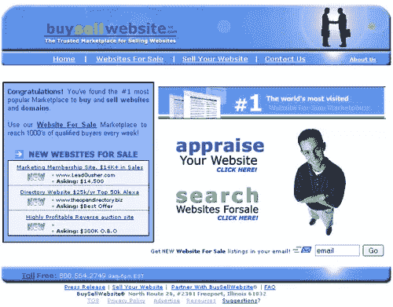
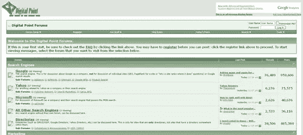
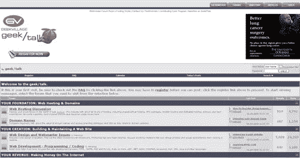
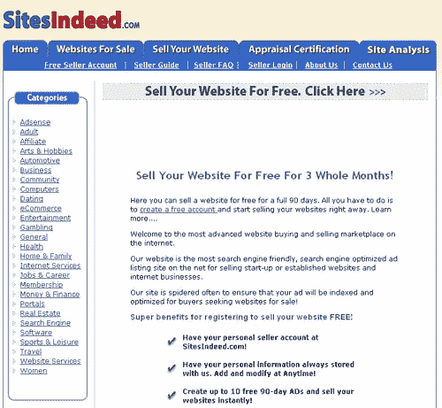
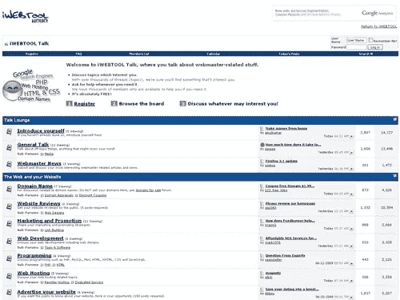
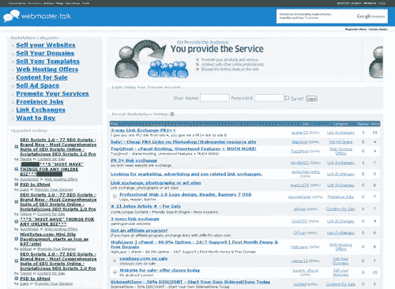

# 销售网站的 10 个地方

> 原文：<https://www.sitepoint.com/10-places-to-sell-your-web-site/>

总有一天，我们都有一个网站的想法，我们建立了它，然后…我们从来没有时间去做它。也有一个时候，你意识到你不再有曾经的激情，而不是让它死去，你想为你曾经热爱的网站找到一个新的守护者。那么，当这些情况发生时，你会怎么做呢？

好吧，现在是你考虑卖掉它的时候了——但接下来的问题是去哪里做。我们为你收集了十个最佳选择。

**[Flippa.com](http://www.flippa.com/?buy_sell=SP)**是最原始也是最大的。作为一个市场，它们使买家和卖家能够买卖网站、博客、电子商务商店和其他数字财产。用起来很简单。卖家可以先给自己的站点估值([在这里给你的站点估值](https://flippa.com/online-business-valuation?buy_sell=SP))然后再卖。Flippa 的突出之处在于买家数量、待售资产数量以及易用性。Flippa 每分钟都会签下一个新买家！网站、商店和数字财产在所有价格范围内出售。它适合那些刚刚起步并寻求创建新企业的人，以及那些寻求购买和投资高价值创收资产的人。

BuySellWebsite.com:BuySellWebsite 专门经营已建立的和刚建立的网站。已建立的网站两周的列表费用为 59 美元，两个月的列表费用为 99 美元(有一个月的免费延期，总共三个月)，包括在首页上展示。初创网站的费用相同，但不包括首页特色。

:一个为所有类型的网络开发提供服务的论坛，只要你成为会员至少 14 天，没有亏损的名声，并且在他们的论坛上至少有 25 个帖子，你就可以发布一个待售网站。

**GeekVillage.com 论坛**:要在 GeekVillage.com 论坛上列出你的网站，每个主题要花费 9.95 美元，而且你必须是论坛的会员。

InternetCompanyForSale.com:这个网站对通过他们公司进行的销售不收取佣金，但是他们会根据你想要销售的网站类型收取一次性的刊登费。已建立的网站支付 59.95 美元的“先列表后销售”。初创网站将花费你 39.95 美元，而一个永久的特色列表，无论是已建立的网站还是初创网站，都将花费你 99 美元，并将让你出现在他们的双周刊上。

SiteIndeed.com:site indeed 免费提供最长 90 天的基本刊登广告，但如果你想延长刊登时间，他们会根据你选择的天数收取费用。该网站还提供特色列表，根据您希望列出的天数，付费为您的网站提供更突出的显示。

Talk.iWebTool.com:一个致力于开发你自己的网站和域名的论坛。它还有一个活跃的销售区，出售域名、网站、脚本等。

Webmaster-Talk.com 市场:一个普通的销售网站，你可以做任何事情，从推广你的服务到销售你已经建立的网站。一般刊登费用是免费的，但促销等服务将花费您在网站上购买的信用点数。有了拍卖，你可以选择在主页上突出它，突出它，等等。，而这些服务每个都要花你几块钱。

哪个网站是你出售多余网站的最爱？

## 分享这篇文章