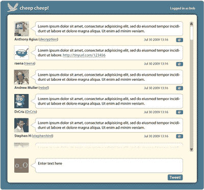
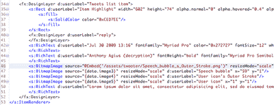
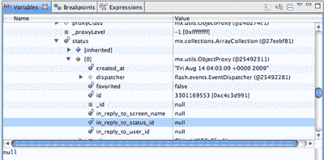

# 使用 Flex 在 Twitter 上共享媒体，第一部分:基础知识

> 原文：<https://www.sitepoint.com/share-media-flex-twitter/>

每个人都在叽叽喳喳！在这一系列文章中，我们将研究如何使用 Adobe 的 Flash Builder 4 的新测试版、Flash Catalyst 测试版和 PHP 为 Twitter 构建一个有吸引力的、实用的 Flash 前端。我们将从基本功能开始，后面的部分将处理与您的朋友共享图像。

要继续阅读本系列，您需要:

*   本文的代码档案:[在这里下载](https://i2.sitepoint.com/examples/flextwitter/flextwitter.zip)
*   Photoshop 或 Illustrator，如果你想创建自己的设计
*   Flash Catalyst beta，[可从 Adobe 实验室获得](https://www.sitepoint.com/blog/)
*   Flash Builder，也可从 Adobe 实验室获得
*   phptwitterlib 库，[可从 GitHub 上的项目页面获得](http://jdp.github.com/twitterlibphp/)
*   一个可以使用 PHP 的 web 主机，配置为支持 [curl](http://au2.php.net/curl) (curl 是 phptwitterlib 的 API 调用所必需的)

在本文中，我们将假设您已经花了一些时间在 Flash Catalyst 上，并熟悉它的工作原理——我们将在本文中使用的技术在 [Flash Catalyst:样机到杰作，第一部分](https://www.sitepoint.com/article/flash-catalyst-flash-builder/)和[第二部分中有所介绍。](https://www.sitepoint.com/article/flash-catalyst-flash-builder-2/)

**注:非常感谢 SitePoint 的 [Raena Jackson Armitage](https://www.sitepoint.com/blog/) 帮助编写本教程的 PHP 部分。**

##### 转换界面

我们已经要求设计师为我们创建应用程序的界面，我们收到了一个 PSD。结果是这样的:

 *我们的样机([在新窗口查看大图。](https://i2.sitepoint.com/graphics/1746_mockup.png) )*

您可以在名为 PSD 的文件夹中的[代码档案](https://i2.sitepoint.com/examples/flextwitter/flextwitter.zip)中找到这个文件。

将这样的设计转换成 Flex 项目的最快方法是使用 Flash Catalyst。Catalyst 是 Adobe 的新交互设计工具，最近作为公开测试版发布。我们的应用程序界面是由我们的设计师在 Photoshop 中创建的，导入到 Flash Catalyst 中，并转换为 Flex 项目。Flash Catalyst 会保留原始 Photoshop 文件中的大部分元素，以便可以在 Photoshop 中重新打开，供以后调整。

虽然 Catalyst 足够稳定，可以使用，但重要的是要记住，它是测试版软件，其功能集是不完整的；这就是为什么最好在 Illustrator 或 Photoshop 中完成大部分设计工作，那里有最合适的工具。

我们的 Twitter 应用程序的界面很简单:它的主要组件是一个 Twitter 帖子的滚动列表和一个用于提交用户帖子的表单中的文本输入字段。

我们将使用 Catalyst 中的**Convert Artwork to Component**工具将滚动条设计转换为垂直滚动条组件。我发现 Catalyst 的箭头有点问题，所以我不得不调整它的设计，使向上和向下按钮位于滚动条的轨道之外。这很容易做到；只需抓住箭头并将其移出。

接下来，我们将处理推文列表——我们将删除除第一条推文之外的所有推文，因为 Catalyst 只需要一条来确定每一行应该是什么样子。然后，选择数据列表设计中的第一行和垂直滚动条，并将它们转换为数据列表组件。在设计的底部，我们将把表单元素转换成文本输入和按钮组件。

然而，我们的设计中缺少一个元素:我们需要为登录屏幕创建一个状态。为此，我们将复制 UI 的整个设计，删除 tweets 和 posting 表单列表，并用一个登录表单替换它们。使用 Catalyst 的工具很容易画出这些。这两种状态应该有名字，以便在代码中容易区分它们；我把我的叫做`twitterLogin`和`twitterDisplay`。

我们可以通过向时间轴添加动画来定义 Flash 如何显示这两种状态之间的变化。让我们在用户提交登录表单后添加一个交叉淡入淡出效果。我们可以在位于设计画布下方的**时间线**区域完成这项工作。

这就是我们在 Catalyst 中需要做的一切。将您的 Catalyst 工作保存为 Flex 项目，并为自己泡一杯茶。我们新转换的文件版本在您的代码归档中，名为 named cheepcheep _ flashbuilder.fxp。

下一步是准备我们的 PHP 代理。

##### 构建 PHP 代理

我们的 Twitter 工具需要能够与 Twitter 通信，以便发送和接收推文。但是，Flash Player 的安全模型阻止 Flash 文件从另一个域访问数据；也就是说，托管在 www.example.com 页面上的 Flash 电影无法从 www.example.net–*检索数据，除非该域通过一个名为跨域策略文件的文件明确授予*权限。[你可以在 Adobe 这里阅读更多关于跨域政策文件的信息。](http://www.adobe.com/devnet/flashplayer/articles/cross_domain_policy.html)

查看 [Twitter 的跨域策略文件](http://twitter.com/crossdomain.xml)，我们可以看到它只会接受来自 twitter.com 托管的 Flash 电影的调用:

```
 <?xml version="1.0" encoding="UTF-8"?> 
<cross-domain-policy 
  xsi:noNamespaceSchemaLocation="http://www.adobe.com/xml/schemas/PolicyFile.xsd"> 
  <allow-access-from domain="twitter.com"/> 
  <allow-access-from domain="api.twitter.com"/> 
  <allow-access-from domain="search.twitter.com"/> 
  <allow-access-from domain="static.twitter.com"/> 
  <site-control permitted-cross-domain-policies="master-only"/> 
  <allow-http-request-headers-from 
     domain="*.twitter.com" headers="*" secure="true"/> 
</cross-domain-policy>
```

这意味着任何托管在其他地方的 Flash 电影——比如我们的网站——都无法检索数据。

相反，我们将创建一个基于 PHP 的代理在我们自己的服务器上运行。我们将设置它接受来自 Flash 电影的`POST`请求，将它们发送到 Twitter，然后将 Twitter 的响应传递回 Flash 电影。

我们*可以*写一个完整的 Twitter API 套件，但是为什么要重新发明轮子呢？Twitter 的 API Wiki 列出了一些我们可以使用的预建库。在这个例子中，我们将包含 twitterlibphp 库来构成我们代理的基础。里面的类`Twitter`包含了每一个可以想到的 Twitter 动作的函数，比如更新你的位置或者关注新的人——关于 Twitter 的 API 方法的完整列表，参见 Twitter 的 API wiki 上的 API 文档[。我们的应用程序目前相当简单，但我们希望确保我们有能力在未来发展，所以 twitterlibphp 是一个不错的选择。](http://apiwiki.twitter.com/Twitter-API-Documentation)

首先，我们需要在脚本中包含 twitterlibphp 库:

```
require("twitter.lib.php");
```

目前，Flash 电影只发送更新和检索用户的朋友的时间线，所以我们可以期待收到用户名，密码，可能还有一条消息。我们希望从 Flash 应用程序中获得第四个变量，它将定义我们希望执行的操作类型。

因为我们希望 Flash 电影使用`POST`来发送我们需要的数据，我们可能会收到一些不需要的反斜杠()；当您的 PHP 副本中配置了`magic_quotes_gpc`时，就会发生这种情况。神奇的引号现在在 PHP 中被否决了，但是仍然有很多 web 主机打开了它们，所以当你接受`POST`提交时，检查一下这个配置总是值得的。下面是一个简单的函数，用于在启用魔术引号的情况下去掉斜线:

```
function tidyslashes($text) {  
  if (get_magic_quotes_gpc()) {  
    $cleantext = stripslashes($text);  
  }  
  else {  
    $cleantext = $text;  
  }  
  return $cleantext;  
}
```

我们将使用该函数来清理我们期望收到的与 tweet 相关的变量，这些变量被声明为全局变量:

```
$username = tidyslashes($_POST['username']);  
$password = tidyslashes($_POST['password']);  
$message = tidyslashes($_POST['message']);
```

我们还需要三个功能——一个用于更新，一个用于检索用户朋友的推文，一个用于查看公共时间表。每个功能都相当相似；我们现在只看一个。下面是`update`函数:

```
function update() {  
  global $username, $password, $message;  
  $twitter = new Twitter($username, $password);  
  $update = $twitter->updateStatus($message);  
  print_r($update);  
}
```

这里发生了什么事？首先，我们获取`username`、`password`和`message`变量。接下来，我们从 twitterlibphp 指定一个新的`Twitter`类实例，传递用户名和密码。第三，我们将变量`update`指定为`Twitter`类'`updateStatus`函数的结果，并简单地打印出`result`，它将是 XML 格式的。

此外，我们将从 Flash 电影中接收一个名为`type`的变量，告诉我们想要执行哪个动作。我们将使用一个`switch`语句来执行适当的函数。如果没有指定类型，或者说除了`update`、`friends`或`public`之外的任何内容，脚本将会终止，并显示一条消息:

```
switch($_POST['type']) {  
  case 'update':  
     update();  
     break;  
  case 'public':  
     getpublictimeline();  
     break;  
  case 'friends':  
     getfriends();  
     break;  
  default:  
     die("died: not called properly");  
     break;  
}
```

你可以在这里查看完整的脚本，在代码文档中也有一份拷贝。

将完成的脚本和 twitter.lib.php 一起复制到一个 web 服务器，并记下 URL 以备后用——我们需要告诉我们的 Flash 应用程序它的位置。如果您下载了我们的脚本版本，您会发现一个非常基本的表单，可以用来测试您的代理的更新功能。如果一切顺利，您应该能够使用该表单发布到 Twitter 帐户！

如果您的 web 服务器没有在本地运行，您的下一步是在 web 服务器上包含一个跨域策略文件，以便以后更容易运行应用程序。下面是一个允许从任何地方访问的许可示例策略文件:

```
<?xml version="1.0"?>  
<!DOCTYPE cross-domain-policy  
SYSTEM "http://www.macromedia.com/xml/dtds/cross-domain-policy.dtd">  
<cross-domain-policy>  
  <site-control permitted-cross-domain-policies="all" />  
  <allow-access-from domain="*" />  
  <allow-http-request-headers-from domain="*" headers="*" secure="false"/>  
</cross-domain-policy>
```

您需要将该文件上传到您的域的根目录，并将其命名为 crossdomain.xml。

现在我们已经准备好了这个代理，我们可以开始向我们的 Flash 项目添加功能并开始测试。

##### 在 Flash Builder 中编写应用程序

在 Flash Builder 的 Flex 项目中，从项目的 **src** 目录的默认包文件夹中打开 **Main.mxml** 。这是应用程序的根，用绿色箭头和蓝色圆点符号表示；这意味着这个文件的根元素包含一个`Application`标签，编译器将把它作为项目的根文件。

在代码底部，您会看到一个`List`标签，这是您在 Flash Catalyst 中创建的数据列表。目前，它包含 Catalyst 在一个`ArrayCollection`中插入的虚拟数据，我们需要对其进行调整。查看这些数据的每一行，您会看到所使用的每张图片都有相应的值。其中只有一个稍后会是动态的，那就是 Twitter 用户的个人资料图片。其他的是接口的一部分，是静态的。

打开 components 文件夹，您会看到其中一个组件名为**repeated item 1 . mxml**——在该文件中，您会在代码底部找到许多`BitmapImage`标记。在 this 和 **Main.mxml** 之间切换，分别从重复列表数据的第一行复制粘贴`image2`、`image3`、`image4`、`image5`的图像位置值，覆盖前四个`BitmapImage`标签的 source 属性。

 *替换位图图像([在新窗口中查看大图。](https://i2.sitepoint.com/graphics/1746_screenshot1.png) )*

接下来，我们需要修改包含登录表单元素的定制组件。从组件目录中定位并打开 **CustomComponent1.mxml** ，找到`richtext1` `RichText`组件。这是我们将要显示的登录错误消息，所以在这里，我们需要将这个组件的`visible`属性设置为 false——当登录尝试失败时，可以打开它。

我们还希望确保密码字段的行为符合预期，显示星号而不是字符，因此我们将向该字段添加一个属性。寻找`textinput0 TextInput`组件；我们将添加一个值为`true`的`displayAsPassword`属性。Catalyst 将这个组件代码顶部的`Script`块放在那里，以便在用户登录时切换到列表状态。现在，只要用户点击**登录**按钮，这个函数就会被调用。但是，如果用户的登录是正确的，我们只想显示该状态，所以我们需要修改这里的代码。

`Script`块中的函数通过调用路径`mx.core.FlexGlobals.topLevelApplication`来引用 **Main.mxml** 。剩下的代码将应用程序的可视状态更改为名为`twitterDisplay`的状态——这是我们的 tweets 列表的状态。我们将在应用程序的另一部分进行状态切换，而不是在这里。当用户登录和密码输入到表单中时，我们将使用路径将该文件中的变量值设置为用户登录和密码的详细信息；然后调用一个函数，通过我们的 PHP 代理从 Twitter 获取用户朋友的时间线数据。为此，我们将在现有函数中添加以下代码行:

`mx.core.FlexGlobals.topLevelApplication.userLogin=textinput4.text;  
mx.core.FlexGlobals.topLevelApplication.userPassword=textinput0.text;  
mx.core.FlexGlobals.topLevelApplication.fetchFriendsTimeline();`

前两个获取表单中两个输入字段的文本值，并将这些值设置为 **Main.mxml** 中的变量，而第三行调用一个我们将编写的函数来调用 PHP 代理。切换回 **Main.mxml** ，我们将在代码顶部添加一个`Script`块:

`<fx:Script>  
 <![CDATA[  
 ]]>  
</fx:Script>`

`CDATA`注释是必要的，这样编译器就知道脚本块的内容不应该作为 XML 来评估。在这些标签中，我们将创建一个`ArrayCollection`来存储从 PHP 代理返回的数据并填充数据列表。我们添加了`Bindable`编译器指令，这样这三个变量将在应用程序运行期间广播它们值的任何变化。我们还将添加另一个变量`twitterCallType`，稍后用作函数中处理 Twitter 结果的开关:

```
import mx.collections.ArrayCollection;   
private var twitterCallType:String;   
[Bindable] private var twitterAC:ArrayCollection;   
[Bindable] public var userLogin:String;   
[Bindable] public var userPassword:String; 
```

我们将向代码底部的`List`标签添加一个`dataProvider`属性，并将其设置为`ArrayCollection`，通过用花括号将其括起来，将其绑定到该变量。到目前为止，我们已经从 Catalyst 创建的列表中删除了`ArrayCollection`。在这个例子中，我们使用了 XML 风格的自结束元素——这就是为什么没有结束的`List`标签:

```
<s:List x="99" y="124" skinClass="components.DataList1"   
  d:userLabel="Data List"   
  visible.twitterLogin="false"   
  id="list1" dataProvider="{twitterAC}" />
```

接下来，我们将添加对 PHP 代理的调用。

##### 连接到数据服务

接下来我们将添加一个`HTTPService`标签来调用 PHP 代理。首先，我们创建标签的实例，定义它的属性，然后像我们在应用程序中做的那样，从事件或函数中调用它。

Flex 4 要求服务标签嵌套在新的`Declarations`标签中。我们的 PHP 代理被构建成通过`POST`方法接收调用，所以我们将把那个属性和代理的 URL 一起添加到`HTTPService`标签中。我们用`id`属性命名实例。当您使用标记的 result 事件调用函数时，Flash Builder 将提示您在将 result 添加到标记时构建一个基本函数。将`showBusyCursor`属性添加到标签中，这将告诉用户我们正在等待服务器的响应:

```
<fx:Declarations>    
<mx:HTTPService id="twitterService" method="POST" url="http://localhost/twitterapp/twittery.php" result="httpservice1_resultHandler(event)" showBusyCursor="true"/>    
</fx:Declarations>
```

需要构建登录表单之前调用的那个`fetchFriendsTimeline`函数。该函数将被定义为 public，以便应用程序中的其他组件可以使用它。在该函数中，调用`HTTPService`实例的 send 方法，使用一个对象传递 PHP 代理所需的参数。使用花括号，我们将为每个参数创建一个逗号分隔的名称/值对列表。

还记得我们在 PHP 脚本中创建的变量吗？我们现在就用这些。在这种情况下，我们需要发送`username`和`password`，它们是我们从登录表单中收到的详细信息，以及一个调用的`type`:此时，它可能包含一个值`update`或`friends`:

```
public function fetchFriendsTimeline():void {    
  twitterService.send({username:userLogin,password:userPassword,type:"friends"});    
  twitterCallType = "friends";    
}
```

当我们将结果事件添加到`HTTPService`标签时，Twitter API 调用的结果由 Flash Builder 创建的函数处理。这目前是空的，所以我们现在需要添加逻辑。请注意，`httpservice1_resulthandler`函数有一个类型为 ResultEvent 的事件参数:当 Flash Builder 添加该函数时，创建了该类的导入语句。我们已经编写了条件逻辑来测试`twitterCallType`的值；如果`HTTPService`调用的值是`friends`，我们将处理它的结果。

##### 调试数据结果

在这个阶段，PHP 代理调用返回的结果的结构是未知的，所以我们将在编写这个函数的其余部分之前检查它。这里，我们将在代码中设置一个断点并调试应用程序。我们将在初始化`twitterAC`的那一行，在`httpservice1_resulthandler`中插入断点:

```
protected function httpservice1_resultHandler(event:ResultEvent):void {    
  if (twitterCallType == "friends") {    
    twitterAC = new ArrayCollection();    
  }    
}
```

双击我们已经初始化的`twitterAC`旁边的行号来设置断点，并通过单击**调试**按钮来运行应用程序——这是工具栏上带有类似 bug 图标的按钮。

现在运行代码:如果一切顺利，我们应该通过 PHP 代理收到 Twitter 的响应，应用程序将在断点处暂停，Flash Builder 将提示您切换回 Flash Builder 并进入调试透视图。这是一组不同的面板或视图，包括位于 Flash Builder 右上角的选项卡中的**变量**视图。双击**变量**选项卡将其展开，您会看到`event`列在那里。展开它，然后展开默认的`result`属性:在这里你会看到 Twitter 返回了一个`statuses`属性。

 *图 3:调试器透视图的一部分([在新窗口中查看大图。](https://i2.sitepoint.com/graphics/1746_debugger.png) )*

这原本是一个 XML 响应，`HTTPService`标签已经自动为您解释成一个本地对象。其中一个状态属性是名为`status`的`ArrayCollection`，其中的每一项都代表一篇 Twitter 帖子。每个帖子都包含帖子本身的信息，嵌套的`user`属性包含关于生成帖子的 Twitter 用户的详细信息。

我们将使用这些变量中的一些来填充我们的 tweet 列表中的项目，其中包含用户的屏幕名称、真实姓名、tweet 的文本以及 tweet 的日期和时间。通常情况下，您需要记下它们在数据结构中的位置。我们正在寻找名为`name`、`screenName`、`profile_image_url`、`text`和`created_at`的变量。如果你看到它们，那太好了——这意味着你已经成功地从 Twitter 上检索到了你朋友的时间表！

再次双击变量选项卡，将 Flash Builder 恢复到原来的状态。通过点击**终止**按钮退出调试会话，该按钮是 Flash Builder 顶部的一个红色方块(类似于 DVD 遥控器的停止按钮)。完成后，请务必退出 Flash Builder 调试会话，否则您会发现浏览器被锁定。

我们还需要调试如果用户输入不正确的用户名和密码会发生什么。再次开始调试，这一次，使用您知道是错误的登录详细信息。您应该通过 debug 透视图中的 **Values** 面板看到返回的数据有很大不同——与成功登录时收到的状态更新集合不同，我们现在可以看到一个`event.result.hash.error`属性。

我们现在可以退出调试器了。我们还可以通过双击行号来删除 Flash Builder 中的断点。

##### 用结果填充应用程序

了解了 Twitter 的响应之后，我们现在将使用这些数据来填充我们之前创建的`twitterAC` `ArrayCollection`。`ArrayCollections`是一种包装类，它将数组公开为具有额外方法和属性的对象集合。`ArrayCollections`的一个很好的特性是它们可以被用作组件的数据提供者，并且能够广播组件内容的变化。

首先，我们需要给`httpservice1_resultHandler`函数添加一些逻辑来处理不正确的 Twitter 登录。我们将检查是否有一个`event.result.hash`属性；如果是，我们将显示一个错误，否则，我们将处理数据并显示列表。我们用测试`if (!event.result.hash)`包围函数中的所有代码，用`else`条件显示错误。

在`if`语句的第一部分，我们嵌套了另一个测试来检查当前状态。如果它的值是`twitterLogin`，我们将把状态换成`twitterDisplay`。

接下来，我们对嵌套在结果中的状态`ArrayCollection`进行循环。在每次迭代中，我们从数据列表重复项中要使用的值创建一个对象，使用数组和点符号的混合指向这些值。然后使用`addItem`方法将每个对象推入`twitterAC`T2。

让我们看看完整的功能:

`protected function httpservice1_resultHandler(event:ResultEvent):void    
 {    
   if ( !event.result.hash ) {    
     if (currentState == "twitterLogin") {    
       currentState = "twitterDisplay";    
         }    
     if (twitterCallType == "friends") {    
       twitterAC = new ArrayCollection();    
       var resultsLen:Number = event.result.statuses.status.length;    
       for (var i:Number=0;i<resultsLen;i++) {    
twitterAC.addItem({userName:event.result.statuses.status[i]. user.name,    
screenName:event.result.statuses.status[i].user.screen_name,    
profileImage:event.result.statuses.status[i].user.profile_image_url,    
tweetText:event.result.statuses.status[i].text,    
tweetDate:dateFormatter.format(new Date(event.result.statuses.status[i].created_at))});    
         }    
     } else {    
         fetchFriendsTimeline();    
         }    
   } else {    
     customcomponent11.richtext1.visible = true;    
     }    
 }`

我们使用了一个 Flex 标签来格式化从通过 PHP 代理从 Twitter 接收的 XML 文件中提取的`created_at`变量。`DateFormatter`标签的`formatString`属性允许我们创建一个类似于我们的设计师在 Photoshop 文件中提供的日期字符串。查看我们在`httpservice1_resultHandler`函数中创建的数据对象中的最后一个值，您会看到日期格式化程序正在运行:

```
<mx:DateFormatter id="dateFormatter" formatString="MMM DD YYYY H:NN"/>	
```

该日期字符串区分大小写，因此日期和时间值必须是大写字母。

当您添加`DateFormatter`时，Flash Builder 将为您在 MX 标签集合的`Application`标签中添加一个额外的名称空间。

##### 显示结果

`twitterAC ArrayCollection`被绑定到列表组件的`dataProvider`属性。当`ArrayCollection`被重新填充时，它将广播它的值已经改变并导致列表刷新。然后它将在`dataProvider`上循环，将每次迭代的值传递给`RepeatedItem`组件。该组件每次都会在名为`data`的默认对象中接收值。我们需要将`data`的属性赋给它们各自的组件进行显示。

再次打开`RepeatedItem`组件，看看用于显示文本的各种`RichText`组件；默认值被分配给这些组件的文本属性，使用花括号进行绑定。我们将用每次在`httpservice1_resultHandler`函数中循环结果数据时创建的对象的属性来替换这些值。

浏览这些组件，用`{data.tweetDate}`替换文本值`{data.text2}`，用`{data.userName}` `({data.screenName})`替换`{data.text3}`，用`{data.tweetText}`替换`{data.text4}`。

Catalyst 为我们创建的代码 Flash 有一个小问题:Catalyst 添加来显示重复项目中的图像的`BitmapImage`标签无法接受数据绑定作为其源的值。用户图标需要显示动态信息，所以我们需要将它改为一个`Image`标签。回到 RepeatedItem1.mxml，查找这组图像，并将用户图标`BitmapImage`替换为`Image`，如下所示:

```
<mx:Image source="{data.profileImage}"     
  x="1" y="1" width="51" height="51"/> 
```

##### 更新用户状态

在 Twitter 上发布状态非常简单。我们在开始时从用户那里收到的用户名和密码再次需要调用 PHP 代理的`update`函数，这一次我们还需要发送来自 tweet 发布区域的文本值作为我们消息的文本。为此，我们可以重用用来获取朋友时间表的标签`HTTPService`，调用`update`而不是`friends`。

再看一下`httpservice1_resultHandler`函数，你会发现它会被一个`else`函数捕获，这个函数会再次调用`fetchFriendsTimeline`。更新后的好友列表还会显示我们的新状态:

```
public function postStatus():void {     
  twitterService.send({username:userLogin,password:userPassword,message:textinput1.text,type:"update"});     
  twitterCallType = "update";     
}
```

##### 结论

到目前为止，我们已经创建了一个简单的应用程序，可以阅读和发布推文。一些简单的 Twitter 功能，比如回复和直接消息，现在已经没有了；我们将在本系列的后面讨论这些，然后添加一些漂亮的图像上传和图像处理特性。

应用程序没有在本地或安全地存储用户名和密码这一事实可能是未来讨论的一个好话题；为了简洁起见，我们现在选择跳过这一步，读者可以把它当作一个练习。理想情况下，您的 PHP 代理还应该包含一些逻辑来确定请求是否实际上是从 Flash 电影接收的，如果请求来自其他地方，则失败。

现在，保存您的工作，放松一下——我们将在第 2 部分再见！

注意:记得[获取本文的代码档案](https://i2.sitepoint.com/examples/flextwitter/flextwitter.zip)，这样您就可以在家里做更多的实验。

感觉自信吗？[在我们由 Adobe 赞助的测验中，测试您今天在这里学到的知识。](https://www.sitepoint.com/quiz/adobe/share-media-flex-twitter)

## 分享这篇文章