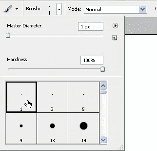
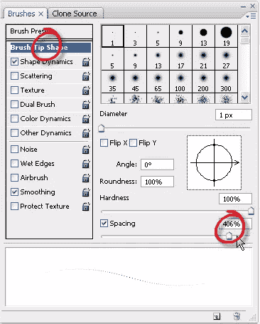
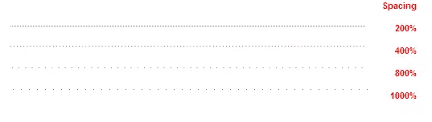
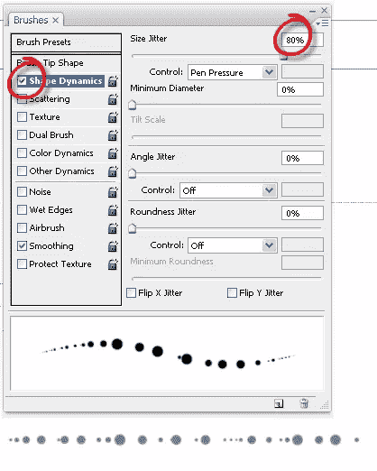
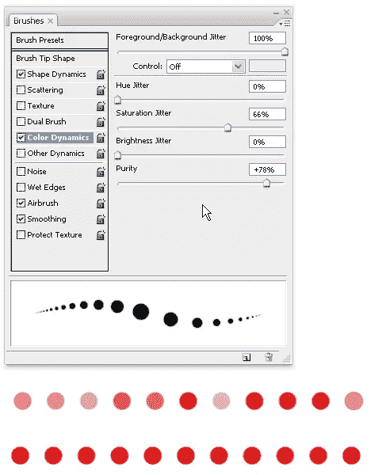

# 如何从一个简单的 Photoshop 笔刷中获得更多

> 原文：<https://www.sitepoint.com/photoshop-brush-palette/>

如你所知，Photoshop 安装了许多笔刷，还有成千上万各种形状和大小的笔刷可供下载。然而，如果你仔细观察画笔调色板，你会发现即使是最简单的画笔，乍一看可能不太令人兴奋，也可以通过变化来创建一些非常好的效果。这里有一些在笔刷面板中改变选项的技巧。

**1。制作一个虚线**
要制作一个漂亮的虚线笔刷，从工具选项栏的笔刷下拉菜单中选择一个小的笔刷尖端。我选择了一个硬度设置为 100%的单像素笔尖。

当你在默认状态下使用这个笔刷绘制时，它看起来是这样的:

如果它还没有打开，你可以通过选择窗口>笔刷或者点击 F5 来打开笔刷面板。

点击单词画笔笔尖形状，你会看到一些新的选项。在调色板的底部，如果您希望点看起来非常接近，请将间距增加到 400%左右；如果您希望点之间有很大的间距，请将间距增加到 800%。在小的预览窗口中，你会看到笔刷笔划的变化。

当你用画笔画画时，效果就产生了。按住 Shift 键获得一条直线。

**2。改变圆点的大小**
你可以通过改变笔刷的形状来改变圆点的大小。这次我用的是 13 号的硬毛刷头。点击笔刷面板上的形状动态，然后增加面板顶部的尺寸抖动。你会得到看起来有点像这样的东西:

**3。改变画笔描边的颜色**
点击画笔调色板中的颜色动态。前景/背景抖动和控制指定绘画如何在前景色和背景色之间变化。在下面的例子中，我将抖动设置为 100%。第一条虚线的纯度为 0%，其下方的一条虚线的纯度约为 80%。纯度增加或减少颜色的饱和度。

这是真正的冰山一角，当谈到画笔调色板。有滑块拖动，复选框检查和下拉菜单选择。你会发现你可以用最简单的笔刷创造出许多很酷的效果。

 **你有什么画笔调色盘的小技巧可以分享吗，我很想听听。** 

## **分享这篇文章**