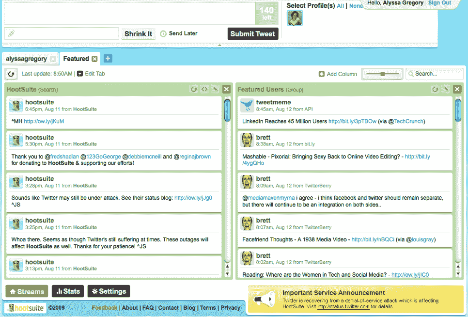
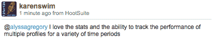

# HootSuite 2.0:专业的 Twitter 客户端

> 原文：<https://www.sitepoint.com/hootsuite-business-twitter-client/>

我最近跳进了 [HootSuite 2.0](http://hootsuite.com/upgrade) 进行试驾，所以我可以在这里分享一篇内部评论。我不隶属于 HootSuite，他们也不是 SitePoint 的广告客户。我认为这可能是一个有价值的工具，尤其是对那些使用 Twitter 做生意的人来说。

## 注册和升级

我以前没有帐户，但我可以通过标准的注册过程在两分钟内创建我的帐户。然后，为了升级到新发布的 beta 2.0，我不得不发推文描述我为什么要升级。轻松点。我在推特上写道:

可以报名 [HootSuite，免费升级到 2.0](http://hootsuite.com/upgrade) 。也有一些 [HootSuite 视频教程](http://www.youtube.com/watch?v=NXpYVTnyCjU)可以帮助你开始。

## 看起来

HootSuite 仪表板与 TweetDeck 有一些相似之处，尽管它是一个基于网络的工具，所以没有本地安装。从仪表板中，您可以将组按列排序，添加选项卡，切换用户帐户，以及拖放以重新组织。这是仪表板布局的外观:

## 标准功能概述

在探索了一会儿之后，我可以诚实地说这是一个功能丰富的 Twitter 工具。一些标准功能(出现在以前的版本中)包括:

*   多档案管理:添加和管理多个 Twitter 账户。
*   多用户功能:通过识别“管理”和“编辑”贡献者来管理多个贡献者的帐户。
*   Ow.ly 社交吧:分享、收藏和跟踪你的推文链接。
*   平。FM 整合:更新脸书、WordPress、MySpace、LinkedIn 等。就在胡特苏特。
*   RSS:将你的 RSS 直接放入你的 Twitter 流。
*   Hootlet:通过工具栏上的 HootSuite bookmarklet 分享链接。

## HootSuite 2.0 功能

HootSuite 2.0 带来了一系列新的功能，帮助专业 Twitter 用户用他们的帐户做更多的事情，并花更少的时间管理它。以下是新功能的概要:

*   选项卡式布局:创建多达六列，并以任何顺序拖放它们。
*   多个栏目:将你的 Twitter 信息流组织成朋友、新闻、搜索词、关键词跟踪等。
*   自动刷新:持续更新，无需手动刷新请求。
*   改进的统计数据:创建显示摘要和个人推文统计数据的图表。
*   可嵌入的专栏:将 Twitter 添加到您的博客或网站中。
*   可点击的标签:在标签上点击鼠标右键，跳转到标签搜索。
*   查看线索化对话:通过线索化对话链接查看人们正在回复什么。

## 我的看法

作为 TweetDeck 的长期用户，我非常依赖于分栏视图，所以这是一个巨大的优势。但我更喜欢 TweetDeck 的一点是有一个独立的可安装应用程序，它可以在我的浏览器之外运行(我每天打开的标签已经够多了！).也就是说，不能低估 HootSuite 2.0 的一些功能以及它们给你的 Twitter 体验带来的价值。

总的来说，我真的很感动。如果你经常在多个 Twitter 账户之间来回切换，让多人在一个账户下发布推文，喜欢为未来安排推文，或者想将你的链接共享功能提升到一个新的水平，HootSuite 可能是你的解决方案。不要忘记统计数据——它们显示出巨大的潜力，可以提供大量有用的信息，帮助你最大限度地利用你的推文。

## HootSuite 用户的评论

由于我是 HootSuite 的新手，仍然在探索它提供的一切，这里有一些 HootSuite 经常用户对他们最喜欢的 HootSuite 2.0 功能的评论:

你用 HootSuite 吗？你最喜欢的功能是什么？

## 分享这篇文章