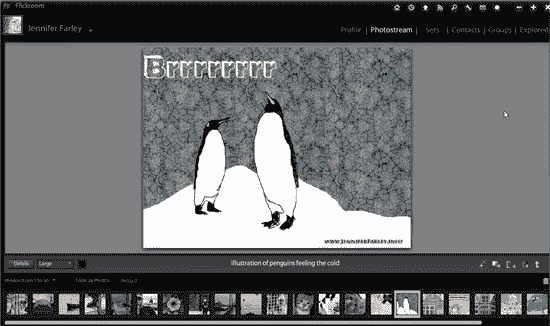

# Flickroom:使用 Flickr 的简单而时尚的方式

> 原文：<https://www.sitepoint.com/flickroom-easy-stylish-way-to-work-with-flickr/>

如果你是 Flickr 用户，有一个可爱的叫做 Flickroom 的 AIR 应用程序。它目前处于测试阶段，看起来和行为有点像“Flickr 遇到 Adobe Lightroom”该界面几乎与 Lightroom 相同，它允许您上传图像，浏览，编辑标题，描述和元数据以及许多其他功能。如果你以前使用过 Lightroom，你会发现浏览图像的方法非常熟悉。

要使用 Flickroom，你需要首先通过你的 Flickr 帐户授权它的使用，但这一切在你第一次启动应用程序后的几个步骤中就可以非常顺利地完成。登录后，你就可以浏览你的照片流、照片集和照片组，与其他 Flickroom 用户聊天，在推特上发布你的照片，并搜索所有 Flickr 用户的照片。

我非常喜欢的一个功能是能够直接将图片从你的电脑拖到应用程序上来上传多张图片。如果你喜欢社交，有一个内置的聊天室可以与其他 Flickroom 用户合作或聊天。

**以下是当前版本的所有功能:**

*   丰富的浏览体验，非常容易使用
*   关于照片流活动的弹出通知
*   只需从桌面拖动图像，即可上传多张照片
*   编辑照片的标题、描述和其他元数据
*   评论、标记收藏、给照片添加注释
*   查看评论、标签、EXIF 数据并将照片保存在磁盘上
*   直接从应用程序中发布照片
*   轻松查看联系人最新上传的内容
*   查看您的哪些照片在 Flickr Explore 中
*   在当前用户或所有 Flickr 用户的照片中搜索
*   使用聊天室与其他 Flickroom 用户协作

对于摄影师、设计师以及任何在 Flickr 上存储或处理图像的人来说，这是一个非常棒的小应用。你可以在这里下载 [Flickroom](http://flickroom.org/) 。

## 分享这篇文章