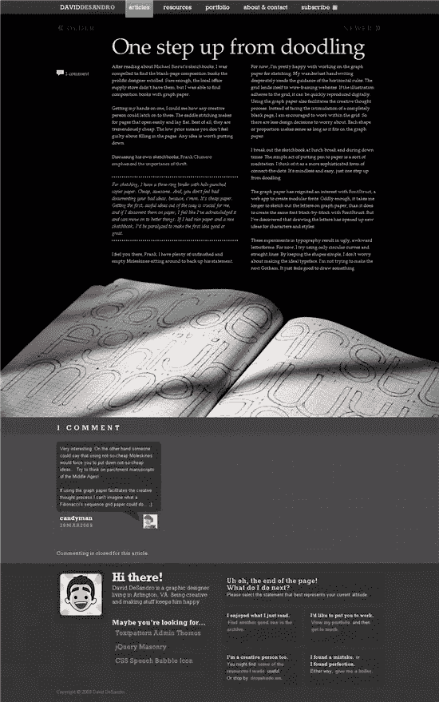
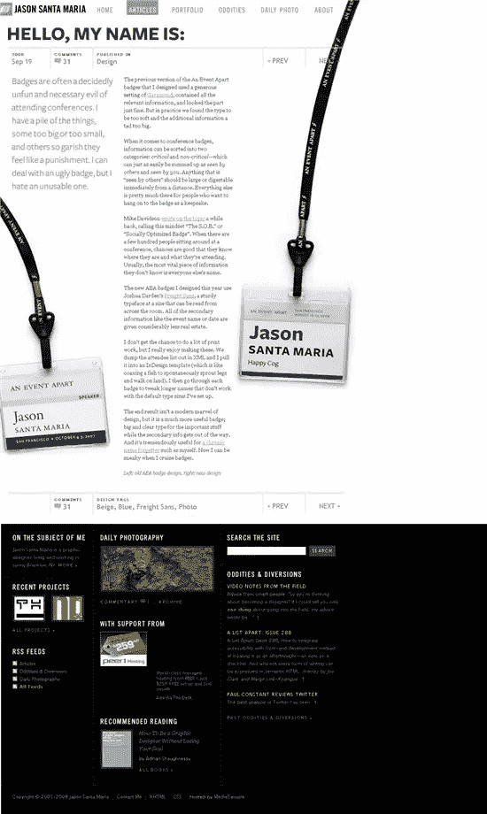
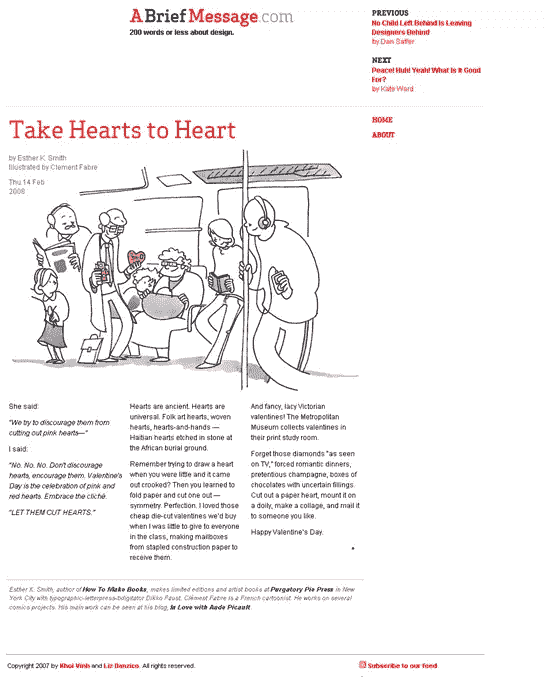
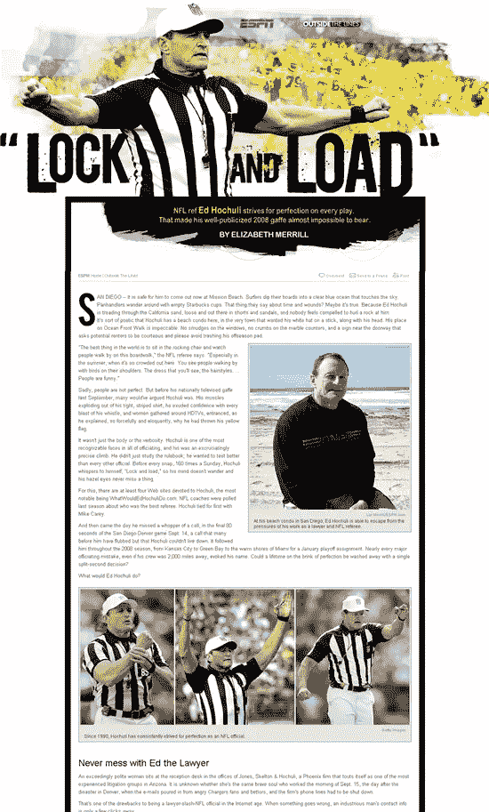

# 艺术指导:将网页设计提升到一个新的水平

> 原文：<https://www.sitepoint.com/art-direction-taking-web-design-to-the-next-level/>

短短几年前，网页设计已经从灰色背景、蓝色和紫色链接走了很长一段路。CSS 和成熟的浏览器使得设计者可以创建漂亮的网站。那么网页设计师的下一个水平是什么，网页设计如何进一步提高？也许设计师应该像艺术指导一样思考和行动。

艺术总监是做什么的？

这个问题问得好。艺术指导这个术语是一个涵盖众多方面的总括术语，但是你可以认为艺术指导负责一件作品的整体视觉外观。该作品可能会出现在杂志、报纸、电视、视频或网络上。艺术总监将发号施令，与可能负责创造整个设计的不同元素的插画师、设计师、文案和艺术家合作，开发并为生活带来创意。

现在，在网络上，已经有一些非常棒的实验设计师在做这个，通常是为个人网站和作品集。然而，对于许多设计师(包括我自己)来说，虽然使用 CMS 使我们创建网站的工作变得更容易，但他们也可能阻碍了我们的成长。我曾经建立过很多 WordPress 网站，虽然我花了很多时间并且喜欢创建一个“独特”的设计，但是这个设计会贯穿整个网站。每一页看起来都差不多。每篇博文看起来都一样。这可以被认为是一致性，重复是设计中的一个重要原则，但是过一段时间后会变得无聊吗？如果你在看杂志，每篇文章看起来都一样吗？没有先生。

谁是艺术指导？

下面你会发现一些链接，这些链接指向我遇到的一些网站，在这些网站上，设计师们正在努力突破界限，对他们的网站和博客进行艺术指导。看看这些网站，你会发现这些设计师在看他们文章的内容，为每个页面制作独特的设计。在每一页或每一篇文章上的导航或标识形式上仍然有一致性，但除此之外，这些设计师正在改变颜色、插图、字体和图像以适应内容。这不再是“一刀切”的设计。

大卫·德桑德罗

[杰森·圣玛丽亚](http://jasonsantamaria.com/)

[一条简短的消息](http://www.abriefmessage.com/)

[ESPN 电子票](http://search.espn.go.com/e-ticket/e-tickets/12)–每个故事都使用不同的标题，许多故事都配有精美的插图。

所以你能做到这样，并开始艺术指导你的网站吗？艺术总监可能不会自己“做”所有的工作，但他们知道完成他们的愿景需要什么技术。所以第一步是尽可能多地学习如何使用你需要的技术来实现你的设计愿景。与他人合作，了解他们所知道的更多信息。

阅读更多关于这个主题的专家的文章，比如杰弗里·泽尔德曼、T2、葵荣和 T4。

*更新:感谢 David DeSandro 指出 [Jason Santa Maria 的灵感书签](http://delicious.com/jasonsantamaria/Inspired)——一个优秀设计的宝库。*

你见过用艺术指导来突破界限的网站吗？我想看看你的链接。

## 分享这篇文章