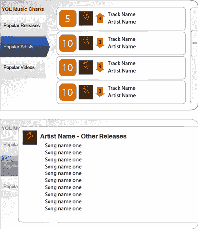
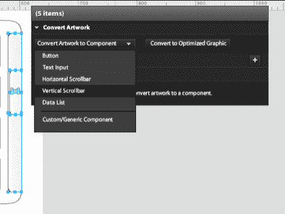
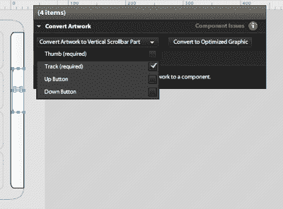
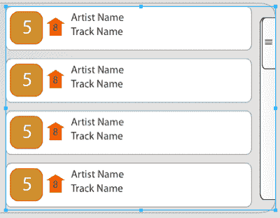

# 闪光催化剂:杰作的模型，第一部分

> 原文：<https://www.sitepoint.com/flash-catalyst-flash-builder/>

Flash Catalyst，以前代号为 Thermo，承诺将界面设计转换为代码的过程变得流畅而简单。在这篇分为两部分的教程中，Andrew Muller 向我们展示了如何构建一个漂亮的 Flash 应用程序来从 Yahoo！，使用 Illustrator、Flash Catalyst 和 Flash Builder。注意—[最后有个小测验！](https://www.sitepoint.com/quiz/adobe/flash-catalyst-flash-builder/)

注意:要在家里玩，你需要准备以下物品:

*   [我们的样本设计，](https://i2.sitepoint.com/examples/mockuptomasterpiece/mockuptomasterpiece-design.ai.zip)插画格式
*   如果您想编辑示例项目，请提供 Illustrator CS4 的副本
*   [Flash Catalyst beta 的副本](https://www.sitepoint.com/blog/)
*   Flex Builder 或 Flash Builder 的副本-[点击此处获取 Flash Builder 的演示。](https://www.sitepoint.com/blog/)

##### 设计师的困境

设计师经常使用各种工具来完成他们的日常工作，通常坚持使用他们最熟悉的工具。Adobe 的 Illustrator 和 Photoshop 是各种各样的界面设计师选择的软件列表中的两个主导软件，无论他们是参与网站设计，丰富的互联网应用程序(RIA)开发，还是任何其他类型的基于屏幕的体验。然后，将设计交给开发人员转换成工作界面。

这种设计过程的缺点是，虽然它允许设计者创建一个 web 应用程序的外观，但在开发人员实现它之前，不可能看到应用程序的感觉或交互性。设计的翻译通常是不完美的，设计人员和开发人员有时会因为某个对象超出一个像素或颜色不正确而产生分歧。如何才能在两者之间搭建更坚固的桥梁？输入闪蒸催化剂。

##### Adobe Flash Catalyst 简介

Adobe 最近发布了 Flash Catalyst 的第一个公开测试版，这是一个新工具，可以帮助设计人员更多地参与到构建 RIA 交互的过程中。设计师可以使用 Catalyst 从他们在 Illustrator 或 Photoshop 中创建的作品中为 Flash Player 构建交互式界面，并在后续版本中支持 Fireworks。Catalyst 能够保持原始艺术品的几乎所有特征；用户可以在应用程序中创建他们最喜欢的界面，将其导入 Catalyst 进行更多更改，然后返回到原始设计工具进行进一步的设计更改。当然，由于 Catalyst 仍然处于测试阶段，在以后的测试版本中会有一些缺失的选项，但它仍然会给用户带来很好的感觉。

除了将作品转换成 Flash 界面之外，Catalyst 还包括一些工具，用于向设计中添加交互式元素。此初始版本能够将对象转换为有限但有用的 UI 组件，包括数据列表、按钮和滚动条，并在 Catalyst 设计视图中直接为线框界面提供额外的 UI 控件。Catalyst 还包括管理状态和动画效果的工具。开发人员可能会喜欢 Catalyst，因为设计人员现在可以在移交设计之前将对象转换为按钮，从而减少开发人员的工作量。这也意味着设计被不恰当地应用到 Flash 应用程序的可能性应该更小，因为所有的视觉效果都是事先准备好的。

##### 在 Illustrator 中模拟界面

我们将创建一个简单的 Flash 应用程序，显示通过雅虎的 YQL(雅虎查询语言)服务在线检索的信息。对于动态内容，我们将使用四个 YQL 查询来检索各种音乐图表信息。为了帮助简化本教程，我们决定使用 YQL 站点上的示例查询。[雅虎还提供设计模板](http://developer.yahoo.com/ypatterns/wireframes/)，你可以用它来制作你下一个 RIA 杰作的原型；Yahoo 设计工具包中的标签模板是该应用程序设计灵感的一部分。

首先，我从 Yahoo 模板工具包中取出一个垂直标签设计，并将其导入 Illustrator。下一个任务是创建应用程序的轮廓形状——在这个例子中，我使用 Illustrator 的绘图工具为它设计了一个盒子，有两个圆角和一个渐变填充，使它看起来有点高。我们正在构建的应用程序将以 XML 形式从 YQL 服务中检索多行数据，因此下一步工作是定义一种显示重复数据的方法。根据数据的类型，典型的界面模式是以行或平铺的方式显示信息——这里我使用了行。

然后，我们需要创建插图来表示音乐图表数据的单行。我们将收到的数据可能包括图表位置、专辑封面插图的 URL、图表位置移动指示器以及艺术家和曲目的名称。最后，还有一个滚动条，旨在匹配应用程序的弯曲角落。

接下来，我们需要创建插图来表示应用程序的详细视图状态。在 Catalyst 中，我们能够使用不同的文件或文件中的不同层来指定不同的状态。Catalyst 也有一个简单的时间轴，当我们在状态之间切换时，它可以用来控制对象淡入淡出的时间。

完成后，我们准备向客户展示模型以获得反馈，最终确定设计，并将其引入 Catalyst 以获得一些交互性！这是显示我们的应用程序的两种状态的模型。

接下来，是时候开始在 Catalyst 中添加交互性了。

##### 在 Flash Catalyst 中实现交互式设计

是时候加入催化剂了！使用选项从现有设计文件创建新项目，并打开我们创建的 Illustrator 文件。解析该文件需要一两分钟的时间——当然，您应该注意画布大小和可编辑区域等选项的提示，但在本例中，我们将一切都保留为默认设置。

让我们从设计的曲目/艺术家图表显示部分开始。我们将把它转换成预定义的 Catalyst 组件，称为**数据列表**。选择设计中的任何对象，你会看到一个名为**平视显示器** (HUD)的浮动灰色面板出现。这用于创建和管理交互式组件。

屏幕右侧的选项列包含一系列面板，如果您以前使用过 Flash，可能会很熟悉这些面板。在这里，您可以找到图层、库面板和属性面板，就像您在 Flash 中管理内容的各个方面一样。就像在 Flash 中一样，一个对象在**层**面板中的位置越高，它就越靠近对象堆栈的顶部——这是需要记住的重要一点。**图层**面板也是快速选择特定对象的好方法，尤其是当它们很小或者很难点击的时候。

##### 构建数据列表

该列表由重复的项目组成，带有滚动条来浏览内容。我们首先将滚动条艺术转换成一个工作滚动条。选择组成滚动条设计的元素。在我们的滑块中，我们有一个轨迹、一个拇指和三个代表拇指握持的小线条；我们将选择所有这些，并从 HUD 中选择**将艺术品转换为组件** > **垂直滚动条**。你可能会发现从**图层**面板中抓取项目更容易，尤其是当它们很小的时候，比如我们滚动条上的微小纹理。

转换完成后，您应该会在 HUD 中看到一个黄色的小消息，表明存在一些组件问题:这是因为我们仍然需要识别组成滚动条的各个部分。从 HUD 中选择 **Edit Parts** ，选择轨迹，然后从 **Convert Artwork** 下拉框中将其定义为滚动条的**轨迹**。选择拇指图像和手爪图形，并从同一组选项中将其设置为**拇指**部分。

现在我们已经完成了滚动条，我们需要返回到主**设计**窗口继续构建应用程序。在设计区域的左上方有一个类似面包屑的指示器，列出了你在应用程序的哪个部分；单击面包屑中的第一项，返回到整个应用程序。

我们将在设计中使用的下一个组件是重复列表项，表示每行信息在数据列表中的外观。我们只需要我们为实体模型创建的行中的一行，因为这是 Catalyst 确定项目外观所需的全部内容，所以我们将删除底部的三行，只保留第一行。然后选择第一行的所有图形，*加上我们刚刚创建的 scrollbar 组件，并使用 HUD 将 artwork 转换为数据列表组件。*

黄色消息再次出现，表明组件有问题——我们需要确定什么元素将形成重复项。选择整行的图稿，点击**编辑部件**，用 HUD 将该行定义为一个**重复项**。您应该会看到该项目将重复下降的窗口。

数据列表的大小会影响当前显示的内容，包括以后上下滚动时内容的裁剪方式，所以现在是时候根据个人喜好调整数据列表的大小了。使用上面的面包屑，仔细检查您是否仍在数据列表组件中，然后使用拖动手柄相应地调整列表的高度。我们将把数据列表组件的高度扩展到应用程序本身内部；这样，列表在使用时会被应用程序屏蔽。

让我们看看那是什么样子。从**文件**菜单中，选择**运行项目**。Flex 将开始构建您的应用程序，并将出现一个新的浏览器窗口。如果一切顺利，您应该会发现可以使用滚动条上下滚动数据列表。

我们应用程序的下一步是开始在设计中添加交互——但是你必须继续关注本教程的下一部分！在第二部分中，我们将添加更多的交互，向您展示如何将 Catalyst 项目引入 Flash Builder，并使用通过 Yahoo 的 YQL 服务生成的查询来填充应用程序。

现在，保存你的项目，放松——我们将在第二部分看到你！

**你认为自己具备成为闪存催化剂大师的素质吗？[用我们的快速测验证明这一点！](https://www.sitepoint.com/quiz/adobe/flash-catalyst-flash-builder/)**

## 分享这篇文章