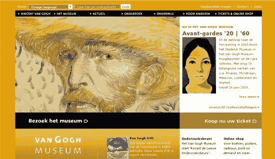
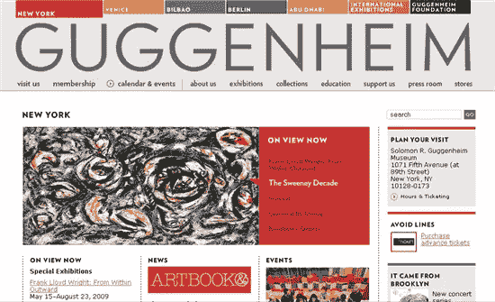
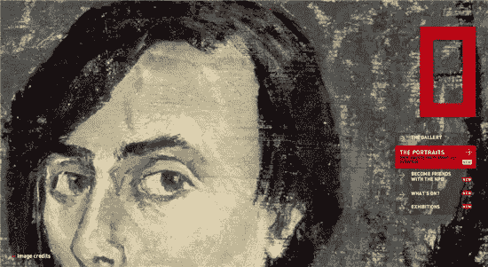
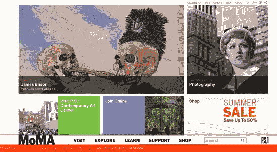
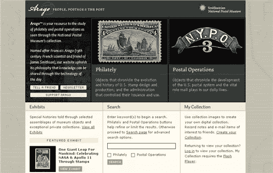
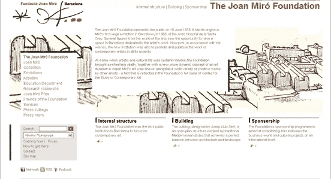
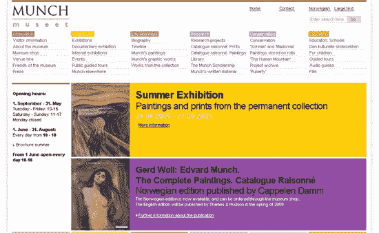

# 十个美丽的艺术博物馆网站

> 原文：<https://www.sitepoint.com/ten-beautiful-art-museum-web-sites/>

对于一个艺术博物馆来说，怎样才算是一个好的网站？最近浏览了不少网站后，我的答案是，这个网站能吸引访问者的注意力，鼓励他们四处看看，就像在实体博物馆一样，激发学习兴趣，让你想再回来看更多。

有成千上万的艺术博物馆网站可供浏览，为什么我选择了以下十个呢？作为一名设计师，我不得不承认网站的外观是一个主要的考虑因素。一些网站只是用他们选择的艺术品和配色方案来吸引你。他们对当前展览的介绍让你想去参观，当然，网站的可用性也是重要因素。这些网站都很容易使用，也很容易找到信息。

下面列出的许多网站也有很好的在线学习部分，在那里你可以找到他们收藏的作品，并了解更多关于当前展览的信息。一些公司肯定在拥抱新媒体，并提供播客和小工具供下载。一些网站有博物馆指南，你可以在参观前下载。

这篇文章花了很长时间来整理，因为我在每个网站上都花了很多时间，真的很喜欢这些网站的艺术和额外的功能。我希望你也会对它们感兴趣。

[泰特美术馆:英国和国际当代艺术](http://www.tate.org.uk/)

[荷兰梵高博物馆](http://www3.vangoghmuseum.nl/vgm/index.jsp)

[荷兰国立博物馆](http://www.rijksmuseum.nl/?lang=en)

[古根海姆](http://www.guggenheim.org/)国际

澳大利亚堪培拉国家肖像画廊

[波士顿美术博物馆](http://www.mfa.org/)

[纽约现代艺术博物馆](http://www.moma.org/)

史密森尼博物馆绝对是一个巨大的场所，在艺术和设计领域有许多不同的部分。我认为特别好的一个部分是“[阿拉戈”邮票集](http://www.arago.si.edu/)，其中包括美国邮票设计的历史。

[西班牙琼·米罗基金会](http://fundaciomiro-bcn.org/index.php?idioma=2)

[Munch Museet](http://www.munch.museum.no/default.aspx?lang=en) , Norway

你是否遇到过任何艺术博物馆网站，它们的设计和内容给你留下了深刻的印象？

## 分享这篇文章