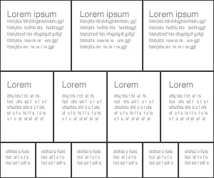

# 用更少的资源编写更好的 CSS

> 原文：<https://www.sitepoint.com/write-better-css-with-less/>

我有一个坦白:我认为 CSS *的某些部分很烂。*重复、乏味，而且……嗯，有点傻。

就我个人而言，我觉得像这样指定后代的风格是非常违背直觉的:

```
#banner { color: white; background: black; }
#banner a { color: yellow; }
#banner p { margin: 0; }
#banner ...
#banner ...
#banner ...
```

…等等，等等，等等。相反，这对我更有意义:

```
#banner {
  color: white;
  background: black;
    a { color: yellow; }
    p { margin: 0em; }
    ...
}
```

而变量呢？他们会很酷:

```
@logo = #457301;

h3 { color: @logo; }
#sale { border: 1px solid @logo; }
.alert { background: @logo; }
```

你和我在一起吗？嗯， [Less](http://lesscss.org/) 承诺让这些白日梦和 more 成为快乐的现实。您可以使用 Less 语法编写样式表，这非常容易掌握——它只是添加了一些类似 CSS 的额外内容的 CSS。然后使用 Less Ruby gem 将其转换为常规 CSS——在命令行上运行它，或者将其合并到应用程序中。

Less 允许您使用变量和嵌套选择器，如上所示，但也提供了一种在类中包含类的方法，以及一些简单的数学运算符。太棒了。让我们来测试一下它的速度，看看它如何处理更简单的样式表。

假设我正在为一个相当常见的网格结构制作一个样式表，就像这样:



通常，我会决定整个页面的宽度(比如说 960 像素——这是一个流行的尺寸)并在此基础上构建不同的宽度，也许实际上是使用框架中的网格系统。我希望最上面的盒子占据容器宽度的三分之一，第二组盒子占据四分之一，底部的盒子占据六分之一，所以我会用我的计算器进行相应的划分。我有一个特别喜欢的绿色，我想用它作为一些框的标题颜色，次要标题的边框颜色，以及页脚的背景。有一个项目看起来有点像页脚，但字体不同。哦，我想给每个部分添加一些基本的字体规范——文本应该越往下越小。一切都很棒:

```
#container {
  width: 960px;
}
.box {
  float: left;
}
#main .box {
  width: 320px;
}
#main .box h3 {
  background: #450;
}
#secondary {
  font-size: 90%;
}
#secondary .box {
  width: 240px;
  border-bottom: 1px solid #450;
}
#footer {
  font-size: 80%;
}
#footer, #super {
  background: #450;
  color: #fff;
}
#footer .box {
  width: 160px;
}
#super {
  font-family: cursive;
}
```

一切都很棒，直到我决定改变容器的宽度。现在我必须返回并编辑`container`的宽度以及`main`、`secondary`和`footer`上的每个派生框的宽度。然后，我决定用紫色代替绿色，所以我必须改变主框标题的颜色，次框的边框，*和*页脚框的背景。烦人！

让我们想象一下，在这个任务中，我使用了更少的资源。当然，首先我需要安装更少的程序，这是命令行上的一项快速工作:

```
sudo gem install less
```

现在我将打开一个新的文本文件，开始写得少一些。我将在变量`@base`中指定一个
基宽:

```
@base: 960px;
```

我最喜欢的颜色:

```
@pretty: #450;
```

然后我将使用`@base`变量来指定主框、次框和页脚框的宽度，作为总宽度的一部分。为了定义每个部分的每个`box`子元素，我将使用嵌套选择器来定义我希望每个部分的`box`子元素如何出现。在我需要指定颜色的地方使用了`@pretty`变量。以下是我的 Less 文件的其余部分:

```
#container {
  width: @base;
}
.box {
  float: left;
}

#main {
  .box {
    width: @base / 3;
      h3 {
        color: @pretty;
      }
  }
}

#secondary {
  font-size: 90%;
  .box {
    width: @base / 4;
    border-bottom: 1px solid @pretty;
  }
}

#footer {
  font-size: 80%;
  background: @pretty;
  color: #fff;
  .box {
    width: @base / 6;
  }
}
```

由于`super`看起来就像`footer`，但是字体不同，我将使用 Less 的类包含技术(他们称之为 mixin)来告诉它也包含这些声明:

```
#super {
  #footer;
  font-family: cursive;
}
```

我将在命令行中使用以下简单语句创建一个 CSS 文件:

```
lessc mystylesheet.less
```

弹出一个样式表，除了我的`footer`和`super`声明之外，它的内容与我在上面以通常方式制作的样式表基本相同。公共声明不是被分组，而是被重复:

```
#footer {
  font-size: 80%;
  background: #450;
  color: #fff;
}
#super {
  font-size: 80%;
  background: #450;
  color: #fff;
  font-family: cursive;
}
```

稍后将详细介绍这个小烦恼。

现在，因为 Less 创建了几乎相同的样式表，所以您可能想知道我要做什么。好了，我们到了该改变我对宽度和颜色的想法的时候了，这就是少真正发挥作用的地方。这一次，我只需要在我的样式表中修改*两行*。首先，让我们调整基本变量的值，如下所示:

```
@base: 720px;
```

现在，让我们把绿色变成紫色:

```
@pretty: #619;
```

现在，我可以不理会其余的声明，生成一个新的 CSS 文件。框的宽度重新计算和颜色替换已经为我完成:

```
#container {
  width: 720px;
}
.box {
  float: left;
}
#main .box {
  width: 240px;
}
#main .box h3 {
  color: #619;
}
#secondary {
  font-size: 90%;
}
#secondary .box {
  border-bottom: 1px solid #619;
  width: 180px;
}
#footer {
  font-size: 80%;
  background: #619;
  color: #fff;
}
#footer .box {
  width: 120px;
}

#super {
  font-size: 80%;
  background: #619;
  color: #fff;
  font-family: cursive;
}
```

当然，这是一个很简单的例子。在现实世界中，一个复杂的基于网格的模板可能包含几十个基于单个图形的声明；一个配色方案可以围绕两到三种基本色调。使用更少，我们可以将这些基本定义视为真正的变量，并花费更少的时间来维护它们。

如果 Less 的 inclusion 方法足够聪明，能够将混合声明中的公共元素分组，那么它可能会更整洁。另一方面，我有点喜欢它在这里出现的方式——我喜欢根据目的将我的样式表组织成几个部分:

```
/* heading styles */
...
/* main content styles */
...
/* footer styles */
...
```

如果在标题区域有一个我喜欢的样式，并且我想在我的页脚有一个类似的项目，我宁愿避免在我的标题部分存储那个页脚项目。如果你想聪明地使用分组选择器，你必须把这两种风格放在某个地方。对我来说，这个特性的便利性超过了这个小麻烦，当然使用 mixins 是完全可选的。

我喜欢聪明人想出节省 CSS 时间的好方法，我可以预见我将来会很好地利用这个漂亮的工具。你可以在它的网站上找到更多信息。

## 分享这篇文章