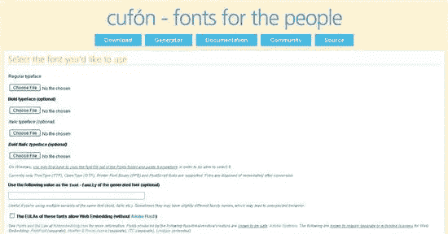

# 在 WordPress 上使用你喜欢的任何字体

> 原文：<https://www.sitepoint.com/use-whatever-font-you-please-on-wordpress/>

今年早些时候，Alex 写了一篇关于 [Cufon 的文章，这是一种文本替换方法](https://www.sitepoint.com/article/fixing-fancy-font-frustrations/)，它使用 [JavaScript](https://www.sitepoint.com/php/) 将 [HTML](https://www.sitepoint.com/php/) 文本替换为以矢量格式呈现文本的`canvas`元素。基本上，如果你是一个厌倦了或者困惑于不能在你的网站上放置任何你喜欢的类型的设计师，Cufon 可以帮助你。要更全面地了解文本替换是如何工作的，请阅读 Alex 的文章[。](https://www.sitepoint.com/article/fixing-fancy-font-frustrations/)

如果你以前没有听说过 Cufon，并且正在使用 WordPress，那么它有点像网页设计师的梦想。多年来，放置您选择的任何字体的能力一直局限于诸如 SIFR 和@font face 之类的选项。这两种字体都为设计者提供了使用旧字体(Times New Roman、Arial、Georgia 等)之外的字体的机会，但它们也有自己的缺点。 [SIFR](http://wiki.novemberborn.net/sifr3/) 是基于 Flash 的，使用起来有点棘手，而 `@font-face`虽然快完成了，但在字体所有权和使用的最终用户许可协议上遇到了大问题。Cufon 介于这两者之间，易于使用。

要在 WordPress 上使用 Cufon，你需要首先[安装插件](http://wordpress.org/extend/plugins/wp-cufon/)，它可以在 WordPress 扩展页面上找到。下一步是使用[字体生成器](http://cufon.shoqolate.com/generate/)。



这里有一些小细节，我发现在成功上传之前，我必须将我想要使用的字体从 Windows 的主 fonts 文件夹中取出。您还需要确认(通过勾选方框)您合法拥有您正在使用的字体。[下载电影](http://moviedl.net/ "download movies, movies, movie downloads, free movies")
<ins>详见 fontembedding.com 字体与法律[。由以下代工厂/供应商/创作者生产的字体已知是安全的:](http://www.fontembedding.com/fonts-and-the-law/) [Adobe Systems](http://www.adobe.com/type/embedding.html) 。以下是已知需要单独或扩展许可证的 Web 嵌入: [FontFont](http://www.fontfont.com/support/licensing.ep) (单独)、[Hoefler&Frere-Jones](http://www.typography.com/)(单独)、 [ITC](http://www.itcfonts.com/About/Embedding.htm) (单独)、 [Linotype](http://www.linotype.com/2061-28225/licenseagreementforfontsoftware.html) (扩展)。</ins>

一旦我这样做了，字体就被转换了，你会看到一个. js 文件，你把它上传到你的 WordPress 插件文件夹。

Cufon 插件将在你的插件文件夹中检测一个正确生成的文件，并使它在你的 WordPress 站点上可用。你的大部分工作都完成了。Cufon 插件页面给出了如何使用 CSS 的例子。js 字体。

我想在我的博客标题上使用 Tw Cen MT 字体，所以我在 CSS 插件页面的空白处添加了以下内容:

```
 Cufon.replace('h1', { fontFamily: 'Tw Cen MT' });

Cufon.replace('h2', { fontFamily: 'Tw Cen MT' }); 
```

产生的标题如下所示:


仅此而已。这是一种快速简单的方法，可以更好地控制我的 WordPress 设计，而不必使用图像或 Flash 进行排版。

你一直在用 Cufon 吗？你觉得它容易使用吗？你在博客上使用它吗？

## 分享这篇文章