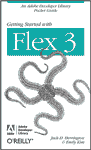

# 居然不是 Web App！将您的技能带到桌面并赢得胜利。

> 原文：<https://www.sitepoint.com/i-cant-believe-its-not-a-web-app-take-your-skills-to-the-desktop-and-win/>

 **
你知道你可以用你的 CSS、HTML 和 JavaScript 技能来构建一个桌面应用吗？如果你是一个网页设计师或开发人员，那么你会想下载我们最新的 Adobe AIR 教程直接到你的大脑，矩阵风格！**

想象一下，开发一个应用程序，你不用担心跨浏览器兼容性的限制！想象一下，不仅可以自由设计窗口内容的样式，还可以自由设计窗口本身的样式！想象一下所有的人…(哎呀，向约翰·列侬道歉！)

你可能知道我对我们的最新文章很兴奋。这本书叫做“用 Adobe AIR 把你的 CSS 带到桌面”，作者是 SitePoint 自己的 Andrew Tetlaw(《科技时报》的作者)。在视频中，他向你展示了如何创建你自己的活生生的桌面应用程序。事实上，这是一个你们中的一些人可能会觉得有用的应用程序——一个接收来自 Flippa 的通知的桌面应用程序，Flippa 是一个新推出的买卖网站的市场。

构建这个应用程序是 Andrew 第一次尝试使用 AIR 进行开发，据他说，这是一次大开眼界的体验，而且实际上很容易做到。

如果您也是使用 Adobe AIR 进行开发的新手，请务必参加本教程末尾的测验，看看您已经掌握了多少新知识。你甚至可能获奖！在与 Adobe 的合作中，我们将向前 100 名完成测验的*分发《Adobe Flex 3 入门》的印刷版。但是你最好快点进去——先到先得，上次我们送这本书的时候，它们很快就被抢购一空了。*

 *如果您希望能够为 Adobe Flash 平台构建任何规模的应用程序，那么在您的库中拥有本手册是一项资产；从简单的小部件到复杂的多特性 RIA。这篇文章只是可能性的冰山一角。

[**阅读文章**](https://www.sitepoint.com/article/css-desktop-adobe-air/) **和[现在参加测验](https://www.sitepoint.com/quiz/adobe/css-desktop-adobe-air/)…然后开始构建一些时髦的桌面应用程序！*** 

## *分享这篇文章*