# 离线设计灵感，第 3 部分:食品包装

> 原文：<https://www.sitepoint.com/offline-design-inspiration-part-3-food-packaging/>

无论是颜色的组合，有趣的标志还是里面的承诺，食品包装是我们大多数人每天都会看到的东西。如果我们以前没有尝试过或见过一种产品，包装会吸引我们，让我们拿起盒子，阅读更多关于它的信息。

举个简单的例子，就拿超市里的玉米片来说吧。如果我第一次遇到这些，对我来说，凯洛格的包装看起来更好，更有吸引力。虽然两者展示的信息相似——一个标志，一个图像，两者都有空白——但它使用了强烈的颜色，一个更大更大胆的图像和左边包装上的营养信息，传达了丰富性。超值玉米片买起来更便宜，但看起来也很便宜。

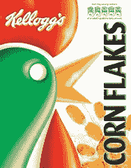 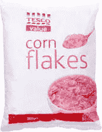

这和网页设计有什么关系？好的设计就是好的设计，不管设计用在哪里，很多概念都是一样的。总的来说，包装设计应该吸引注意力，应该使产品具有吸引力，并且能够以创意打动我们。就像一个网站。

因此，下面我挑选了一些有创意的，一些创新的，并希望鼓舞人心的食品包装。如果你饿了，现在把目光移开，因为这里有 15 个很酷的食品包装设计的例子。

1.这种饼干和奶油蛋糕的组合有一种可爱的复古感觉。复古的外观是通过使用简单的平面插图的老式字体实现的。

[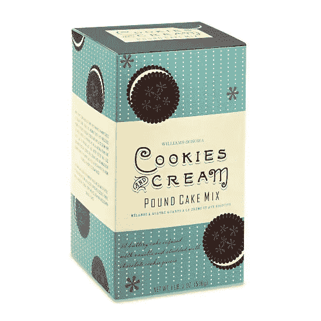](https://www.sitepoint.com/wp-content/uploads/2009/06/cakemix.jpg)

2.色彩鲜艳、图文并茂的包装显然是针对儿童市场的。

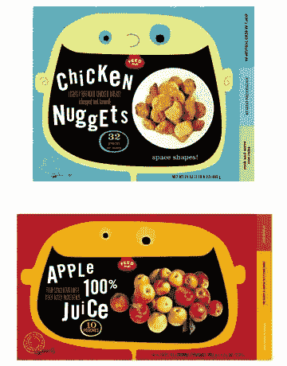

3.干净凉爽，这是寒冷的比利。

[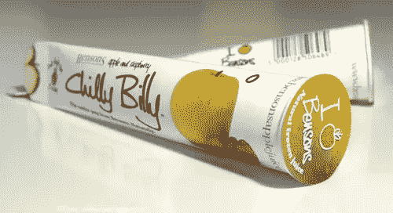](https://www.sitepoint.com/wp-content/uploads/2009/06/chillybillybyripedesign.jpg)

4.这些自由放养的鸡蛋的一个相当时髦的基于类型的设计。

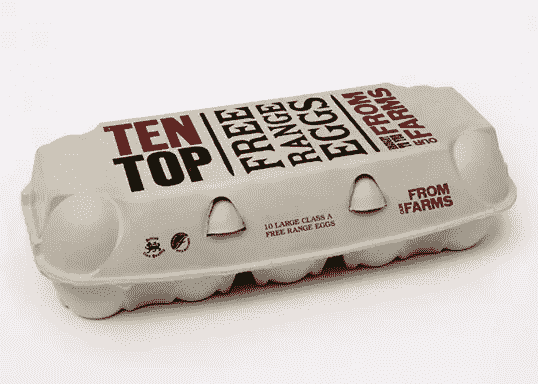

5.总是很酷，本和杰里的包装是非常容易识别其卡通风格的插图和字体。

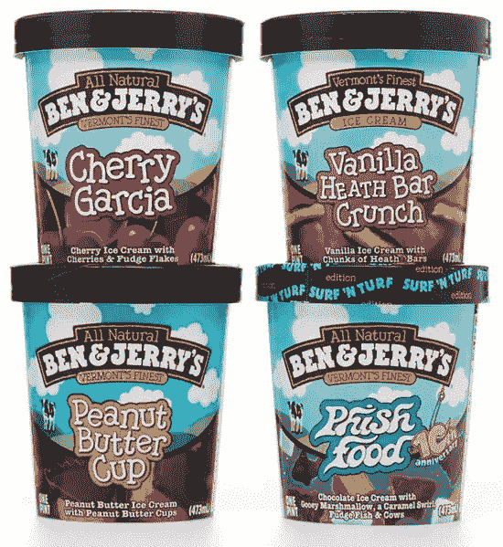

6.可爱的马铃薯薯片包装上白色空间和马铃薯图像的巧妙运用。

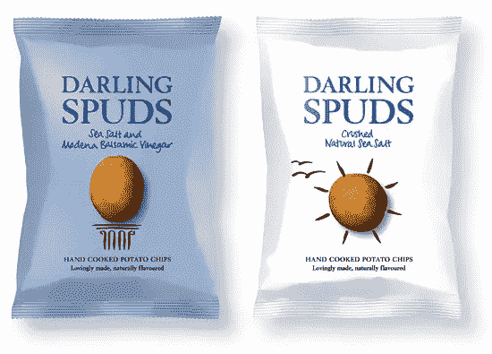

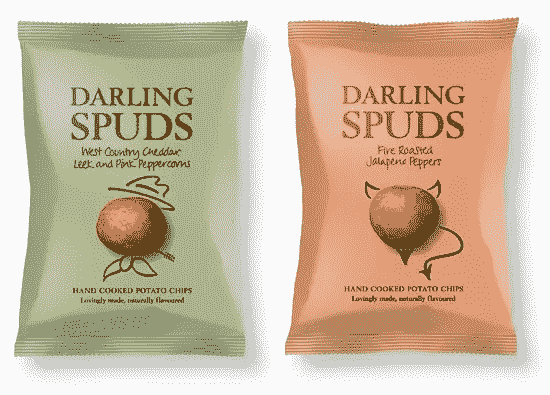

7.萨拉贝丝果酱上优雅的排版和标签设计。

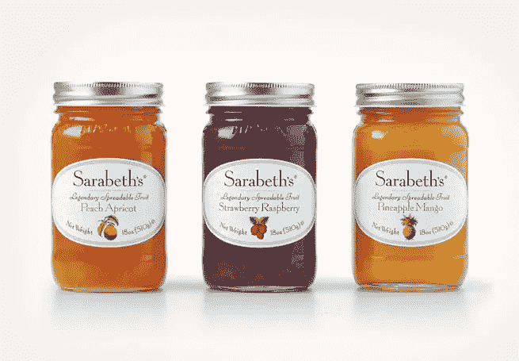

8.这家小食品公司有一系列针对儿童的食品。每个包装都有自己美丽的插图。

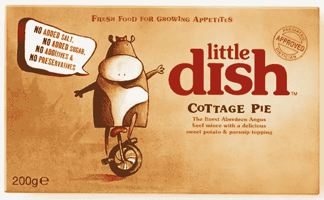

9.如果我真的能忍受吃沙丁鱼的想法，那么我会仅仅为了这个设计而买这个包。

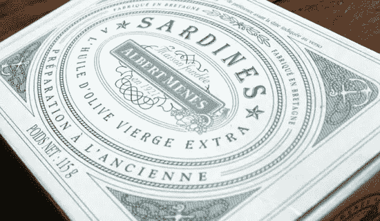

10.这些 Via Roma 食品罐上的标签采用幽默的黑白摄影，结合优雅的现代字体。

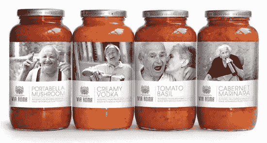

11.透明蜂蜜，透明标签上有来自 Waitrose 的可爱标志。

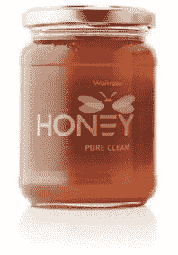

12.不是供人食用，但是很吸引人！一系列彩色标签上的简单图标在这些小狗零食上形成了一个吸引人的设计。

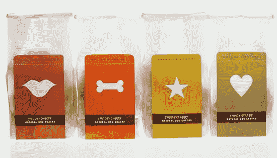

13.非常干净的现代酸奶设计。

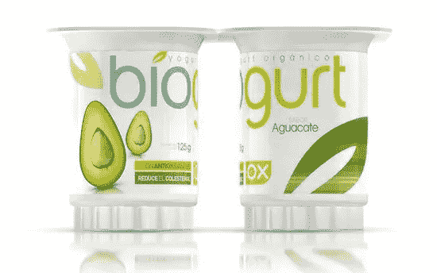

14.Popfish 是巴西的一家日本餐馆，这是他们色彩鲜艳的包装。

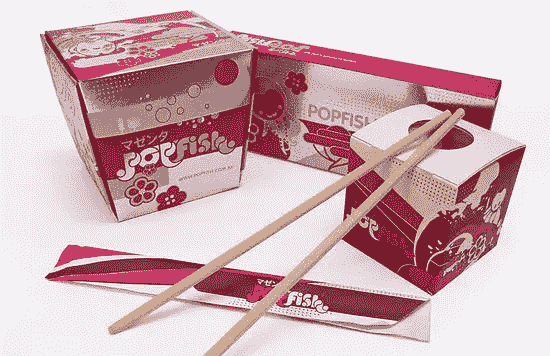

15.最后，也是我个人的最爱。不完全是食物，而是非常酷的草莓蝙蝠侠牛奶鸡尾酒。

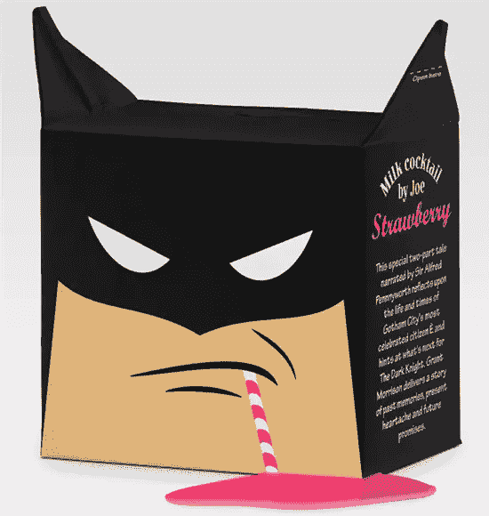

**在哪里可以找到更多关于包装设计的网站:**

[Dzinebites](http://dzinebites.blogspot.com/)

[分型线](http://www.thedieline.com/)

[图形交换](http://www.graphic-exchange.com/07packaging.htm)

当然，这应该是关于线下的灵感，所以请留意你当地的商店、餐馆、咖啡馆！拍下你喜欢的设计，并把它们保存起来，作为以后的灵感来源。

你觉得这些设计怎么样？最近有没有看到其他让你觉得「哇」的食品包装？

**site point 上的相关阅读:**

*   **[线下设计灵感，第二部分:报纸](https://www.sitepoint.com/offline-design-inspiration-part-2-newspapers/)**
*   **[线下设计灵感，第一部分:杂志](https://www.sitepoint.com/designinspiration-magazines/)**

## 分享这篇文章