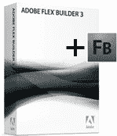

# 宣布我们 Flash Builder 赠品的获奖者

> 原文：<https://www.sitepoint.com/announcing-the-winners-of-our-flash-builder-giveaway/>

你发现 Flex 4 中有什么新的和酷的了吗？就在一周前，我们发表了一篇关于 Adobe Flex 框架的新文章,其中包括一场由 Adobe 赞助的[竞赛](https://www.sitepoint.com/quiz/adobe/whats-new-flex-4/),以赢得一份 Flex Builder(以及 Flash Builder 4 发布时的免费升级)。

我们有三个这样的奖品要送出，而你只有七天的时间报名。干得好，那些没有浪费时间回答问题，让自己的名字在名单上的读者！对于那些错过了的人，请关注[博客](https://www.sitepoint.com/blogs/)和[论坛](https://www.sitepoint.com/forums/)寻找你的下一个机会(这并不太遥远…关注这个空间！)

非常感谢 Adobe 提供这些奖项。

现在，为胜利者干杯！这一次，幸运的读者是…

(请击鼓)

*   **约瑟夫·希姆斯，美国**
*   **加拿大科特·特威德**
*   **韦恩·麦克马纳斯，英格兰**

Curt 是一名平面设计师和网络开发人员，刚刚开始开发网络应用程序，他说他真的很期待。柯特评论道:

> 感谢 SitePoint 多年来的所有精彩文章。

这是我们的荣幸，科特！

Wayne 是一名 32 岁的客户端开发人员，他喜欢 SitePoint 的一点是:

> 我目前正在使用或计划在不久的将来使用的一系列优秀的技术教程。我期待着深入学习 Flash Builder 4！

那我们最好把他的奖品快递寄出去！

恭喜你们三个！

就像我说的，如果你错过了这次，不要担心——未来还有机会赢得其他大奖，所以请关注这个博客，了解更多细节。

哦，不要忘了:如果你有兴趣进一步提高你的 Flex 技能，你仍然可以[阅读文章](https://www.sitepoint.com/article/whats-new-flex-4/)来了解 Flex 4，并通过[参加测验](https://www.sitepoint.com/quiz/adobe/whats-new-flex-4/)来测试你理解了多少。

*   阅读文章:[https://www.sitepoint.com/article/whats-new-flex-4/](https://www.sitepoint.com/article/whats-new-flex-4/)
*   参加测验:[https://www.sitepoint.com/quiz/adobe/whats-new-flex-4/](https://www.sitepoint.com/quiz/adobe/whats-new-flex-4/)
*   在 SitePoint 上阅读更多 Flex 文章:[https://www.sitepoint.com/subcat/flex](https://www.sitepoint.com/web/flash-and-flex/)

## 分享这篇文章