# 18 个自由文本编辑器清理你的代码

> 原文：<https://www.sitepoint.com/18-free-text-editors/>

虽然有很多付费的解决方案来编辑你的代码，但并不是每个人都有几百美元的预算来把它们放在桌面上。幸运的是，对于你能想到的每一种编辑风格，都有许多免费的解决方案。我们把这个列表的重点放在了跨平台、仅支持 Mac OS X 和仅支持 Windows 的可下载解决方案上，但我们也包括了一个在线选项。我们希望将来会有更多这样的项目，这样你就可以真正地与团队中的其他成员合作。浏览一下 18 个编辑的列表，你一定会找到一个最适合你需求的！

## 跨平台编辑器

**[Amaya](https://www.w3.org/Amaya/)**:WYSIWYG 网页编辑工具和浏览器的混合体，最初由 INRIA 国家信息与自动化研究所开发，后被万维网联盟(W3C)收购。该项目是开源的，因为它是一个测试平台，所以它支持主流浏览器尚不支持的协议和语言，比如 RDF。该程序适用于 Unix、Linux、Windows、Mac OS X、Amiga 操作系统等。

[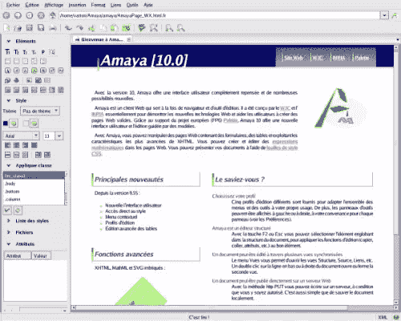](https://www.sitepoint.com/wp-content/uploads/2009/06/amaya1.png)

**[Arachnophilia](http://www.arachnoid.com/arachnophilia/)** :一个基于 Java 的编辑器，具有编辑多个文档的能力，一个内置的 FTP 客户端，这样你就可以在不离开界面的情况下上传更改，用户定义的模板，用户可定制的工具栏和其他几个功能。

[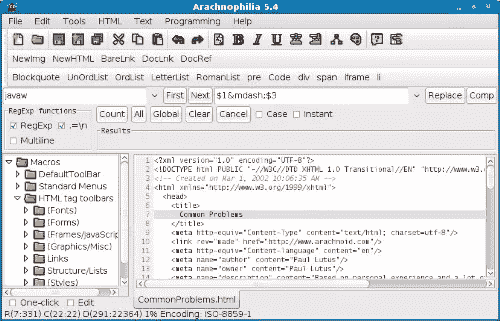](https://www.sitepoint.com/wp-content/uploads/2009/06/arachnophilia1.png)

[**Bespin**](https://bespin.mozilla.com/) :列表中唯一的云编辑器，Bespin 是 Mozilla 实验室的一个项目。这是一个完全基于云的 Web 编辑器项目，旨在鼓励协作工作，因为它可以从任何地方访问。Web 应用程序允许 Arduino、CSS、HTML、JavaScript 和 PHP 的语法高亮显示。你可以在 SitePoint [这里](https://www.sitepoint.com/bespin-cloud-coding/)和[这里](https://www.sitepoint.com/mozilla-launches-very-slick-cloud-based-ide/)阅读之前关于 Bespin 的报道。

[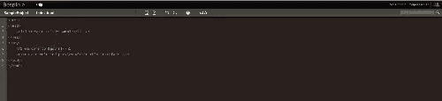](https://www.sitepoint.com/wp-content/uploads/2009/06/bespin1.png)

蓝鱼 :蓝鱼从 1997 年开始以各种形式出现，只有一个固定的员工，奥利维尔·塞辛克。该程序具有可定制的语法高亮显示，适用于 C、ColdFusion、CSS、HTML、Java、JavaScript、JSP、Perl、Python、Ruby、SQL、XHTML 等。有人认为它填补了纯文本编辑器和大型 IDE 开发平台之间的空白，可以在 Linux、Mac OS X、Solaris 和 Windows 上运行。

[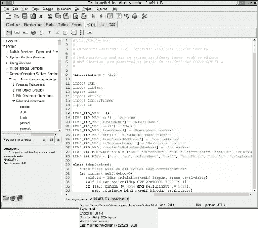](https://www.sitepoint.com/wp-content/uploads/2009/06/bluefish1.png)

**[Eclipse](http://www.eclipse.org/)** :这个编辑器是用 Java 编写的，作为它工作的原始主要语言，但是由于众多插件，你也可以用 Perl、PHP、Python 等语言编辑。由于开源的特性，插件对于开发者想为之构建的任何语言都是受欢迎的。由于 Eclipse 只不过是一个运行时内核，这个程序运行起来更像是一个插件平台。这使得整个程序非常轻量级，您可以只安装您需要的部分，而不会因为过多的功能而拖累自己。该程序可以在 Linux、Mac OS X 和 Windows 上运行。

[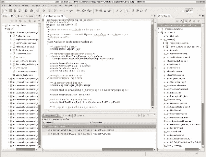](https://www.sitepoint.com/wp-content/uploads/2009/06/eclipse1.png)

**[J](http://armedbear-j.sourceforge.net/)** : J 是一个用 Java 编写的文本编辑器，可以在任何安装了 Java 1.4 的系统上工作，但是推荐使用 1.5。该编辑器于 2009 年 3 月更新，尽管在此之前，自 2004 年 9 月以来就没有人动过它。该程序可以在 Linux、Mac OS X、OS/2、Unix、VMS 和 Windows 上运行。

[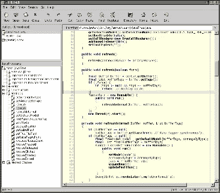](https://www.sitepoint.com/wp-content/uploads/2009/06/j1.png)

**[jEdit](http://www.jedit.org/)** :自 1998 年开发以来，这个基于 Java 的编辑器自 2004 年以来一直没有一个主要版本，但有许多预览版本。虽然它不是目前最流行的编辑器，但该系统为 130 多种不同的编程语言提供了缩进和语法高亮功能。该程序可以在 Linux、Mac OS X、OS/2、Unix、VMS 和 Windows 上运行。

[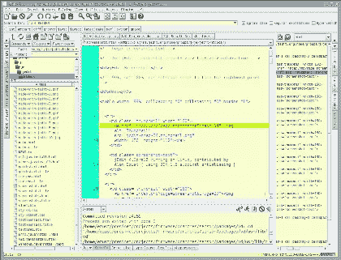](https://www.sitepoint.com/wp-content/uploads/2009/06/jedit1.png)

**[JuffEd](http://sourceforge.net/projects/juffed/)** : JuffEd 是一个为程序员和高级用户构建的编辑器，它的特点是为许多语言提供语法高亮，包括 HTML、Java、JavaScript、Perl、PHP、Python、Ruby 等等。它还有几个其他有用的工具，比如自动缩进、自动完成、高亮显示等等。该程序是跨平台的，可以在几种不同的操作系统上运行。

[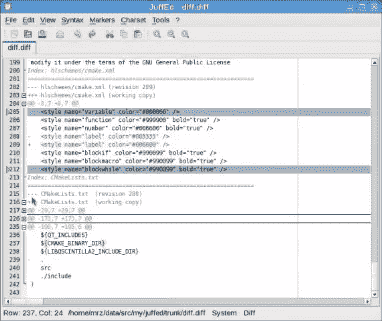](https://www.sitepoint.com/wp-content/uploads/2009/06/juffed1.png)

KompoZer : KompoZer 不久前被最初的创造者停止生产，但是现在由围绕它建立起来的社区开发。该程序符合 W3C 标准，默认情况下在 HTML 4.01 中生成新页面。这个所见即所得编辑器有一个内置的 HTML 验证器，可以在不离开程序的情况下检查你的工作。该程序与 Linux、Mac OS X 和 Windows 兼容。

[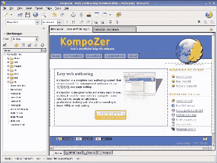](https://www.sitepoint.com/wp-content/uploads/2009/06/kompozer1.png)

**[NetBeans](http://www.netbeans.org/index.html)** :这个特别的程序是一个应用程序框架和编辑器的混合体，包括语法高亮、JavaScript 和 CSS 编辑、Ruby 开发工具等等。NetBeans 可以在 Linux、Mac OS X、Solaris 和 Windows 上运行。

[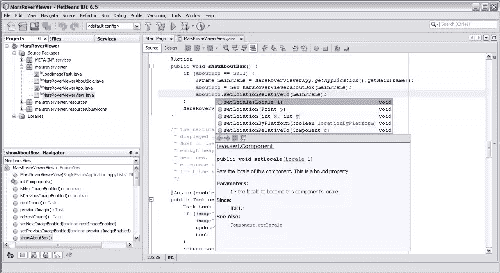](https://www.sitepoint.com/wp-content/uploads/2009/06/netbeans1.png)

这个文本编辑器具有 20 多种语言的语法高亮显示，可以同时支持多种字体，编码模板，一次编辑多个文档，以及许多其他功能。由于 RText 是用 Java 编写的，它可以在 Linux、Mac OS X、OS/2、Unix、VMS 和 Windows 上运行。

[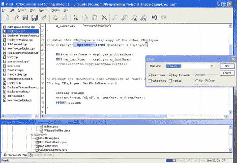](https://www.sitepoint.com/wp-content/uploads/2009/06/rtext1.png)

SciTE : SciTE，是基于闪烁的文本编辑器的缩写，是一个轻量级的文本编辑器，允许通过简单地编辑文本文件来定制以满足你的需要。它支持多种语言，运行脚本，甚至有一个小的 EXE 文件，这样如果你的工作需要你在一台电脑上而不是你自己的电脑上，你就可以从一个闪存驱动器上运行这个程序。SciTE 兼容 Linux 和 Windows。

[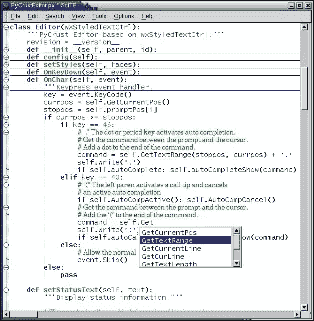](https://www.sitepoint.com/wp-content/uploads/2009/06/scite1.png)

## 仅限 Mac OS X 的编辑器

**[Smultron](http://tuppis.com/smultron/)**:Smultron 为 C、C++、CSS、D、HTML、Java、LISP、Python、Ruby 和 XML 等语言提供语法高亮显示，以及选项卡创建、列查看、自定义快捷方式等等。

**:text wrangler 具有多种语言的语法高亮显示、文件比较、多次撤销等功能。该程序还允许运行脚本，如 AppleScript，Python，Perl 和 Shell。**

 **[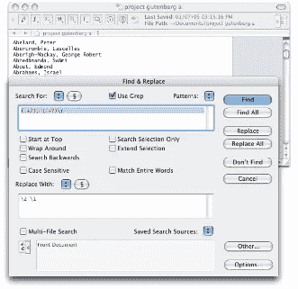](https://www.sitepoint.com/wp-content/uploads/2009/06/textwrangler.png)

## 仅限 Windows 的编辑器

**[HAPedit](http://hapedit.free.fr/)** : HAPedit 为 ASP、CSS、HTML、JavaScript、PHP、SQL 等提供语法高亮显示。其他功能包括一个 SQL 控制台，FTP 管理器，统计你的网页，看看有多大的文件，以及其他功能。

[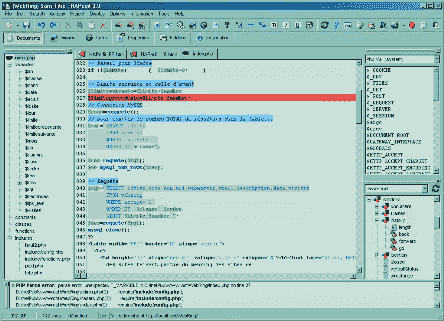](https://www.sitepoint.com/wp-content/uploads/2009/06/hapedit1.png)

**[【notepad++](http://notepad-plus.sourceforge.net/uk/site.htm)**:除了支持 48 种不同语言的语法高亮显示，该程序还被设计得比大多数编辑器更环保。该计划还支持分屏观看/克隆支持，FTP 浏览，自动完成，所见即所得观看和许多其他功能。

[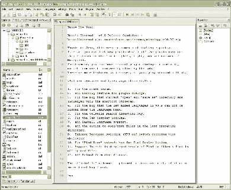](https://www.sitepoint.com/wp-content/uploads/2009/06/notepad1.png)

**[NoteTab](http://www.notetab.com/downloads.php)** : NoteTab 确实提供了免费的轻量级版本，但它更像是你在付费版本中所能找到的味道。它是可用的，它不会让你为购买而烦恼，但是随着你对它的熟悉，你可能最终会升级到标准版或专业版。

[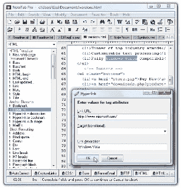](https://www.sitepoint.com/wp-content/uploads/2009/06/notetab1.png)

PSP 可以编辑 C，HTML，JavaScript，PHP，Perl 和其他语言，它也可以通过 FTP 接口直接在你的服务器上编辑文件，全十六进制编辑器，语法高亮，文本文件之间的文件比较和许多其他功能。

[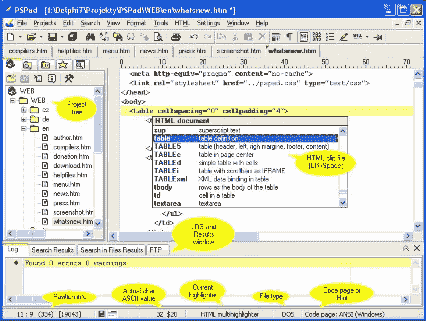](https://www.sitepoint.com/wp-content/uploads/2009/06/pspad1.png)

你最喜欢的编辑代码的免费程序是什么？** 

## **分享这篇文章**