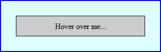

# 在 JavaScript 中实现事件延迟

> 原文：<https://www.sitepoint.com/javascript-event-latency/>

在 JavaScript 中处理浏览器事件可能是客户端编程中最耗时、最令人沮丧和最容易被误解的方面。像 [jQuery](http://jquery.com/) 这样的库使它变得更容易，但是了解一些表面下发生的事情仍然是有用的。

在本文中，我们将实现事件延迟，也就是说，对事件的响应将在事件触发后的一小段时间内发生。这通常在创建下拉菜单等情况下很有用。因此，让我们从一点 HTML 和 CSS 代码开始(为了这个例子的目的，它保持简短，因此没有 DOCTYPE)…

```
 <html>
<head>
<title>Latency test</title>

<style type="text/css">
#element1
{
	width: 20em;
	margin: 20px;
	background-color: #dff;
	border: 2px solid #00d;
}

#para1
{
	text-align: center;
	padding: 10px;
	margin: 30px;
	background-color: #ccc;
	border: 1px solid #000;
}
</style>

</head>
<body>

<div id="element1">
	<p id="para1">Hover over me...</p>
</div>

</body>
</html> 
```

这就产生了一个类似如下的框…



现在我们将在结束的`body`标签前添加一点 JavaScript 代码…

```
 <script type="text/javascript">

window.onload = function() {

	// get nodes
	var element1 = document.getElementById("element1");
	var para1 = document.getElementById("para1");

	// define events
	if (element1 && para1) {
		element1.onmouseover = Handler;
		element1.onmouseout = Handler;
	}

	// event handler
	function Handler(e) {
		e = (e ? e : window.event);
		var on = (e.type == "mouseover");
		Highlight(on);
		return false;
	}

	// highlight or dim element (pass true|false)
	function Highlight(on) {
		para1.firstChild.nodeValue = (on ? "over" : "out");
		element1.style.backgroundColor = (on ? "#ffd" : "#dff");
		if (!on) alert("moved out");
	}

};

</script> 
```

这增加了几个(DOM0)事件，当光标移过或移出浅蓝色元素 1 `div`时触发这些事件。调用一个事件处理函数来解决 IE 不一致的问题，并发现是否触发了鼠标悬停或移出事件。Highlight 函数被传递 true(鼠标经过)或 false(鼠标离开)，它相应地改变段落文本和背景颜色。最后，如果鼠标被移出，会显示一个警告框。

然而，当我们将鼠标移动到灰色段落框中时，会出现“移出”警告。这是因为浏览器触发了两个事件 element1 的 mouseout 和 para1 的 mouseover。虽然我们没有委托 para1 的事件处理程序，但是浏览器实现了一种称为[冒泡](http://www.quirksmode.org/js/events_order.html)的技术，事件将通过所有 element1 的后代传播。

在这个例子中，我们只关心最后一个触发的事件是否是 mouseout，而不是紧接着 mouseover。因此，我们可以用一点事件延迟来修复 Handler()函数中的问题:

```
 var timer;
	function Handler(e) {
		e = (e ? e : window.event);
		var on = (e.type == "mouseover");
		if (timer) clearTimeout(timer);
		timer = setTimeout( function() { Highlight(on); }, 300);
		return false;
	} 
```

当事件发生时，我们清除任何现有的超时。然后创建一个新的超时，它在 300 毫秒后调用 Highlight 函数(Highlight(on)包含在一个函数中，所以闭包保留‘on’的值)。这个过程使得 Highlight()的执行频率不可能超过 300 毫秒。当它被调用时，只有最近的“on”值可用。

重新加载页面，您会注意到在任何事件动画出现之前有一个短暂的延迟。此外，只有当您移出蓝色的#element1 框时，警告才会出现。

我希望您会发现该技术对其他 JavaScript 项目有用。

## 分享这篇文章