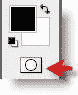
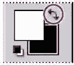
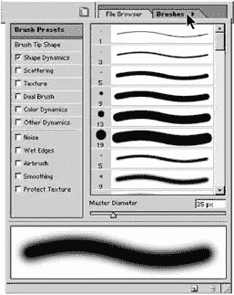

# 使用快速蒙版在 Photoshop 中进行更好的选择

> 原文：<https://www.sitepoint.com/better-selections-in-photoshop-with-quick-masks/>

在 Adobe Photoshop 中，你可以制作临时蒙版，叫做**快速蒙版**。蒙版可让您隔离和保护图像的某些部分。当您基于选区创建蒙版时，未选择的区域将被蒙版或保护不被编辑。

**创建快速蒙版**

1.打开要选择的图像。有时你可以先用魔棒做出一大块选区。

2.选择魔棒工具(  )。

3.单击衣服上的任意位置开始选择过程。

4.若要添加到选区，请按住 Shift 键，同时用魔棒单击以添加到选区。

这件衣服仍然只是部分被选中。现在我们将使用快速蒙版添加到这个选区。

6.在工具箱中选择快速蒙版模式按钮(  )。默认情况下，您在标准模式下工作。当你点击快速蒙版按钮时，你将在快速蒙版模式下工作。如果您再次点击此按钮，您将返回标准模式。

在快速蒙版模式下，会出现一个红色叠层(称为 rubylith ),用于蒙版和保护选区之外的区域。

**编辑快速蒙版**

现在，我们需要通过添加或删除部分蒙版区域来优化礼服的选择。我们使用笔刷工具来改变你的快速蒙版。将选区编辑为蒙版的好处是，您几乎可以使用任何工具或滤镜来修改蒙版。

在快速蒙版模式下，Photoshop 自动默认为灰度模式。前景色默认为**黑色**，背景色默认为**白色**。在快速蒙版模式下使用绘画或编辑工具时，请记住:

*   用白色绘画会抹掉蒙版(红色覆盖层)并增加所选区域。
*   用黑色绘画会增加蒙版(红色覆盖)并减少所选区域。

**通过擦除蒙版区域添加到选区**

首先用白色来增加裙子内的选定区域。这将擦除一些遮罩。

1.要使前景色为白色，请选择前景色和背景色选择框上方的切换前景色和背景色图标(  )。

2.选择画笔工具(  )。

3.在工具选项栏中，确保模式为正常。然后点按箭头以显示“笔刷”弹出式调板，并选择一个中等大小的笔刷。

4.使用画笔工具，开始在裙子的红色区域上绘画。当你用白色绘画时，红色区域被擦除。如果你画在裙子的轮廓之外，也不用担心。您可以稍后根据需要通过遮罩图像区域来进行调整。

5.继续用白色涂抹衣服上的所有面具(红色)。工作时，在快速蒙版模式和标准模式之间来回切换，以查看在蒙版中绘画如何改变所选区域。

请注意，选择边界已经增加，选择了更多的衣服。

6.一旦你擦除了礼服中的所有红色区域，再次点击标准模式图标(  )来查看你的快速蒙版作为选择。如果选择超出了裙子的范围，不要担心。

7.如有必要，缩小以便可以看到整个图像。
**通过添加蒙版区域从选区中减去**

如果您已经擦除了裙子边缘以外的遮罩，则部分背景会包含在选区中，因此您需要返回到快速遮罩模式，并通过使用黑色绘画将遮罩恢复到这些边缘区域。

1.点击快速蒙版模式按钮( [![clip_image004[1]](img/c8ccb9b9f69eb447d23ecba8982b2707.png)](https://www.sitepoint.com/wp-content/uploads/2009/06/clip-image0041.gif) )返回快速蒙版模式。

2.要使前景色为黑色，选择切换前景色和背景色图标( [![clip_image009[1]](img/696ddb36b59193d935a0487c1e33c04d.png)](https://www.sitepoint.com/wp-content/uploads/2009/06/clip-image0091.gif) )，或按键盘上的 X 键。确保黑色方框现在出现在顶部。请记住，用黑色绘画将增加红色覆盖。

3.从“笔刷”弹出式调板中选取一种笔刷。选择一个小笔刷来优化选区的边缘。

4.现在用黑色颜料将蒙版(红色覆盖)恢复到任何仍然没有保护的背景区域。继续工作，直到只有礼服内部的区域保持未被遮罩，并且您对遮罩选择完全满意。

5.在工具箱中，切换到标准模式以查看您的最终服装选择，并继续这样工作，直到您得到您想要的选择。

我喜欢快速蒙版，因为它允许你使用熟悉的和易于使用的工具，如画笔，创建一个非常精确的选择。您以前使用快速蒙版做过选择吗？你觉得有用还是太费时间了？

## 分享这篇文章