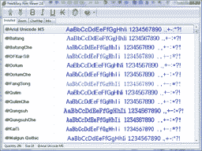
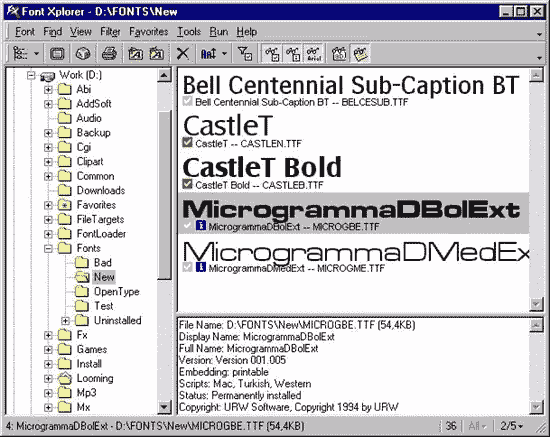
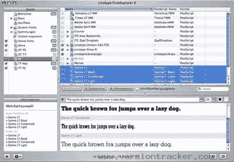

# 四个免费的字体管理器

> 原文：<https://www.sitepoint.com/three-free-font-managers/>

网上有如此多的字体，包括免费的和商业的，难怪许多设计师发现他们的字体收藏很快就失控了。我每周都会下载几个新字体，但我确实经历过在我的机器上有数百(如果不是数千)种字体的阶段。要掌握那么多字体变得非常困难，那么什么样的软件可以帮助你跟踪字体和管理呢？

商业字体管理器倾向于提供更多的功能和更复杂的工具。然而，如果你开始设计或者对字体感兴趣，有很多免费的字体管理程序。

**什么是字体管理软件**

您的 pc 或 mac 已经具备了一定的管理水平。您可以安装、查看或删除字体，也可以根据特定标准将它们分组。当应用程序需要时，计算机上安装的每种字体都会消耗一定量的系统资源。如果只是很偶尔用，装个字体基本上就是浪费。大多数字体管理软件只允许您在实际需要时激活或临时安装字体，从而释放资源，让您的电脑更高效地运行。

这里有几个免费和共享软件的例子，你可以考虑使用:

用于 windows 的[免费简易字体查看器](http://www.styopkin.com/details_free_and_easy_fonts_viewer.html)简单易用，让你查看已安装的字体并体验它们的各种风格。您可以预览字体，安装和卸载字体，以及查看更详细的字体信息。

[AMP 字体浏览器](http://www.ampsoft.net/utilities/FontViewer.php)让您快速浏览已安装和未安装的字体。它可以安装和卸载字体，并组织他们的类别。字体可以在程序运行时临时安装，以便在应用程序中使用，并在程序关闭时卸载。

Font Xplorer 1.2.2 是一个优秀的免费字体管理器，在功能和复杂度方面可以被认为是下一步。您可以浏览硬盘上已安装(和尚未安装)的字体，并使用*比较模式*搜索字体。您可以加载和卸载字体、安装和卸载字体、重命名字体、保存位图图像、查看字体信息(如版权信息和可用字符集)、搜索重复字体、过滤字体等等。

**对于 Mac 用户**
[Linotype font explorer X 1 . 2 . 3](http://www.fontexplorerx.com/download/)(注:是本页最后一个链接)是一个免费的，现在不支持的字体管理器。您可以查看、安装、卸载、排序和分组字体。

这只是可用内容的一小部分，如果您开始使用字体管理，可能会对您有用。

你使用过这些程序或其他程序来管理字体吗？

## 分享这篇文章