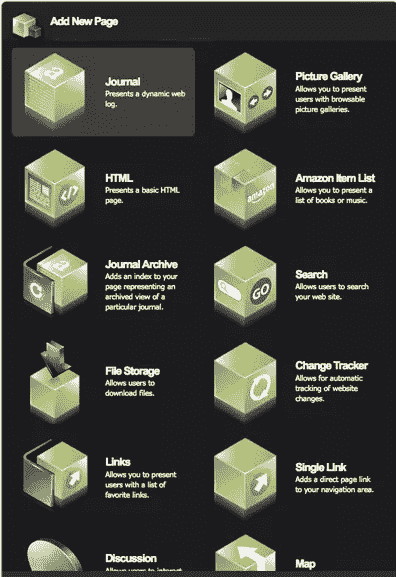
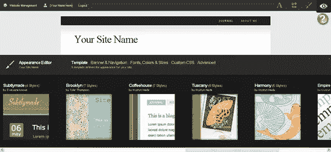

# Squarespace:这会让网页设计师变得多余吗？

> 原文：<https://www.sitepoint.com/squarespace-could-it-make-web-designers-developers-redundant/>

Squarespace 是一个商业内容管理系统(CMS ),它允许用户快速、方便地建立动态网站、照片库、论坛或博客。它包含许多具有特性和功能的核心模块。与 WordPress 不同，没有下载，因为所有的软件和数据都在 Squarespace 拥有和运行的服务器上。

这里的想法是用户可以使用拖放功能创建一个网站。使用 WYSIWYG(所见即所得)实现，网页和博客帖子可以在不了解 HTML 或 CSS 的情况下建立。或者，如果你是网站管理员，你可以使用 Markdown 编写自己的 CSS。正如预期的那样，菜单和导航由 CMS 负责。

核心模块及其各自的功能包括:

*   博客/日志——几乎所有你能想到的功能都包含在这里:RSS 支持、永久链接、评论、完全存档等等。
*   照片库-自动调整图像大小，RSS 和灯箱集成。
*   表单生成器–添加联系人或查询表单。
*   文件存储–允许用户下载文件。
*   论坛-建立社区。
*   变更跟踪——关注您在网站上所做的变更。
*   谷歌地图——轻松地在网站上添加地图。
*   亚马逊项目-将书籍或音乐添加为列表。
*   搜索–为网站添加搜索功能。

这些模块中的每一个都是通过点击一个按钮来添加的。

**设计**

有大量专业设计的模板，你可以应用到整个网站。模板本身非常灵活，可以选择多少列，宽度，横幅图像，颜色，字体，还可以选择添加自己的自定义 CSS。

**成本**

不利的一面是…
基本套餐每月花费 8 美元，包括主机服务、1GB 的存储空间和 75gb/月的带宽。有五种套餐可供选择，其中“社区套餐”的价格高达每月 50 美元。

我已经试用了几天，这是一个非常好的应用程序，而且整合得非常好。我不认为设计师需要为此失去太多的睡眠，使他们成为多余的人**(我只是成为一个戏剧女王)**，但根据它变得有多受欢迎，建立一个 Squarespace 网站可能是我们需要增加技能的事情。

你用过 Squarespace 吗？你认为这会成为开源软件 WordPress 的有力竞争对手吗？

## 分享这篇文章