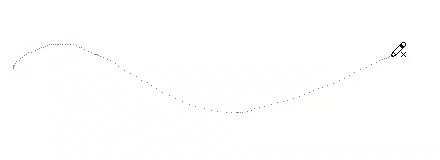
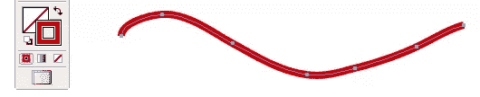
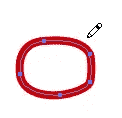
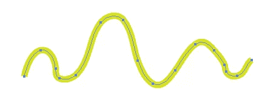
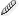
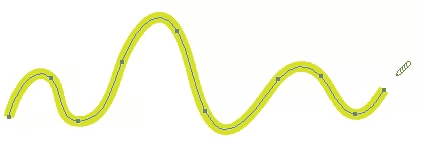

# 在 Illustrator 中绘图，第 3 部分:铅笔工具

> 原文：<https://www.sitepoint.com/illustrator-drawing-tools-part-3-the-pencil-tool/>

到目前为止，我们已经看了[线条工具](https://www.sitepoint.com/drawing-in-illustrator-part-1-the-line-tools/)和[形状工具](https://www.sitepoint.com/drawing-in-illustrator-part-2-the-shape-tools/)。今天我们来看看更直观的绘图工具之一——铅笔。顾名思义，这非常像使用真正的铅笔来绘制路径。您可以使用铅笔绘制开放或封闭的路径，并使用平滑工具来消除一些皱纹！

**用铅笔画画**

1.从工具箱中选择铅笔工具(或按 N 快捷键)。
2。单击要开始路径的位置，然后拖动并绘制。

您会注意到，当您拖移时，指针后面会出现一条虚线。锚点将出现在路径的起点和终点，以及路径上的几个点。完成拖动后，路径将采用您设置的任何描边和填充属性。

 **用铅笔工具绘制封闭路径；**
1。选择铅笔工具。
2。开始拖动以绘制您的路径。
3。现在，按住 **Alt** (Windows)或 **Option** (Mac OS)键。这基本上让 illustrator 知道你想创建一个封闭的路径。你会看到铅笔工具显示一个小圆圈，表示你正在创建一个封闭的路径。这意味着您不必将光标放在起始锚点上来关闭路径。Illustrator 将为您关闭路径。

4.当你画完你想要的形状后释放鼠标，然后当路径关闭时，释放 **Alt/Option** 键。

当你用矢量绘图时，一个好的经验法则是使用尽可能少的锚点。锚点越少，曲线和直线越平滑。铅笔工具的一个缺点是它倾向于创建带有不必要锚点的路径。平滑工具通过移除多余的锚点来平滑路径的外观。

假设我用铅笔画了下面的路径。它比我想要的要粗糙一些，所以我要把它弄光滑。

1.选择您刚刚绘制的对象或路径。
2。从工具箱中选择平滑工具，或者按住 **Alt/Option** 键从钢笔工具快速切换到平滑工具。
3。沿着要平滑的路径段的长度拖动工具。你不必在整个物体上拖动它。

4。继续平滑，直到你对路径满意。

一起使用，你会发现铅笔和光滑的工具是一个很好的绘画组合。明天我们将看看初学者最害怕的工具之一——钢笔工具。

**相关阅读:**
[Illustrator 绘图工具，第一部分:线条工具](https://www.sitepoint.com/drawing-in-illustrator-part-1-the-line-tools/)
[Illustrator 绘图工具，第二部分:形状工具](https://www.sitepoint.com/drawing-in-illustrator-part-2-the-shape-tools/)

## 分享这篇文章