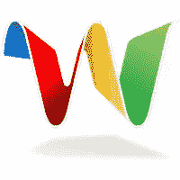

# Google I/O 真让人大开眼界！

> 原文：<https://www.sitepoint.com/google-io-a-real-eye-opener/>



最近的[谷歌 I/O 活动](http://code.google.com/events/io/)产生了很多很棒的东西，包括一个新的地图 API 和最令人惊叹的:Google Wave。微软选择在这个时候宣布他们的新搜索引擎，[必应](https://www.sitepoint.com/microsoft-bing/)，有点令人费解。它似乎被谷歌的所有声明大大掩盖了。对我来说，宾变成了烟枪。没关系，以下是我个人最喜欢的谷歌输入输出:

[Web Elements](http://google-code-updates.blogspot.com/2009/05/introduce-google-web-elements.html) 允许你将各种谷歌产品嵌入到一个网页中；Google Docs 中的电子表格或演示文稿、Google Friend Connect 中的对话、Google Calendar、自定义搜索和新闻等项目。[Web Elements 站点](http://www.google.com/webelements/)有一组生成代码的简单表单；你需要做的就是选择特征，然后复制和粘贴。我确实注意到他们中的许多人使用了 iframe，这可能会让那些不喜欢 iframe 的人失望。但是，它们很容易使用，我毫不怀疑它们会受欢迎。

曾经想象过能够用 JavaScript 编写 Word 宏是什么样子吗？Google Apps 脚本将允许你用 JavaScript 自动运行 Google Apps。演示视频展示了一个电子表格，它使用一些定制的 JavaScript 函数来转换测量值、发送电子邮件和翻译语言。这看起来像是谷歌应用程序成为一个有能力的办公室替代品的又一个组成部分。添加应用引擎，你可以想象你的公司的内部网完全运行在谷歌的产品上。

## 谷歌地图 API v3

谷歌地图 API 已经进行了重大的重新设计，并发布了版本 3。令人高兴的是，您不再需要 API 密钥。有许多变化，但为了便于比较，请看一个来自 v2 API 的示例:

```
function initialize() {
 if (GBrowserIsCompatible()) {
  var map = new GMap2(document.getElementById("map_canvas"));
  map.setCenter(new GLatLng(37.4419, -122.1419), 13);
  map.setUIToDefault();
 }
}
```

现在将其与新的 v3 API 进行比较:

```
function initialize() {
 var latlng = new google.maps.LatLng(-34.397, 150.644);
 var myOptions = {
  zoom: 8,
  center: latlng,
  mapTypeId: google.maps.MapTypeId.ROADMAP
 };
 var map = new google.maps.Map(document.getElementById("map_canvas"), myOptions);
}
```

好多了。这与我对良好的 JavaScript 应该是什么样子的感觉非常吻合。API 使用起来更干净，而且它的命名空间也很合适；全局名称空间中不再有以“g”开头的函数。它显然速度更快，下载的 JavaScript 更少，并且现在支持 Safari Mobile。

## Google Wave

对我来说，最重要的是谷歌 Wave。我会把它描述成 12 种装扮成忍者的牛逼。这是一个结合了电子邮件、即时消息等功能的实时协作和通信平台。听起来像是*的企业风格*，在我看来，这似乎也非常适合 Twitter 式的临时交流。令人惊讶的是，它是作为开源产品发布的。

你真的需要[观看演示视频](http://wave.google.com/)来获得对 Wave 的正确理解。演示中的产品是一个使用 Google Web Toolkit 构建的 HTML 5 应用程序。但是，由于 Wave 是一个开放平台，任何人都可以开发替代的 Wave 客户端、扩展，或者在其他 web 平台中嵌入 Wave。你甚至可以毫不费力地在网页中嵌入 wave。首先，你为它制造一个地点:

```
<div id="waveframe" style="width: 500px; height:100%"></div>
```

然后用 JavaScript 初始化它:

```
function initialize() {
 var wavePanel = new WavePanel('http://wave.google.com/a/wavesandbox.com/' );
 wavePanel.loadWave('wavesandbox.com!w+waveID');
 wavePanel.init(document.getElementById('waveframe'));
} 
```

有很多值得兴奋的事情！

## 分享这篇文章