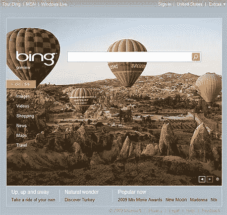
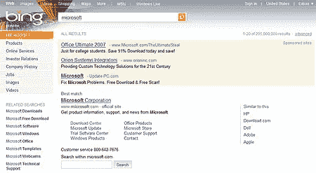

# 微软 vs 谷歌:开始吧

> 原文：<https://www.sitepoint.com/microsoft-bing/>

如果你还没有听说过微软的新搜索引擎，[Bing.com](http://www.bing.com/)，你很快就会知道了:该公司计划在必应广告上花费高达 1 亿美元。

必应是微软在自己的游戏中挑战谷歌的最新尝试。他们以前已经尝试过几次了，但这次能成功吗？Bing 好吗？

第一，名字。根据微软首席执行官史蒂夫·鲍尔默的说法，“这个名字很短，很容易说，它在全球范围内都有效。”也许他是对的。尽管在市场调查上花费了数百万美元，微软从来没有以抢眼的产品而闻名。名字要么是枯燥和描述性的(Internet Explorer、Word 或 Office)，要么是令人困惑和市场导向的(Live-Wassit 或 Widget)。网)。Bing 更像是一个 Web2.0 创业公司的名字，几乎没有微软的品牌。

Web2.0 的感觉并不以名字结束。界面是光滑的，图形化的，充满了效果和弹出对话框(除非你用的是 IE6)。微软在过去尝试过有趣和时尚，但看起来总是像一个试图跳迪斯科舞的父亲。Bing 要好得多:它会吸引孩子，而不会吓跑企业用户。

但是搜索有什么好处吗？微软称 Bing 为“决策引擎”,因为它能更仔细地提炼结果，并提供相关感兴趣的话题。它会识别你的搜索词，并在左边的菜单中提供改进。例如，输入“星际迷航”,它会提供顶级搜索结果以及图片、演员细节、壁纸、主题曲、DVD 和剧集指南的链接。虽然谷歌提供了 9200 万个链接，但 Bing *only* 有 5200 万个结果，但可以提供更合适的材料和相关的搜索词。

有趣的是，像“facebook”这样的词最初只返回一个结果:Facebook.com。这里有参考文献、应用程序和一个关于该网站的嵌入式维基百科页面的链接。你可以扩展搜索结果，但不像谷歌，离开网站的理由更少:这是微软和他们的广告客户会欣赏的。

不太受欢迎的词显示类似谷歌的结果列表，在顶部和右侧有赞助商链接。有一些不错的操作:将鼠标悬停在一个链接上，它会向你显示网站上的一段文本，或将鼠标悬停在一个视频上，它会立即播放一个短片。

总的来说，Bing 有一种尚未完成、正在进行的感觉(尽管它比 [Wolfram Alpha](https://www.sitepoint.com/wolfram-alpha-launch/) 要好)。基于美国的服务是最完整的:通过点击右上角的国家名称切换到它。针对英国和其他地区的特定版本预计将在几周内推出。

与微软之前过于雄心勃勃的声明不同，该公司淡化了他们对必应的期望。他们最初的目标是雅虎，该公司目前处理的 Live.com 搜索量是其两倍左右。但他们没有骗任何人:谷歌是他们真正想要击败的竞争对手。评估必应的搜索结果比谷歌好还是差还需要时间。它们看起来不错——或许同样不错——但它能克服人们的搜索转换惯性吗？

微软表示，必应将解决 40%无人应答的搜索查询。我很想知道他们是如何得出这个数字的，但如果用户对他们的搜索结果感到失望，谷歌还会如此占据主导地位吗？

你觉得冰怎么样？它足够好来挑战谷歌吗？或者它只是又一次令人沮丧的失败？

## 分享这篇文章