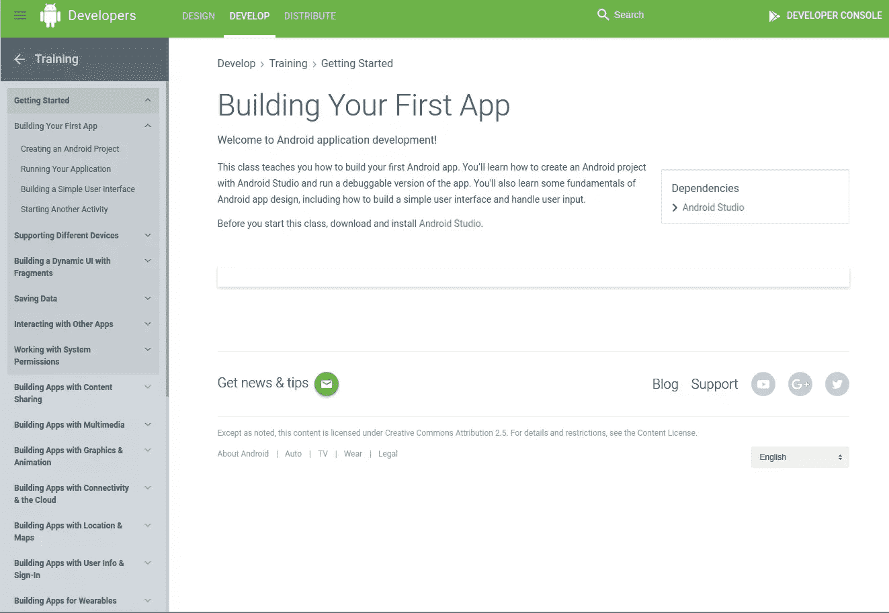
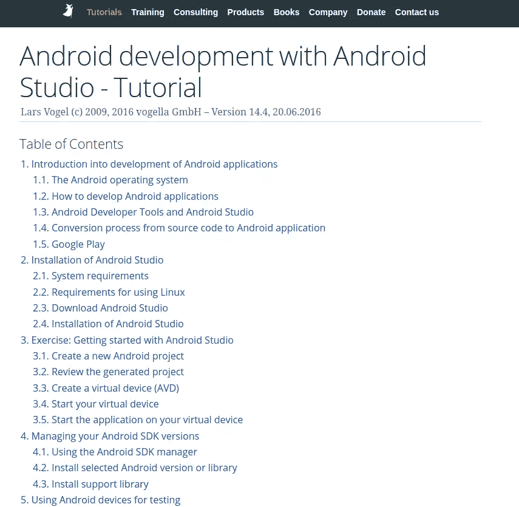
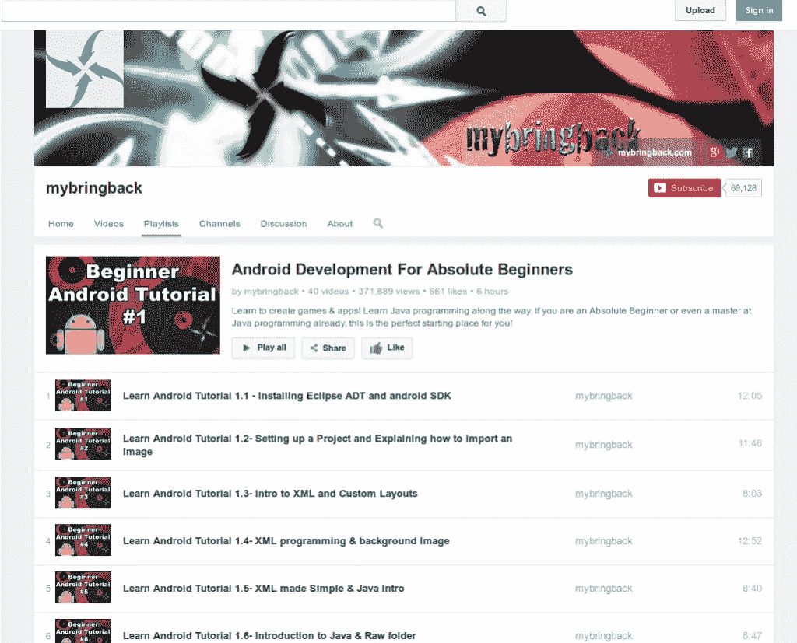
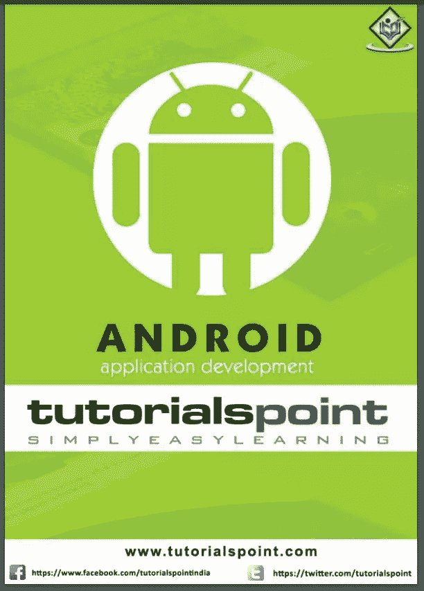
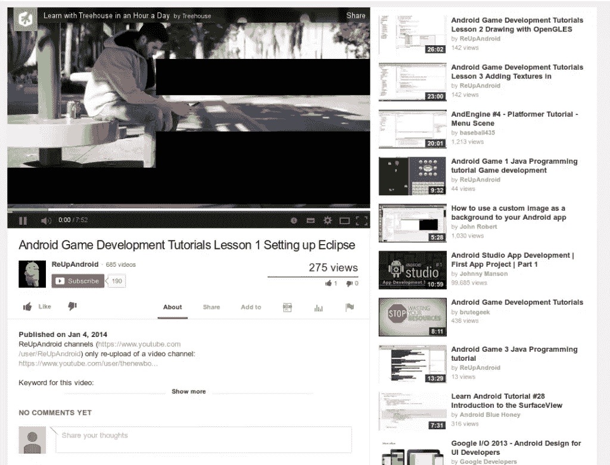
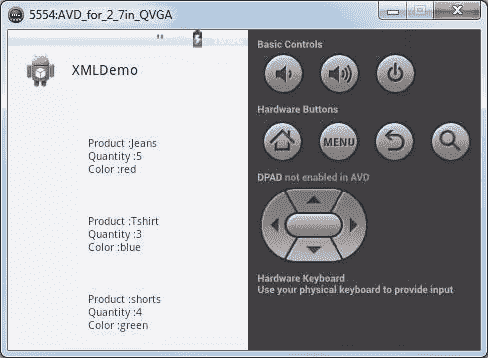
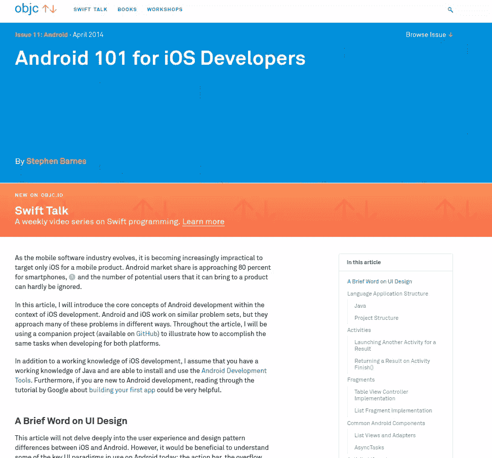
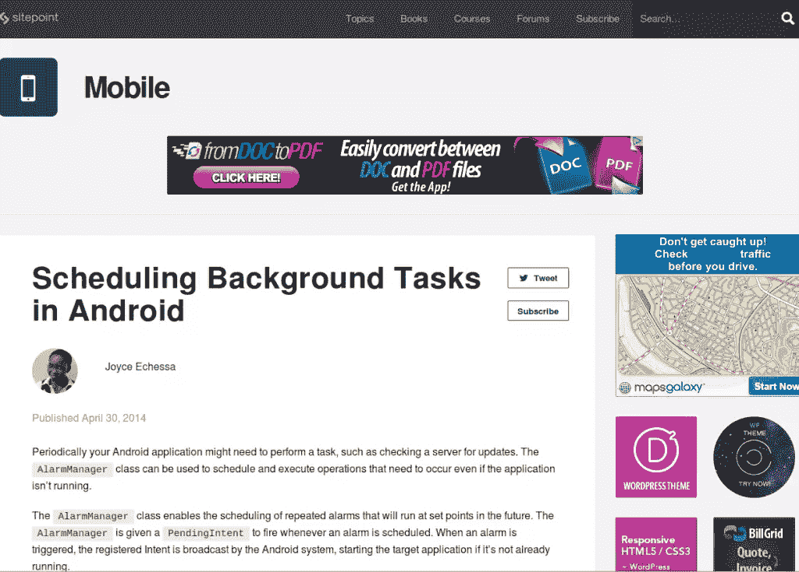
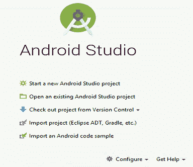
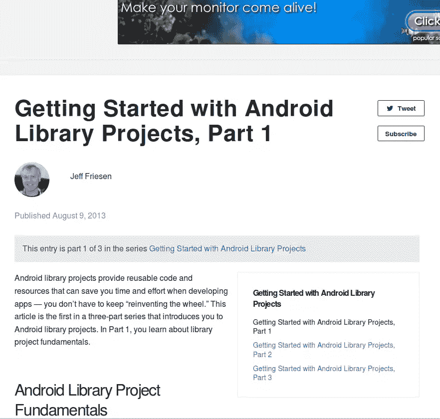

# 首次开发应用程序的 12 个最佳 Android 教程

> 原文：<https://www.sitepoint.com/12-android-tutorials-beginners/>

*本文更新于 2017 年 1 月。*

*通过我们的截屏了解更多关于官方 Android IDE 的信息[官方 Android IDE 之旅——Android Studio](https://www.sitepoint.com/premium/screencasts/a-tour-of-the-official-android-ide-android-studio)截屏。*

当有这么多信息，并且你是第一次 Android 开发人员时，很容易对从哪里开始感到困惑。为了让你不抱幻想地认为这个列表是最好的或者完整的，这里有 12 个 Android 教程。

并不是所有的教程及其内容都是严格针对初学者的。他们中的一些人从初学者开始，然后钻研更高级的主题。因此，如果你不能遵循每一个教程中的所有内容，不要绝望或沮丧。

如果你遇到了障碍，就花更多的时间阅读教程，如果有必要的话读几遍。如果你仍然和它不友好，那就没什么可大惊小怪的——向前看，以后再来看。

## 构建您的第一个应用

自然地，我们从 Android 的创造者 Google 的教程开始。'[构建你的第一个应用程序](https://developer.android.com/training/basics/firstapp/index.html?hl=p)'教程从最开始开始，它适合绝对的初学者。如果你没有任何编程知识，不要指望能够处理教程，但如果你有一些编程背景，这很容易。

教程最后有几个“最佳实践”部分。这很好，因为所有关于主题的重要内容都在一个地方，你只需要阅读它。

## Android 开发–教程

本教程接近顶部的原因是它非常新(基于 Android 7.0，截至今天的最新 Android 版本)。

本教程比谷歌的教程有更多的主题和信息，所以如果你正在寻找一个深入的教程，这是其中之一。

这不是一个简单快速的教程。如果你想从中获得最大的收获，你将需要相当多的时间来从头到尾阅读它。如果您需要详细查阅某个特定主题，这可能是一个很好的来源。

## 视频教程系列

我发现视频教程用处不大(除非它们教授设计、动画或任何其他视觉主题)，但对许多人来说，它们是首选的学习方式。如果你属于这个群体，你一定会喜欢[这个系列视频教程](https://www.youtube.com/playlist?list=PLB03EA9545DD188C3)。

这是一个全面的视频教程系列，长度从 5 分钟到 15 分钟不等。与前两个教程类似，这个系列涵盖了从绝对初级到高级主题的所有内容。它不是最新的，但我找不到一个像样的视频教程关于一个更近的 Android 版本。

## 安卓教程/书

这可能有点老套，但对我来说，了解一件事情的最好方法是阅读相关书籍。在一本书里，所有的东西都是有逻辑地组织起来的，页面被编号并保持它们的布局，有足够的文字来解释代码和图形。这个列表中的前两个教程像书一样，但是如果你想要更真实的东西，你可以把它们打印出来。更好的是，像这样的 pdf 教程是更好的选择。与之前的资源类似，这个可能不是最新的，但它确实涵盖了 Android 编程的主要原则。

这是一个更全面的教程，涵盖了从初级到高级的 Android 开发。

## 游戏开发系列

如果你有一些关于 Android 的知识，但你想深入研究游戏开发，[这一系列视频教程](https://www.youtube.com/watch?v=EJqmN94eIKk)是一个很好的开始。该系列从 Android(和 Eclipse)的基础知识开始，但我个人的感觉是，如果你对 Android 完全陌生，这个旅程将会非常艰难。同样，本教程不是关于最新的 Android 版本，但它确实提供了一个关于 Android 编程的坚实基础，我找不到比这更新的了。

据我所见，该系列也提到了一般的 Android，而不仅仅是游戏开发。如果你不了解 Android 基础，我的建议是先看一些通用的 Android 教程，然后再转到专门的话题，比如游戏开发。

## 更好的 Android 操作栏用户界面

在你看够了一般的 Android 教程之后，让我们转到常见任务的教程。对于其中的一些主题，你也可以在通用教程中找到信息，但是如果你想要更多的细节，这是给你的。第一个教程是关于[如何用 Android 动作栏](https://www.sitepoint.com/better-user-interfaces-android-action-bar/)构建更好的用户界面。

在本教程中，您将学习如何设置动作栏，如何添加动作，如何分割，隐藏和覆盖它，以及如何添加导航。您还将了解动作栏的交互性，例如如何处理项目上的点击以及如何使用动作视图。

## 学习在 Android 应用程序中解析 XML 数据

虽然您可以编写不涉及任何数据输入的 Android 应用程序，但通常您需要外部数据。在这种情况下，您需要知道如何处理这些数据。XML 可以帮你很多，这就是为什么我在 Android 应用程序中包含了一个关于[如何解析 XML 数据的教程。](https://www.sitepoint.com/learning-to-parse-xml-data-in-your-android-app/)

本教程一步一步地带领您进入 XML 解析的世界。它还可以帮助您创建一个类似于下一个屏幕截图的解析器。

## 面向 iOS 开发者的 Android 101

随着 Android 的大受欢迎，即使是死忠的 iOS 开发人员也可能会考虑转向或至少扩展到它。如果你是一名 iOS 开发人员，你是幸运的，因为从整体上看，你对移动开发并不陌生。当然，你可以阅读我之前列出的一般 Android 教程，但是特别为你，[这里有一个更好的教程](http://www.objc.io/issue-11/android_101_for_ios_developers.html)。不幸的是，本教程中的一些信息可能已经过时，但随着移动编程技术的快速发展，这是不可避免的。你可能想查看同一主题的[最近的教程](https://savvyapps.com/blog/how-to-start-android-development-with-an-ios-background)，但是它没有第一个那么详细。

这篇教程很棒，因为它总结了 iOS 开发和 Android 开发的区别，从而让你的改变更容易。你可能需要单独阅读它提到的一些要点，但它是一个很好的教程，不需要太详细。

## 在 Android 中调度后台任务

这个主题有点高深，但是因为它并不太难，而且很有用，所以把它列入列表是有意义的。Android 中的'[后台任务'教程讨论了 Android 中的闹钟类型以及如何设置。](https://www.sitepoint.com/scheduling-background-tasks-android/)

## Android 冒险 Android Studio 入门

我不认为 Android Studio 是开发 Android 应用程序的最流行的方法，但因为它(据称)使 Android 开发更容易，[这里有一个关于 Android Studio 的教程](http://www.i-programmer.info/programming/android/5887-android-adventures-getting-started-with-android-studio.html)。

即使你已经使用了其他的 Android 开发工具，并且你不想改变它们，阅读 Android studio 能提供什么仍然是有意义的。

该教程非常详细——从如何安装 Android Studio、如何创建新项目、如何添加功能、如何运行等开始。该教程不难阅读，但如果你没有 Android 知识，你可能无法理解一切。

## 本地化 Android 应用程序

安卓应用风靡全球。你的用户说不同的人类语言，这意味着如果你想接触他们，你需要考虑本地化你的 Android 应用。[本教程](https://www.sitepoint.com/localizing-android-apps/)全部讲解。

## Android 库项目入门

在你 Android 开发生涯的某个时候，你会厌倦不得不一直重新发明轮子，你会欣赏可重用代码的优势。如果你已经在那里了，你肯定会想知道更多关于可重用代码的知识。在这种情况下[本教程](https://www.sitepoint.com/getting-started-with-android-library-projects-part-1/)将帮助你尽快开始。

“Android 库项目入门”教程有点长，因为这是一个由三部分组成的系列。第一部分用一些基本的概念让你兴奋起来，而另外两部分则深入探讨如何以及何时使用 Android 库项目的更多细节。

## 结论

我不能保证在读完这个列表上的所有教程后，你会成为一名顶尖的 Android 开发者，但它们是一个很好的开始。

这些教程大部分是给初学者的，但我相信即使是有经验的 Android 开发者也会有新的东西要学，或者找到更好的方法来完成他们已经做了很久的任务。所以，如果你有一分钟的空闲时间，检查教程，学习一些新的东西，让我们知道你最喜欢的教程。

*通过我们的截屏了解更多关于官方 Android IDE 的信息[官方 Android IDE 之旅——Android Studio](https://www.sitepoint.com/premium/screencasts/a-tour-of-the-official-android-ide-android-studio)截屏。*

## 分享这篇文章