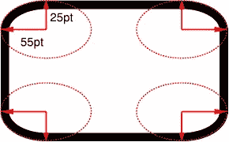

# 12 个鲜为人知的 CSS 事实(续)

> 原文：<https://www.sitepoint.com/12-little-known-css-facts-the-sequel/>

一年多前，我发表了最初的 [12 个鲜为人知的 CSS 事实](https://www.sitepoint.com/12-little-known-css-facts/)，直到今天，它仍然是 SitePoint 有史以来最受欢迎的文章之一。自从那篇文章发表后，我一直在为一篇新文章收集更多的 CSS 小技巧和花絮。因为我们都知道每一部成功的电影都应该有一个俗气的续集，对吗？


SitePoint/ [Natalia Balska](http://sf-lab.net/) 的作品。

所以让我们直接进入今年的开发者大会。我相信我们中的许多人至少知道其中的一些，但是你可以在评论中让我知道有多少对你来说是新的。

## 1.`border-radius`属性可以使用“斜杠”语法

这是我四年多前在 SitePoint 上之前[写过的东西，但我仍然认为许多初学者甚至一些有经验的开发者不知道这个功能的存在。](https://www.sitepoint.com/setting-css3-border-radius-with-slash-syntax/)

信不信由你，以下是有效的`border-radius`代码:

```
.box {
  border-radius: 35px 25px 30px 20px / 35px 25px 15px 30px;
}
```

如果你从未见过这种情况，可能会有点困惑，所以下面是规范中的解释:

> 如果在斜线前后给出值，那么斜线前的值设置水平半径，斜线后的值设置垂直半径。如果没有斜线，则两个半径的值相等。

该规范还提供了以下图表:



该图像的标题解释道:`border-top-left-radius: 55pt 25pt`的两个值定义了角的曲率。

因此，在值中使用斜线允许您创建不对称的弯曲拐角。如果你想更详细地了解这一点，可以查看上面链接的我的原创文章，或者更好的是，试试 MDN 的这个[便捷的互动演示:](https://developer.mozilla.org/en-US/docs/Web/CSS/Tools/Border-radius_generator)

[https://mdn.mozillademos.org/en-US/docs/Web/CSS/Tools/Border-radius_generator%24samples/border-radius-generator?revision=516167](https://mdn.mozillademos.org/en-US/docs/Web/CSS/Tools/Border-radius_generator%24samples/border-radius-generator?revision=516167)

大多数`border-radius`生成器不允许您设置这些可选值。MDN 生成器是我发现的唯一一个可以做到这一点的生成器。

## 2.属性接受相对关键字

正常情况下，当您看到定义的`font-weight`属性时，该值将是`normal`或`bold`。您也可能偶尔会看到一个以百为增量的整数值:`100`、`200`等。，直到`900`。

然而，经常被遗忘的两个值是`bolder`和`lighter`。

根据规范，这些关键字指定了比继承值更大或更小的权重。当您处理的字体有多个粗细，比普通的“粗体”更粗，比普通文本更浅时，这一点就显得尤为重要。

在以百为基数的值中，“粗体”映射到`700`,“正常”映射到`400`。因此，如果你有一个字体有一个`300`权重，但没有更低，如果继承的值是`400`，那么“更轻”的值将产生`300`。如果没有更轻的重量(即`400`是最轻的重量)，那么它将停留在`400`处，因此“更轻”的值没有影响。

请看下面的 CodePen 演示:

在 [CodePen](http://codepen.io) 上通过 SitePoint ( [@SitePoint](http://codepen.io/SitePoint) )查看使用 font-weight 加粗/加粗关键字的笔[。](http://codepen.io/SitePoint/pen/domZLx/)