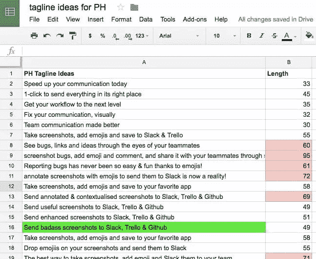

# 开始寻找产品前要知道的 12 件事

> 原文：<https://www.sitepoint.com/12-things-to-know-before-you-launch-on-product-hunt/>

[Product Hunt](https://www.producthunt.com/) 是一个收集全球新产品的热门网站。它始于 Listserv，后来发展成为一家拥有数百万美元资产的[公司。它拥有知名投资者，如 Reddit 创始人](http://www.sfgate.com/business/article/Product-Hunt-goes-from-listserv-to-5757577.php)[亚历克西斯·奥哈尼安](http://alexisohanian.com/)。这些投资者相信该网站有一天能与 TechCrunch 竞争。

Gary Gaspar 是一位精明的产品搜寻老手，也是一位来自比利时的年轻企业家。他还是一家 SaaS 公司 [Marker](https://getmarker.io/) 的首席执行官，该公司帮助企业在 Trello、Slack、Github 和其他地方标注截图。Gary 在寻找产品的过程中经历了高潮和低谷。在他的第一次约会中，他有 60 个来自产品搜索的访客。他的第二次尝试为他赢得了 1600 个免费试用注册。

加里同意在一次独家采访中分享 12 个成功秘诀。

## 1.不要鼓励人们投赞成票

产品搜寻是建立在投票之上的。你得到的支持越多，你就越成功。加里补充道:

“寻找产品的整个想法是让社区对你的产品给予信任。如果社区喜欢它，你的产品会上升到顶端。如果他们没有，你就不配上头版。”

然而，不要把你的发射留给自己。你应该告诉你的朋友、家人和客户你的产品搜索活动。诚然，产品搜索禁止那些施压或鼓励人们投票的用户。尽管如此，让人们知道你的发布，并要求他们如果喜欢你的产品就投赞成票，这并没有错。加里说:

“我不认为这是一个非黑即白的决定。你可以让一些朋友或家人，甚至你自己的客户给你一个支持票，如果他们认为你值得的话。我认为你不应该坐以待毙，等待赞成票的到来。你可以通过让球滚动一点来帮忙。10%应该是来自[个人要求]的绝对最高票数。”

## 2.预料不到的事情

产品搜索有一个特殊的系统。你可以推出自己的产品，也可以让别人替你提交产品。如果他们来了，你需要做好准备。加里不是，他的第一次发射并不成功。加里伤感地回忆道:

“我们进行了两次发射。第一个不是我们做的，是个大失败。我们只有 20 张赞成票和 60 名来自产品搜索的独立访客。”

基本上，有人在 Gary 准备好之前就推出了 Marker，这是一场灾难。这不是恶意的，这只是一个球迷想与世界分享标记。然而，这对加里没有任何好处。产品搜索中的产品有 24 小时的时间大展拳脚。加里没有准备好，看起来他失去了机会。不允许您两次提交相同的产品。

## 3.您可以重新启动产品搜索

Gary 认为他没有从产品搜索中得到他应该得到的东西。这就是为什么他决定进行第二次发射——标记 2.0。他也看到了一线希望。这一次，他将完全控制发射的时间。

“您不能提交两次[产品]。我们知道我们对(第二次)发射有 100%的控制力。”

希望你不用发射两次。然而，总有可能有人会提前让你去找产品。如果你能改进你的产品，值得考虑第二次推出。

## 4.重新启动并不适合所有人

当加里重新推出产品时，社区经理本·托塞尔对此表示怀疑。他向 Gary 询问重大更新。加里并不担心。他准备了一份名单。

1.  工具和 UX 的完全重新设计
2.  新的入职流程
3.  与吉拉的新整合
4.  一个新的截图编辑器
5.  表情符号！

正如你所看到的，有重大的更新。重新推出产品是一个容易被滥用的系统。这就是为什么 Product Hunt 确保每一次重新发布都比原来有实质性的改进。重新启动是一项重大投资。在一个完美的世界里，你希望第一次就做对。

## 5.产品搜寻用户的转化方式不同于普通用户

免费试用到期后，Gary 发现 Product Hunt 的客户转化不如普通客户。他们很感兴趣，但他们不符合他的买家身份。加里解释道:

“也许你会发现(只有少数产品搜索注册)会真正坚持下来。然后你要搞清楚为什么这个用户子集是成功的。代理商是我们最好的客户，大多数来自 PH 的用户都不是代理商。”

并非所有的风险都是平等的。Gary 获得了 6000 多个注册，但他在非代理客户中的成功率很低。在他分析了这些数据之后，他能够更好地服务于他的目标市场。

## 6.产品搜寻算法优先考虑速度

这句引自 [Medium](https://medium.com/@edmoyse/the-stats-behind-product-hunt-why-you-should-launch-exclusively-38663c369f18#.i1hfgx24f) 的话，解释了产品猎奇潮的千变万化。

午夜钟声敲响时(太平洋标准时间)，产品搜寻日再次开始，产品清单被清除，新产品开始被搜寻

这就是速度至关重要的原因。

“你希望在 24 小时内获得尽可能多的支持票。加里说:“如果你想获得 500 张赞成票，你最好在第一天就获得其中的绝大多数。”

产品搜索的曝光是时间敏感的。从这个意义上说，它比电子邮件更接近脸书。一旦有东西从脸书信号中消失，它就消失了。眼不见心不烦。产品搜索也是如此，但与脸书不同，你不能再次发帖。

## 7.有效的标语是有用的

想出一个吸引人的标语绝非易事。这是一项需要大量工作的任务。加里和他的团队花了整整一周的时间来构思一条标语。这是一些想法的 Excel 表格。

一句好的标语能达到完美的平衡。很具体。但是，不太具体。以下是 Gary 用他典型的丰富多彩的风格说的话。

“这个想法是，你希望尽可能具体，你希望传达尽可能多的价值。你不希望过于具体到甚至不再性感的地步。”

你可以看看加里的例子，看看斗争。

*   **太含糊:**今天加快你的沟通
*   **太具体:**把带注释的、有语境的截图发给 Slack、Trello、Github。
*   **刚刚好:**把 badass 截图发给 Slack，Trello，和 Github

如你所见，他决定在他的标语中诅咒。这并不适合所有人，但这符合他的个性和品牌。

## 8.不要跳过视频和图像

加里为寻找产品制作了一个丰富多彩、引人入胜的视频。你不必专门为你的产品搜寻制作一个视频。加里没有；他的视频也在他的网站上。然而，他精心制作了一个高质量的视频。事实上，加里花了两个工作日才完成。

“我首先是为了网站。然后我想我也可以用它来进行产品搜索活动。这花了我大约两天时间，因为我在这方面没有任何技能。”

声明一下，Gary 不建议花两天时间做一个视频。他这样做是因为预算的原因。加里指出:

“我的哲学是让最优秀的人去做他们能为你做的事情，只要你负担得起。对我们来说，这不是我们想要投资的东西，所以我就自己做了。”

## 9.你不需要统治海洋，但你想引起轰动

你不一定要成为产品搜索的第一名。这不是零和游戏，而是对勋章的追求。然而，你想把事情做好，让别人注意到你。否则，你就是在浪费时间。

“你不需要成为第一，但你需要进入前五名或前十名。Gary 说:“你从 PH 中唯一能得到的是流量和用户的洞察力。

随着产品搜索的增长，这些数字可能会失去意义。关键是，你想和相当多的人联系。仅仅寻找产品是不够的。你想要大量曝光。

## 10.不要在发布前要求你的产品尽善尽美

Product Hunt 有一个明确的政策，反对释放[蒸汽制品](https://www.producthunt.com/faq)。所以，不要发布。然而，你的产品不会尽善尽美。加里强调你不应该让完美成为优秀的敌人:

“在旅程的前六个月，你需要反馈。如果你打算花六个月的时间调整你的设计，你是在浪费时间。很多企业家都是用劣质产品工作的。”

加里是什么意思？基本上，不要花几个月的时间泡在泡泡里，做一些小的设计改动。商业的首要任务是提供价值。要做到这一点，你需要反馈。

“如果你甚至不知道一个产品是否能解决痛点，你就不会想推出它，”Gary 说。

使用产品搜索获取有价值的反馈，帮助您取悦客户。即使客户为你的产品付费，你仍然可以改进。马克就是这种情况。

## 11.产品搜寻改善了已经在销售的产品

马克笔解决了一个痛点。在产品搜索之前，Marker 拥有来自世界各地的付费客户。在他开始寻找产品后，Gary 意识到顾客是不顾设计而使用 Marker，而不是因为设计。Gary 记得 Marker 的第一个版本受到了许多评论者的抨击:

“将我们产品的这个版本发布出去非常具有挑战性。它甚至会伤害你的自尊心。【人家说了好多:】这个丑。这不起作用。这有一百万个漏洞。与此同时，世界各地的人们都在使用我们的产品，并为使用付费。”

Gary 正在解决一个棘手问题，但仍有很大的改进空间。Product Hunt 向 Marker 发送了 6000 份注册信息，但它也提供了宝贵的反馈，帮助他的公司更好地服务于现有客户。加里补充道:

“如果你想进入大众市场，你需要一些在设计、缺陷和用户体验方面都可以接受的东西。”

Marker 已经不仅仅是解决一个棘手的问题。现在加里想取悦他的顾客并扩大他的业务。产品搜寻启发他走这条路。

## 12.抓住有影响力的人

第一次，一个随机搜索产品的用户启动了 Marker。Gary 权衡了他对 Marker 2.0 的选择。他意识到有影响力的人是产品搜寻取得巨大成功的关键。Gary 解释说，自己启动 Marker 是一个备用计划。

“这是我们的 B 计划。让别人帮你做总是更好，如果是一个有影响力的人并有一群追随者就更好了。你更信任别人。如果我拥有一家餐厅，我告诉你我必须去镇上最好的餐厅，(这种说法)存在偏见。”

加里联系了一位名叫布拉姆·坎斯坦的有影响力的人。他有超过 5000 名产品搜索粉丝，这个数据对加里很有吸引力。那么，加里是如何找到并推荐他的呢？他回忆了这个过程:

“基本上是大量的研究，我看到他的一篇博文，他说他乐于接受产品创意。[布拉姆]说，我认为这是一个伟大的产品。”

加里给布拉姆发了一份信息清单:标语、名字、网址、描述和截图。他想让自己轻松一些。之后，布拉姆负责剩下的。剩下的就是历史了，一个 6000 人注册的精彩故事。

## 结论

产品搜寻是每个创业公司都需要考虑的事情。投资者正投入数百万美元，因为他们看到了巨大的潜力。你的创业公司可以利用这种潜力。

Gary 通过反复试验，艰难地了解了产品搜寻。使用这 12 条建议，你会更容易做到。

## 分享这篇文章