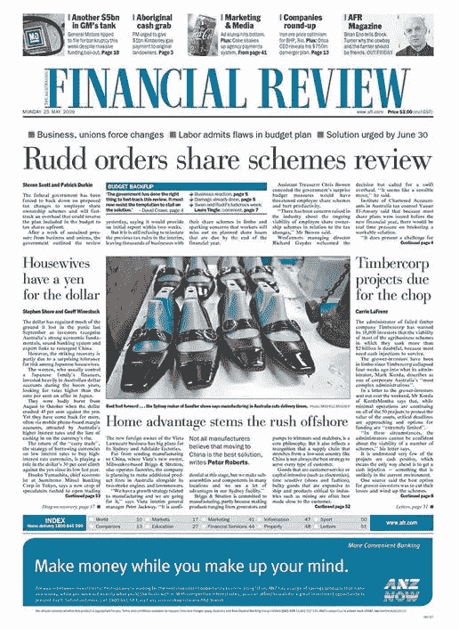
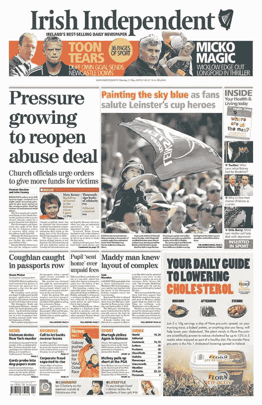
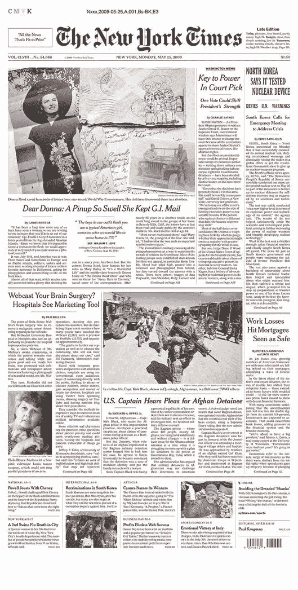
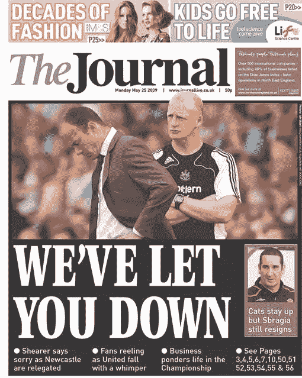
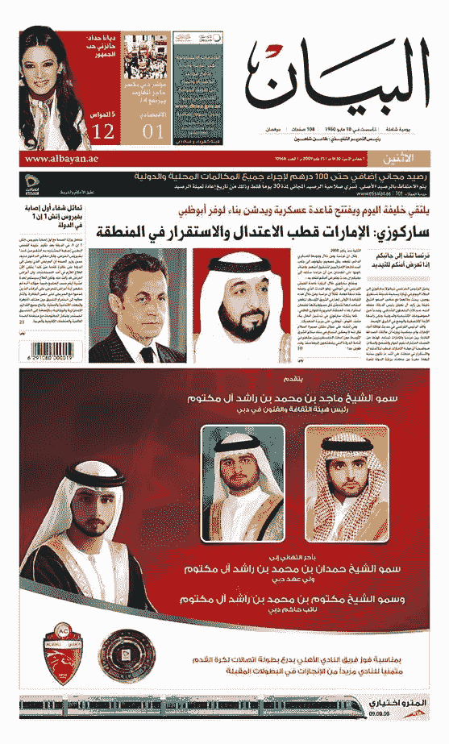

# 离线设计灵感，第 2 部分:报纸

> 原文：<https://www.sitepoint.com/offline-design-inspiration-part-2-newspapers/>

上个月，我写了一篇关于我们如何利用[杂志封面获得色彩灵感](https://www.sitepoint.com/designinspiration-magazines/)的文章。继续这个主题，我再次从印刷材料中寻找想法和灵感。这一次，设计创意的来源是报纸。

第一份“报纸”是分发给商人的手写时事通讯。印刷报纸大约在 15 世纪晚期出现在德国，而第一份美国印刷报纸《公共事件》于 1690 年出现在波士顿。正如你所想象的，这些论文都是以打字为主的。

然而，如果你选择这样看的话，今天的报纸确实是一场赏心悦目的盛宴。想想所有相关的设计元素

排版
摄影
插图
信息图形
横幅
标志
品牌
布局网格

不要忘了在周末，许多报纸提供的所有额外的版面、精美的杂志和海报，会带来更多的视觉享受和创意。

让我们来看几个例子。你会看到所有的报纸都使用网格来编排故事和图片。许多网页设计师现在使用网格或框架来设计他们的网站。

**1。澳大利亚金融时报**在颜色和字体选择上相当稳重。他们有非常特定的受众，设计反映了这一点。注意蓝色的重复。它出现在报纸标题、索引、页面底部的大广告甚至是主图片中。

**2。爱尔兰独立报**更鲜艳一点，但是在文本和图像中，蓝色和橙色在页面上重复出现。(顺便提一下，本页的主图显示了一些爱尔兰橄榄球球迷。我不是在吹牛，但是爱尔兰橄榄球队今年表现非常好！)

**3。《纽约时报》在标题、副标题和引用语中使用了优雅的字体。**

**4。英国杂志**有一个相当标准的小报版面，有一个大图片和超大标题。反出型反映了足球运动员制服的黑色和白色。这支特殊的足球队以他们黑白相间的队服而闻名。

**5。阿拉伯联合酋长国迪拜出版的日报《Al Bayan》**有一幅彩色的主图，三个部分用颜色和右边的标志清晰地划分开来。这看起来就像一个博客。我不会说阿拉伯语，但我可以清楚地看到最重要的信息在右手边，因为字体比左手边大。

因此，即使消息本身是悲观的，也不要理会那些小字，后退一步，看看设计。

你有没有发现自己看的不仅仅是报纸上的故事？报纸版面设计影响了你的设计或想法吗？

**相关阅读:**

*   [线下设计灵感，第一部分:杂志封面](https://www.sitepoint.com/designinspiration-magazines/)

## 分享这篇文章