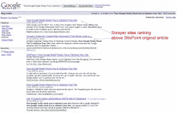

# 更多谷歌搜索引擎优化神话曝光

> 原文：<https://www.sitepoint.com/google-seo-myths/>

 谷歌的苏珊·莫斯克瓦 2008 年在谷歌网站管理员中心博客上写了一篇名为[的文章，揭开了“重复内容惩罚”](http://googlewebmastercentral.blogspot.com/2008/09/demystifying-duplicate-content-penalty.html)的神秘面纱。一年后，许多网站管理员仍然在看“重复内容”，而没有真正理解它是什么和它做什么。

同一网站上的一篇旧文章称[巧妙地处理了重复内容](http://googlewebmastercentral.blogspot.com/2006/12/deftly-dealing-with-duplicate-content.html)，并澄清了与该主题相关的大部分问题。尽管这篇文章的日期是 2006 年，但是“重复内容”阵营的情况并没有发生太大的变化。谷歌仍然希望你优化你的网站，并适当屏蔽所有重复的网站内容。谷歌仍然希望你保持内部链接的一致性，他们仍然希望你用适当的顶级域名处理特定国家的内容，他们仍然希望你使用网站管理员工具中的首选域名功能。样板重复规则没有改变，谷歌仍然不喜欢发布存根(尽管许多网站仍然逃脱了这种做法，但不会太久)。

令人惊讶的是，谷歌建议不要担心搜索引擎，因为这些搜索引擎通常在搜索结果页面中排在原始内容的前面。

一般来说，刮擦式网站没有站点重复内容那么伤人——你知道你的网站模板也算在重复内容的计算中吗？在肉眼所见的背后，是使用“单词”生成可视布局的 HTML 代码。如果代码中的单词比文章的实际文本多 70 %,您可能会遇到内容重复的问题。所以，如果你有这种可能，就不要懒得写更长的文字了。

最后但同样重要的是，你要知道，站内重复内容也会影响你的 PageRank。你可能认为当你发布一个新网站时，页面排名是零。不对。每次你发布一个新页面，它都会有一个大于零的页面排名。谷歌为现有网站分配页面排名——当它们第一次出现时，页面排名是基于内部链接结构和内容，而不是基于外部链接计算的。在这种情况下，影响 PageRank 的是网站的内容和非重复页面的数量(越多越好)。我希望这至少给那些看到他们的新网站有 PR4 的人一个答案，然后因为他们的 PR 下降而感到困惑。PageRanks 下降是因为谷歌的慷慨不会持续太久。如果新页面获得的 PR 值比平时高，利用这个机会，尽可能多地获取外部链接来支持它们，否则，谷歌的下一次 PR 更新会让你怀疑 WTF！

## 分享这篇文章