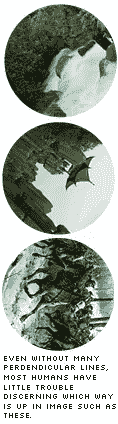

# 谷歌的新验证码:唯一的方法是向上！

> 原文：<https://www.sitepoint.com/googles-new-capcha-the-only-way-is-up/>

[验证码](http://en.wikipedia.org/wiki/Captcha)一直是一个有争议的话题。除了记录在案的无障碍问题，当我们被要求表演一个马戏团的把戏来证明我们是一个人时，我们都会感到简单的恼怒——这是我们通常认为理所当然的事情。不幸的事实是，垃圾邮件发送者不会很快消失，许多人有时间、资源和倾向来利用他们可以找到的任何角度。我们*的**需要**的*好，这方面的原创思维。

上周，谷歌研究院的 Rich Gossweiler、Maryam Kamvar 和 Shumeet Baluja 发表了他们关于这个主题的最新想法，题目是“[社交调整验证码](http://googleresearch.blogspot.com/2009/04/socially-adjusted-captchas.html)”。

一份白皮书详细解释了这个想法，但是这个概念很简单。用户看到的是一个圆形切割的图片，它被旋转到随机的、非标准的角度。然后要求他们将图像旋转回正确的方向。

作为已经进化到能够快速处理现实世界中的视觉信息的人类，我们生来就有非常好的软件来判断哪条路是对的。然而，计算机目前还远不能熟练地理解一系列可能变化很大的图像。你只需看看本田的阿西莫机器人或 T2 的机器人足球相对缓慢的动作，就能明白这对一台机器来说是多么繁重的任务。

显然，该方法与其他基于图像的验证码方法共享一些特征(例如，“你看到多少只小猫？”方法)，但有一个主要优点。其他方法需要人类编写新的测试(例如，多少..嗯..金鱼？..')，新的社交调整验证码测试可以很容易地由机器自动生成，但却不容易被机器解决。

如果你考虑经典的字母数字验证码方法，一个机器人只会尝试匹配大约 40 个字符到任何给定的字形——尽管是扭曲的字形。图像定位是由几乎无限的 feeder 图像池驱动的，这些图像取自各种各样的主题、方面和角度。当然，编写一个搜索地平线和垂直线的机器人将是一个合理的开始，但它只能让你到此为止(如示例所示)。

这当然不是本垒打。这对视力受损的人来说没有改善。类似地，有运动障碍的用户可能很清楚他们喜欢用哪种方式来定位图像，但是可能会纠结于重新定位图像的物理过程。也许伟大的界面设计可以否定这个问题。

也有一些批评说，这种方法不能保护垃圾邮件发送者，他们雇佣廉价的人工破解验证码。

然而，在我看来，这是一个不公平的要求，因为它超出了 CAPTCHA 的工作范围——将人类与机器人分类。区分好用户和坏用户是完全不同的一类问题。

你觉得怎么样？你会想把你的字母数字验证码替换成这样的东西吗？

## 分享这篇文章